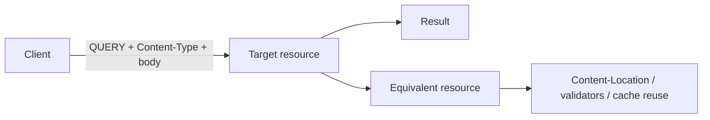

# HTTP QUERY Method, Safe Request Bodies & Cache Semantics

## Konu anlatımı
RFC 10008 (Haziran 2026) HTTP `QUERY` metodunu, request content ile tanımlanan server-side sorgular için safe ve idempotent bir yöntem olarak standartlaştırır. GET'te büyük/yapısal filtreleri URI'ye taşımak pratik sınırlar ve log exposure yaratabilir; POST body taşır fakat safe semantiği vermez. QUERY bu boşluğu doldurur.

## Mental model

## Internals ve semantik
- QUERY safe ve idempotent'tir; retry intended state change üretmemelidir.
- Request body semantiği `Content-Type` ile belirlenir; eksik/uyumsuz type reddedilmelidir.
- `Accept-Query` desteklenen query media type'larını ilan edebilir.
- `OPTIONS`/`Allow` method desteğini keşfetmekte kullanılabilir.
- 415 unsupported media type, 422 anlaşılmış ama işlenemeyen query, 406 kabul edilemeyen response representation için anlamlı ayrımlardır.
- Equivalent resource kavramı body ve metadata'yı da query kimliğine dahil eder; cache tasarımında yalnız URI yeterli değildir.

## Mülakat soruları
1. Safe ile idempotent farkı nedir?
2. Büyük read-only query için QUERY neden POST'tan daha doğru semantik verebilir?
3. Body taşıyan safe request cache key'ini nasıl etkiler?
4. Proxy/WAF yeni method'u tanımıyorsa rollout nasıl yapılır?
5. Staff seviyesinde SDK, gateway, CDN, observability ve fallback governance'ını nasıl tasarlarsın?

## Seviyeye göre cevap
- **Junior:** GET/POST/QUERY ve safe/idempotent kavramlarını ayırır.
- **Mid:** content negotiation, status codes, discovery ve retry davranışını açıklar.
- **Senior:** cache, abuse control, gateway/WAF ve logging risklerini değerlendirir.
- **Staff:** progressive adoption, fallback ve platform standardını tasarlar.

## Kısa alıştırma
Büyük analitik filtre için GET, POST `/search` ve QUERY tasarımlarını URI length, retry, cache, logs ve intermediary compatibility açısından karşılaştır.

## Proje fikri
`http-query-lab`: JSON body kabul eden QUERY endpoint, OPTIONS discovery, `Accept-Query`, ETag ve canonical-body hash cache'i uygula. JSON key order değişiminde canonicalization etkisini ölç.

## Failure modes / trade-off / production
QUERY'yi GET-with-body sanmak, safe olduğu için compute limit koymamak, body'yi cache identity'den çıkarmak, gateway method allowlist'ini test etmemek ve query içeriğini ham telemetry'ye yazmak tipik hatalardır. 405/415/422, query cost, body size, retry, cache hit ve gateway rejection izlenmelidir.

## Kaynaklar
- RFC 10008 — The HTTP QUERY Method: https://www.rfc-editor.org/rfc/rfc10008.html
- RFC 9110 — HTTP Semantics: https://www.rfc-editor.org/rfc/rfc9110.html
