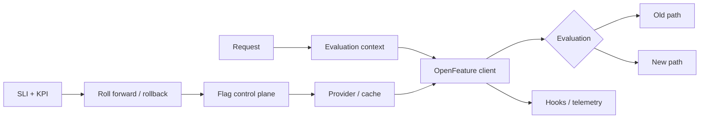

# OpenFeature, Feature-Flag Evaluation & Progressive Delivery Governance

## Konu anlatımı
Feature flag production'da deployment ile release'i ayıran control mechanism'dir. OpenFeature, uygulamanın flag vendor'ına doğrudan bağlanması yerine vendor-neutral evaluation API sağlar. Provider gerçek flag sistemini sarar; typed evaluation API flag değerini çözer; evaluation context targeting bilgisini taşır; hooks telemetry ve policy gibi lifecycle davranışlarını ekler.

2026 ortasında yayımlanan OpenFeature Specification v0.9.0 evaluation/provider bölümlerini stabilize etti; hooks, events ve evaluation context yüzeylerini güçlendirdi. Bu abstraction'ın amacı “vendor hiç önemli değil” demek değil, application contract ile control-plane implementation'ını ayrıştırmaktır.

## Mental model

## Evaluation semantics
Provider boolean/string/number/structure gibi typed değerler resolve edebilir. Evaluation context targeting key ve custom attributes taşır. Dynamic-context modelinde precedence global → transaction → client → invocation → before-hook şeklindedir. Fractional rollout'ta stable targeting key aynı subject'in aynı varyanta düşmesini sağlar.

Provider lifecycle `NOT_READY`, `READY`, `STALE`, `ERROR`, `FATAL` gibi durumlar sunar. Bu durumların her biri için uygulamanın default/fallback davranışı belirlenmelidir. Default value rastgele bir convenience değil, provider failure anındaki ürün ve güvenlik semantiğidir.

## Hooks ve hot path
Hooks before/after/error/finally lifecycle'ında telemetry, context filtering veya policy uygulayabilir. Request-time evaluation yoluna blocking remote call eklemek tail latency ve availability coupling yaratabilir; local evaluation/cache sık kullanılan tasarımdır. Evaluation context PII taşıyabilir, dolayısıyla context minimization ve logging politikası gerekir.

## Progressive delivery
Tipik rollout `%1 → %5 → %25 → %50 → %100` gibi aşamalarla ilerler. Her aşamada teknik guardrail (error rate, latency, saturation) ve ürün KPI'ı birlikte değerlendirilir. Rollback threshold önceden tanımlanmalı; flag owner, expiry/TTL ve cleanup işi rollout planının parçası olmalıdır.

## Mülakat soruları
1. Feature flag ile config arasındaki fark nedir?
2. Percentage rollout nasıl deterministic/sticky olur?
3. Provider unavailable ise fail-open/fail-closed nasıl seçilir?
4. Evaluation context'te hangi PII riskleri vardır?
5. Staff seviyesinde naming, ownership, expiry ve kill-switch standardı nasıl kurulur?
6. CTO seviyesinde velocity, vendor risk, compliance ve flag debt nasıl dengelenir?

## Seviye beklentisi
- **Mid:** targeting/default/rollout mantığını uygular.
- **Senior:** caching, stale config, latency, observability ve PII riskini yönetir.
- **Staff:** ortak SDK/provider abstraction ve lifecycle governance kurar.
- **Principal:** multi-provider migration ve experimentation integrity'yi değerlendirir.
- **CTO:** progressive delivery'yi şirket risk/velocity ekonomisine bağlar.

## Mini alıştırma
Checkout rollout'u için targeting key, guardrail SLI, business KPI, rollback threshold, provider-outage davranışı ve flag deletion tarihi belirle.

## Proje fikri
`progressive-delivery-lab`: OpenFeature ile iki implementation arasında deterministic cohorting, local/remote provider mock, stale cache, provider failure, hook telemetry ve rollback simulator kur.

## Failure modes / trade-off / production
Owner/expiry koymamak, request başına remote evaluation yapmak, ham PII taşımak, default'u düşünmeden seçmek, client/server evaluation farkını yok saymak ve rollback metric'ini sonradan belirlemek yaygın hatalardır. Production'da evaluation latency/error, provider status, stale age, variant distribution, SLI/KPI ve expired-flag count izlenmelidir. Feature flag authorization mekanizması değildir.

## Kaynaklar
- OpenFeature v0.9.0 update: https://openfeature.dev/blog/openfeature-mid-2026-update/
- Evaluation API: https://openfeature.dev/specification/sections/flag-evaluation/
- Providers: https://openfeature.dev/specification/sections/providers/
- Evaluation Context: https://openfeature.dev/specification/sections/evaluation-context/
- Hooks: https://openfeature.dev/specification/sections/hooks/
