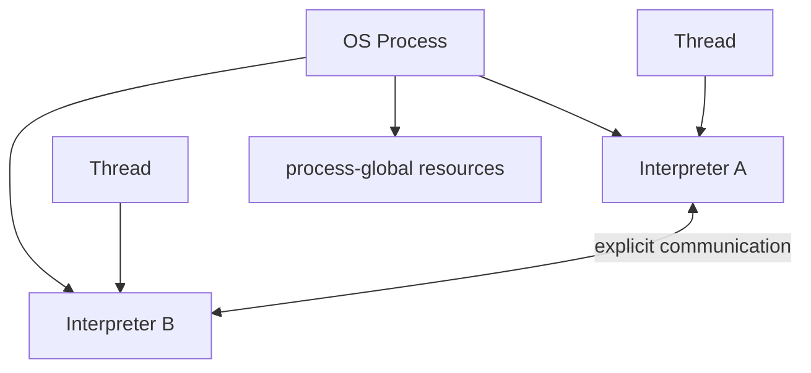

# Python Subinterpreters: Isolation, Parallelism & Runtime Trade-offs

## Neden önemli?
Python 3.14 ile PEP 734 ve `concurrent.interpreters`, aynı process içinde birden çok isolated Python interpreter'ını standart API ile yönetilebilir hale getirdi. Bu model thread ile process arasında basit bir orta nokta değildir: isolation, communication, extension compatibility ve failure containment eksenlerinde ayrı trade-off'lara sahiptir.

## Mental model

Interpreter'ların import state'i, modülleri, sınıfları ve değişkenleri ayrıdır. Ancak aynı process içinde file descriptor, address space ve bazı native/process-global kaynaklar paylaşılır. Bu yüzden subinterpreter bir security sandbox değildir.

## Thread, interpreter, process
- Thread: düşük communication cost, yüksek shared-state riski.
- Subinterpreter: Python runtime state isolation; explicit data transfer; aynı process failure/resource domain'i.
- Process: daha güçlü OS isolation ve crash containment; daha pahalı startup/IPC olabilir.
- Free-threaded CPython: farklı eksen; GIL'siz thread parallelism hedefler, interpreter isolation modelinin yerine geçmez.

## Production tasarımı
CPU-bound işlerde `InterpreterPoolExecutor` ile process pool'u gerçek payload üzerinde benchmark et. RSS, startup, serialization, throughput, p95 latency ve worker failure ölç. Native extension'ların multi-interpreter uyumluluğunu deployment gate yap. Büyük mutable graph'ları worker'lar arasında sürekli kopyalamak yerine task contract'ını küçük tut.

## Mülakat soruları
1. Subinterpreter neden thread değildir?
2. Interpreter tek başına neden concurrency sağlamaz?
3. Process pool yerine ne zaman interpreter pool seçersin?
4. C extension'lar neden risk yüzeyidir?
5. Staff/Principal: plugin platformunda isolation boundary'yi nasıl seçersin?

## Failure modes
Security sandbox varsaymak; native global state'i gözden kaçırmak; serialization cost'u ölçmemek; shared FD/process-global side effect'leri unutmak; yalnız microbenchmark kullanmak.

## Mini çalışma / proje
Aynı CPU-bound workload'u `ThreadPoolExecutor`, `InterpreterPoolExecutor` ve `ProcessPoolExecutor` ile çalıştır. Warm/cold latency, RSS, throughput ve failure davranışını raporla; extension compatibility testi ekle.

## Kaynaklar
- https://peps.python.org/pep-0734/
- https://docs.python.org/3.14/library/concurrent.interpreters.html
- https://docs.python.org/3.14/c-api/threads.html
- https://docs.python.org/3.14/howto/free-threading-python.html
