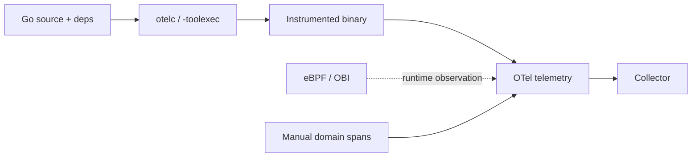

# OpenTelemetry Go Compile-Time Instrumentation & Zero-Code Boundaries

## Neden önemli?
Go observability'de manual instrumentation en zengin business semantics'i verir; fakat fleet çapında coverage maliyetlidir. OpenTelemetry Go compile-time instrumentation, `otelc` ile Go build sürecini `-toolexec` üzerinden sararak desteklenen package/function'lara hook enjekte eder. v1.0.0 itibarıyla OpenTelemetry dokümantasyonunda stable/production-ready olarak tanımlanır.

## Mental model
Üç katmanı ayır:
1. **Manual:** domain-aware, en yüksek semantic fidelity.
2. **Compile-time:** build-time hook injection; runtime attach gerekmez.
3. **eBPF/OBI:** runtime observation; source/build değişikliği minimumdur ama application-specific semantics sınırlıdır.

“Zero-code”, “complete observability” demek değildir. Auto coverage + selective manual semantics çoğu production sistemi için daha doğru modeldir.

## Internals ve trade-off
- `otelc`, compiler çağrılarını `-toolexec` ile intercept eder ve instrumentation rules uygular.
- Binary instrumentation kodunu içerir; build provenance/toolchain pinning operasyonel sözleşmenin parçası olur.
- Supported-library/version matrisi coverage drift yaratabilir.
- HTTP/gRPC context propagation otomasyon için yüksek getirili sınırlar; business events çoğunlukla manual kalır.
- Duplicate spans, cardinality, PII, sampling ve exporter backpressure ayrıca yönetilmelidir.

## Mülakat soruları
- Manual, compile-time ve eBPF instrumentation farkları nelerdir?
- Compile-time model neden runtime agent istemez?
- Unsupported dependency upgrade'ini nasıl fark edersin?
- Senior: rollout overhead'ini hangi metriklerle canary edersin?
- Staff/Principal: yüzlerce serviste coverage, provenance, privacy ve telemetry cost'u nasıl govern edersin?

## Seviye beklentisi
- **Mid:** span/context ve üç modelin farkı.
- **Senior:** overhead, trace continuity, cardinality ve compatibility.
- **Staff:** fleet rollout, version pinning, coverage SLO ve CI contract tests.
- **Principal:** vendor neutrality, supply-chain provenance, privacy ve platform economics.

## Alıştırma / proje
Aynı `net/http` + gRPC servisini manual OTel, compile-time `otelc` ve eBPF/OBI ile çalıştır. Source diff, build time, CPU/RSS, p95 latency, spans/request ve trace-parent continuity ölç. Dependency upgrade'i ile coverage drift testi ekle.

## Production failure modes
Unsupported library'yi fark etmemek, high-cardinality attributes, PII sızıntısı, duplicate telemetry, toolchain drift, sampling'i geç düşünmek ve instrumentation overhead'ini ölçmemek. İzlenecek metrikler: dropped spans, exporter queue, CPU/RSS delta, p95/p99 delta, spans/request, cardinality, sampling rate ve instrumentation-version dağılımı.

## Kaynaklar
- https://opentelemetry.io/docs/zero-code/go/compile-time/
- https://opentelemetry.io/docs/zero-code/go/
- https://opentelemetry.io/docs/zero-code/go/autosdk/
- https://opentelemetry.io/docs/languages/go/instrumentation/
