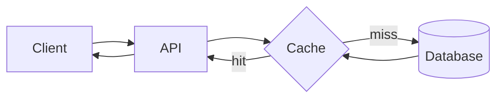
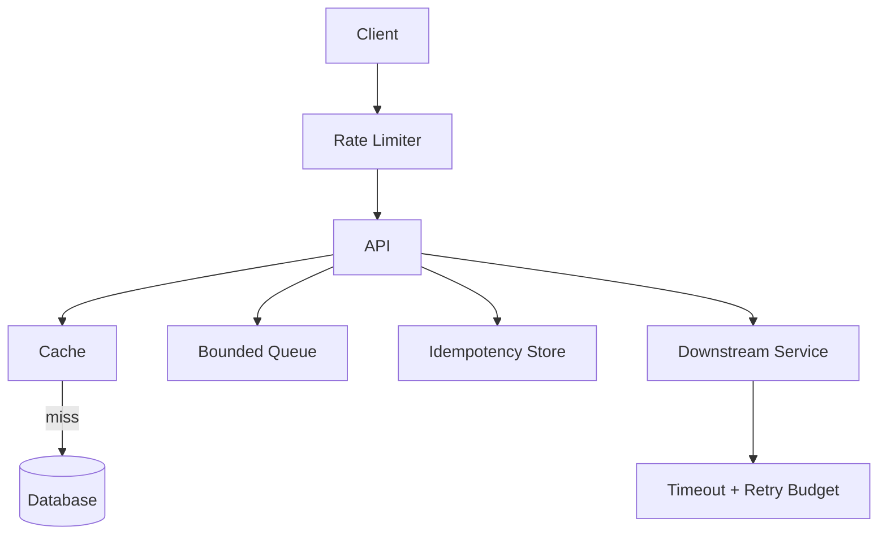

# 01 — Cache, Rate Limiting, Idempotency ve Retry

Backend mülakatlarında birçok soru aslında aynı dört production probleminin etrafında döner:

1. Pahalı işi tekrar yapmamak.
2. Sistemin kapasitesinden fazla trafik almamak.
3. Aynı isteğin tekrar gelmesinde yanlış yan etki üretmemek.
4. Geçici hatalarda sistemi daha da kötüleştirmeden toparlanmak.

Bu bölüm bu dört problemi tek bir mental model içinde birleştirir.

---

## 1. Cache neden kullanılır?

Bir veri kaynağı pahalıysa, sık erişilen sonucu daha hızlı ve daha ucuz bir katmanda tutabiliriz.



Basit akış:

```text
cache'te var mı?
  ├─ evet -> dön
  └─ hayır -> DB'den oku -> cache'e yaz -> dön
```

Buna **cache-aside** denir.

### Cache ne kazandırır?

- düşük latency,
- database load azalması,
- daha yüksek throughput,
- pahalı hesaplamaların tekrarını azaltma.

Ama cache yeni problemler de getirir:

- stale data,
- invalidation,
- stampede,
- memory pressure,
- consistency farkları.

---

## 2. Cache invalidation neden zor?

Database güncellendi ama cache güncellenmediyse kullanıcı eski veri görebilir.

```text
DB:    plan = pro
Cache: plan = free
```

Yaygın yaklaşımlar:

- TTL,
- write-through,
- write-behind,
- explicit invalidation,
- event/CDC ile invalidation.

Hiçbiri her workload için kusursuz değildir.

### TTL seçimi

Uzun TTL:

- daha iyi hit rate,
- daha fazla stale data riski.

Kısa TTL:

- daha taze veri,
- daha çok backend load.

Bu tip kararlar system design görüşmelerinde doğrudan trade-off sorusudur.

---

## 3. Cache stampede

Popüler bir key expire olunca binlerce request aynı anda database'e gidebilir.

```text
10k request
    ↓
cache miss
    ↓
10k DB queries
```

Çözüm pattern'leri:

- request coalescing / single-flight,
- stale-while-revalidate,
- TTL jitter,
- lock/lease ile tek refresher,
- pre-warming.

Staff-level düşünce: cache outage veya mass expiration'ın database'i de çökertmemesi gerekir.

---

## 4. Rate limiting neden var?

Bir servis sınırlı kapasiteye sahiptir. Rate limiter trafik hızını kontrol eder.

Kullanım alanları:

- abuse protection,
- fairness,
- tenant isolation,
- API quota,
- dependency protection,
- cost control.

### Fixed window

```text
10:00:00 - 10:00:59 -> max 100 request
```

Basittir ama window boundary çevresinde burst oluşabilir.

### Sliding window

Son belirli zaman aralığını daha doğru temsil eder ama implementation daha pahalı olabilir.

### Token bucket

Bucket belirli hızda token kazanır. Request token tüketir.

```text
       refill
         ↓
[ token token token ]
         ↓ request consumes
       allow / reject
```

Burst'e kontrollü izin verdiği için production sistemlerinde sık kullanılır.

---

## 5. Rate limit key nasıl seçilir?

Şunlardan biri veya kombinasyonu olabilir:

- user ID,
- API key,
- tenant ID,
- IP,
- endpoint,
- organization,
- model/operation type.

Yanlış key fairness sorununa yol açabilir.

Örneğin yalnızca IP bazlı rate limit NAT arkasındaki binlerce kullanıcıyı tek kullanıcı gibi görebilir.

---

## 6. Distributed rate limiter

Tek process içinde rate limiter kolaydır. Birden fazla API instance olduğunda global state problemi çıkar.

```text
          ┌─ API-1
Client -> LB
          ├─ API-2
          └─ API-3
```

Her API kendi sayacını tutarsa global limit aşılabilir.

Seçenekler:

- merkezi Redis/Valkey counter,
- sharded counter,
- local approximate limits + global quota,
- token lease/budget dağıtımı.

Trade-off:

```text
accuracy <-> latency <-> availability
```

Her request'te merkezi store'a gitmek daha doğru olabilir ama limiter'ı bottleneck yapabilir.

---

## 7. Idempotency

Bir operation birden fazla kez uygulanmasına rağmen aynı logical sonucu koruyabiliyorsa idempotent davranış gösterir.

Örneğin ödeme sistemi:

```text
POST /payments
Idempotency-Key: abc123
```

Client timeout yaşar ve aynı request'i tekrar gönderir. Server `abc123` key'inin daha önce işlendiğini biliyorsa ikinci kez ödeme oluşturmaz.

Kavramsal tablo:

```text
abc123 -> payment_789 -> success
```

### Neden önemli?

Distributed sistemlerde client şu durumu ayırt edemeyebilir:

```text
request server'a hiç ulaşmadı mı?
yoksa
server işlemi yaptı ama response kayboldu mu?
```

Retry için idempotency bu belirsizliği yönetmenin temel araçlarından biridir.

---

## 8. Retry ne zaman yapılmalı?

Her error retry edilmez.

### Retry edilebilir olabilecek durumlar

- transient network failure,
- timeout,
- bazı 5xx hataları,
- rate-limited durumda `Retry-After` politikasına göre.

### Genellikle retry edilmemesi gerekenler

- invalid request,
- authentication failure,
- deterministic validation error,
- açıkça permanent failure.

### Exponential backoff

```text
1. retry -> 100 ms
2. retry -> 200 ms
3. retry -> 400 ms
4. retry -> 800 ms
```

### Jitter

Bütün client'ların aynı anda retry yapmasını engellemek için bekleme süresine randomness eklenir.

---

## 9. Retry storm

Bir dependency yavaşladığında otomatik retry trafik miktarını katlayabilir.

```text
normal: 10k req/s
retry x3
potential attempts: ~30k req/s veya daha fazla
```

Sonuç:

```text
slow dependency
   ↓
retries
   ↓
more load
   ↓
slower dependency
   ↓
more retries
```

Bu positive feedback loop outage'ı büyütür.

Çözümler:

- retry budget,
- capped attempts,
- deadline propagation,
- circuit breaker,
- load shedding,
- backpressure.

---

## 10. Timeout katmanları

Timeout yoksa request sonsuza yakın bekleyebilir. Ama kötü timeout da hata yaratır.

Örneğin:

```text
Client timeout:       2 s
API total deadline: 1.8 s
DB timeout:         500 ms
cache timeout:       50 ms
```

Bu sadece örnektir; gerçek değerler SLO ve latency dağılımına göre seçilir.

Önemli fikir: iç dependency timeout'u dış deadline'dan daha kısa olmalıdır ki üst katmana hata yönetimi için zaman kalsın.

---

## 11. Circuit breaker

Dependency sürekli fail ediyorsa her request'i oraya göndermek anlamsız olabilir.

Basit state machine:

```text
CLOSED
  ↓ failures exceed threshold
OPEN
  ↓ wait
HALF-OPEN
  ↓ success -> CLOSED
  ↓ failure -> OPEN
```

Ama circuit breaker yanlış ayarlanırsa gereksiz outage yaratabilir. Metric ve recovery behavior önemlidir.

---

## 12. Backpressure

Producer consumer'dan hızlıysa queue büyür.

```text
Producer: 10k jobs/s
Consumer: 6k jobs/s
Difference: +4k jobs/s
```

Sınırsız queue problemi çözmez; sadece geciktirir.

Bir süre sonra:

- memory dolar,
- latency yükselir,
- jobs stale olur,
- recovery süresi uzar.

Backpressure producer'a kapasite sinyali vermektir.

Örnek policies:

- reject,
- block,
- slow producer,
- sample/drop,
- lower priority work'i at.

---

## 13. Bunlar birlikte nasıl çalışır?

Production API örneği:



Bu primitive'ler birbirinden bağımsız değildir.

Örneğin cache çökerse DB load artar; DB yavaşlarsa retries artar; retries rate limiter'a takılabilir; queue büyür; tail latency yükselir.

İyi system design tek tek kutuları değil, failure zincirlerini düşünür.

---

# Habitat bağlantısı

Habitat benzeri merkezi storage platformu şu politikaları tek yerde uygulayabilir:

- request shaping,
- rate limiting,
- auth,
- caching,
- routing,
- tenant isolation.

Avantaj: her ürün ekibi aynı problemi tekrar çözmez.

Risk: merkezi platform yanlış davranırsa blast radius çok büyük olabilir.

Staff/Principal sorusu:

> Merkezi rate limiter veya cache katmanı çökerse platform fail-open mı fail-closed mı davranmalı?

Cevap operation'a göre değişebilir. Security-sensitive write ile public read aynı policy'yi kullanmak zorunda değildir.

---

# Mülakat soru bankası

## Junior

**1. Cache nedir, neden kullanılır?**

Latency ve backend load üzerinden anlat.

**2. Rate limiting nedir?**

Kapasite, abuse ve fairness bağlamında cevapla.

**3. Timeout neden gerekir?**

Sonsuz beklemeyi ve resource occupation'ı sınırlar.

## Mid

**4. Cache-aside nasıl çalışır?**

Hit/miss/write-back akışını çiz.

**5. Token bucket ile fixed window farkı nedir?**

Burst behavior ve implementation trade-off'unu anlat.

**6. Idempotency key ne işe yarar?**

Payment/create operation retry örneği ver.

**7. Exponential backoff neden kullanılır?**

Dependency'nin recovery için zaman kazanması ve retry pressure'ın azalması.

## Senior

**8. Cache stampede nasıl önlenir?**

TTL jitter, single-flight, stale-while-revalidate, prewarm konuş.

**9. Distributed rate limiter nasıl tasarlanır?**

Correctness/availability/latency üçgenini tartış.

**10. Retry hangi durumda outage'ı büyütür?**

Retry amplification ve dependency saturation anlat.

**11. Queue neden bounded olmalı?**

Latency ve memory açısından Little's Law/queueing reasoning'e bağlanabilir.

## Staff / Principal

**12. 1000 tenant'lı platformda noisy neighbor'ı nasıl engellersin?**

Per-tenant quota, concurrency limit, weighted fairness, resource isolation ve admission control.

**13. Merkezi cache servisinin outage'ında DB'yi nasıl korursun?**

Load shedding, stale reads, local cache, request collapsing, degraded mode ve capacity reserve.

**14. Global idempotency nasıl tasarlanır?**

Scope, key lifecycle, dedup store, consistency ve multi-region races tartış.

## Engineering Manager / CTO

**15. Reliability primitive'lerini her takım mı yazmalı, platform takımı mı?**

Standardization, developer velocity, blast radius, ownership ve platform maturity üzerinden karar ver.

---

# 30 dakikalık uygulama

## Mini token bucket rate limiter

Bir servis yaz:

```text
allow(key) -> true/false
```

Parametreler:

- capacity,
- refill rate,
- current tokens,
- last refill time.

Testler:

1. Normal traffic.
2. Burst.
3. Long idle sonrası burst.
4. 100 concurrent caller.
5. Clock/time edge cases.

Sonra distributed hale getirmek için ne değişmesi gerektiğini README'de tartış.

## Bununla ne yapabiliriz?

`production-api-protection-lab` isimli bir proje:

```text
client
  ↓
rate limiter
  ↓
API
  ├─ cache
  ├─ idempotency
  └─ downstream mock
        └─ timeout/retry/circuit breaker
```

Grafana/Prometheus benzeri metrikler ekleyebilirsen şu dashboard'u üret:

- request rate,
- rejection rate,
- cache hit ratio,
- retry count,
- queue depth,
- p50/p95/p99,
- downstream error rate.

Bu tek proje backend + SRE + system design + distributed systems görüşmelerinde konuşulabilir.

---

# Kaynaklar

- Microsoft Azure Architecture Center — Cache-Aside Pattern: https://learn.microsoft.com/azure/architecture/patterns/cache-aside
- AWS Builders Library — Timeouts, retries and backoff with jitter: https://aws.amazon.com/builders-library/timeouts-retries-and-backoff-with-jitter/
- Google SRE Book — Handling Overload: https://sre.google/sre-book/handling-overload/
- Google SRE Book — Addressing Cascading Failures: https://sre.google/sre-book/addressing-cascading-failures/
- Valkey documentation: https://valkey.io/topics/
- RFC 6585 — Additional HTTP Status Codes (`429 Too Many Requests`): https://www.rfc-editor.org/rfc/rfc6585

> Bu bölümdeki teknikleri “best practice listesi” olarak ezberleme. Her birinin hangi failure mode'u engellediğini ve hangi yeni riski eklediğini öğren.
