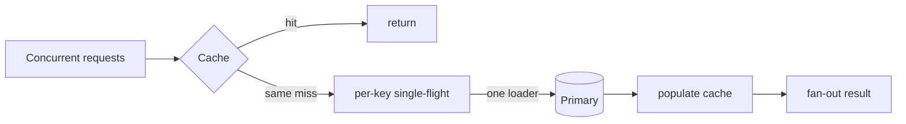

# Cache Stampede, Single-Flight ve Hot-Key Koruması

Cache-aside mimarisinde populer bir key expire oldugunda cok sayida concurrent request ayni miss'i gorup primary database'e ayni anda gidebilir. Cache normalde load azaltirken expiration ani load amplifier'a donusur; buna cache stampede veya dogpile denir.

## Mental model

## Koruma teknikleri
- **Single-flight/request coalescing:** ayni key icin bir loader calisir, digerleri sonucu bekler.
- **TTL jitter:** cok sayida key'in ayni anda expire olmasini azaltir.
- **Stale-while-revalidate:** eski degeri kisa sure servis ederken arka planda refresh yapar.
- **Proactive refresh:** expiry yaklasirken popular key'i yeniler.
- **Short loader lock:** multi-process/multi-replica coordination gerekirse tek loader secmeye yardim eder.

Her teknik farkli trade-off getirir. Stale serving freshness'i azaltir; distributed coordination latency ve failure surface ekler; single-flight scope'u process ile sinirli olabilir.

## Mulakat sorulari
- Cache stampede nasil olusur?
- TTL jitter neyi cozer?
- Single-flight ile distributed lock farki nedir?
- Loader crash olursa waiters ne yapar?
- Hot key tek shard'i doyurursa hangi seceneklerin var?
- Cache tamamen unavailable olursa primary'yi nasil korursun?

## Production tasarimi
Bounded waiting, deadline, stale policy, per-key concurrency, hot-key telemetry ve DB load shedding birlikte dusunulmelidir. Cache source-of-truth olmamali; degradation davranisi onceden tanimlanmalidir.

Habitat-benzeri metadata/read-heavy control plane'de backend capability veya policy metadata cache'lerinde stampede primary metadata store'u doyurabilir. Single-flight + jitter + stale policy bu boundary'de uygulanabilir.

## Kaynaklar
- Redis cache-aside ve stampede protection: https://redis.io/docs/latest/develop/use-cases/cache-aside/redis-py/
- Redis distributed locks: https://redis.io/docs/latest/develop/clients/patterns/distributed-locks/
