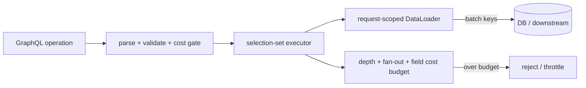

# GraphQL Execution Cost, N+1, DataLoader & Query Budgets

**Seviye:** Junior → Principal  
**Alan:** Backend / System Design

## Temel fikir
GraphQL response shape'ini client'a bırakır; backend maliyetini otomatik sınırlamaz. Tek operation, nested resolver zinciri yüzünden çok sayıda DB/RPC çağrısına dönüşebilir. Klasik N+1 örneği: parent listesi için 1 sorgu, sonra her parent'ın child alanı için N sorgu.

Executor graph ile storage-access graph'ı aynı değildir. Production mental modeli üç katmandır:

## Execution ve N+1
GraphQL September 2025 specification'a göre query selection set'leri dependency izin verdiği ölçüde paralel yürütülebilir; top-level mutation fields side-effect sırası için serial yürütülür. Naive resolver `users -> each user's orders` yolunda 1+N backend call üretebilir.

DataLoader benzeri request-scoped loader'lar key lookup'larını batch eder ve aynı request içindeki duplicate key'leri memoize edebilir. Batch function sonuçları input key sırasına hizalamalıdır. Loader'ı kullanıcı/tenant sınırları arasında global cache'e çevirmek authorization/data-leak riski doğurur.

## Query budget
Yalnız depth limiti yeterli değildir: shallow ama yüksek fan-out/list cardinality query pahalı olabilir. Cost modelinde depth yanında pagination bounds, list multiplier ve field-specific weight düşünülmelidir. Static estimate runtime telemetry ile kalibre edilmelidir.

## Mülakat soruları
1. GraphQL neden N+1'e yatkındır?
2. DataLoader batching ile caching arasındaki fark nedir?
3. Loader neden request-scoped olmalıdır?
4. Batch function neden key-order contract taşır?
5. Depth limiti neden tek başına abuse/cost koruması değildir?
6. Senior: `users(100)->orders(100)->items(100)` için cost modelini nasıl kurarsın?
7. Staff/Principal: multi-tenant gateway'de fairness ve budget versioning nasıl yönetilir?

## Beklenen cevap derinliği
- **Junior:** resolver ve N+1'i örnekler.
- **Mid:** batching/memoization ve request scope'u açıklar.
- **Senior:** fan-out, cardinality, authorization ve downstream saturation'ı tartışır.
- **Staff/Principal:** static estimation, runtime telemetry, tenant fairness ve schema governance'ı bağlar.

## Alıştırma
`users(first:50) -> orders(first:20) -> items(first:10)` için worst-case entity count ve naive round-trip sayısını hesapla. DataLoader sonrası batch sınırlarını işaretle; field weights ve list multipliers kullanan basit cost formülü öner.

## Proje fikri
`graphql-cost-lab`: naive resolver'larla N+1 üret, DB-call counter ekle; request-scoped DataLoader sonrası call sayısını karşılaştır. Validation aşamasına depth + list multiplier + field weight budget'ı ekle ve estimated/actual cost metriği yayınla.

## Failure modes / trade-off / production
Global loader cache authorization boundary'sini bozabilir. Aşırı batch SQL `IN` veya downstream payload limitine çarpabilir. Static cost storage skew'ını kaçırabilir; aggressive budget legitimate query'leri kırabilir. Operation hash/name, estimated cost, resolver count, batch size, DB/RPC calls, rows scanned, response bytes, p95/p99 ve tenant consumption birlikte izlenmelidir.

## Kaynaklar
- GraphQL Specification — September 2025: https://spec.graphql.org/September2025/
- GraphQL Specification — current: https://spec.graphql.org/
- DataLoader reference implementation: https://github.com/graphql/dataloader
- GraphQL Golden Path — Depth limits: https://goldenpath.graphql.org/solutions/depth-limits/
