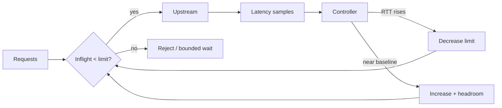

# Adaptive Concurrency Control & Queue Collapse

**Seviye:** Junior → Staff  
**Alan:** Backend / Cloud / SRE

## Neden var?
Rate limit “birim zamanda kaç istek?” sorusunu, concurrency limit “aynı anda kaç iş sistemin içinde?” sorusunu kontrol eder. Little's Law sezgisi `L ≈ λW`: arrival rate aynı kalsa bile latency yükselince inflight büyür. Bu da queue'yu uzatıp latency'yi daha da yükselterek positive-feedback overload yaratabilir.

Adaptive concurrency statik bir semaphore sayısı yerine latency feedback ile inflight limitini ayarlar. Envoy gradient controller ideal/no-load'a yakın `minRTT` ile güncel `sampleRTT`'yi karşılaştırır. Basitleştirilmiş gradient `(minRTT + buffer) / sampleRTT` olarak düşünülebilir: latency şişince limit düşer, sistem rahatlayınca kontrollü headroom ile büyür.

## Mental model

## Temel mekanik
- Baseline RTT congestion olmayan servis süresini yaklaşıklar.
- Sampling window güncel congestion sinyalini üretir.
- Limit dolunca unbounded queue yerine reject/reset/503 veya bounded waiting gerekir.
- Retry overload sırasında ek yük üretebilir; retry budget, jitter ve host seçimi limiter ile birlikte tasarlanmalıdır.
- Health check/çok ucuz request'ler sample dağılımını bozabilir.
- Autoscaler, circuit breaker, retry policy ve adaptive limiter birbirine bağlı feedback loop'lardır.

## Mülakat soruları
1. Rate limiting ve concurrency limiting farkı nedir?
2. Aynı RPS neden downstream yavaşlayınca sistemi çökertir?
3. `minRTT` neden congestion sinyali için yararlıdır?
4. Neden limiter önünde unbounded queue istemezsin?
5. **Senior:** baseline drift ve retry amplification controller'ı nasıl bozar?
6. **Staff:** endpoint maliyetleri farklıysa global limit yerine hangi isolation modelini kurarsın?
7. **Staff:** autoscaling ile limiter oscillation'ını nasıl azaltırsın?

## Beklenen cevap derinliği
- **Junior:** inflight, queue, latency ve rate/concurrency farkını açıklar.
- **Mid:** Little's Law, overload feedback ve rejection davranışını bağlar.
- **Senior:** sampling, retry amplification, fairness ve baseline drift'i tartışır.
- **Staff:** per-route isolation, controller interaction, rollout ve SLO telemetry tasarlar.

## Kısa alıştırma
200 RPS alan servis 50 ms ortalama latency'de yaklaşık 10 inflight taşır. Latency 500 ms olduğunda yaklaşık 100 inflight gerekir. Connection pool 80 ise queue/rejection davranışının nerede başladığını ve hangi SLO sinyallerini izleyeceğini açıkla.

## Proje fikri
`adaptive-limit-lab`: kontrollü latency enjekte edilen küçük HTTP upstream üzerinde sabit semaphore ile gradient-benzeri controller'ı karşılaştır. Throughput, p50/p99, inflight, reject rate ve queue depth ölç.

## Failure modes / trade-off
GC pause, cold start ve network jitter congestion sanılabilir. Agresif controller throughput'u gereksiz düşürür; yavaş controller queue collapse'ı durduramaz. Bypass traffic feedback'i eksik bırakabilir. Retry ve autoscaling ile kötü ayarlanmış controller oscillation yaratabilir.

## Production bağlantısı
Overload protection, RPC gateway ve service-mesh katmanlarında kullanılır. Concurrency limit, inflight, rejected requests, baseline/sample RTT, queue depth, retry volume, saturation ve p99 birlikte izlenmelidir.

## Kaynaklar
- Envoy — Adaptive Concurrency: https://www.envoyproxy.io/docs/envoy/latest/configuration/http/http_filters/adaptive_concurrency_filter.html
- Envoy — Adaptive Concurrency v3 API: https://www.envoyproxy.io/docs/envoy/latest/api-v3/extensions/filters/http/adaptive_concurrency/v3/adaptive_concurrency.proto
- Netflix — concurrency-limits: https://github.com/Netflix/concurrency-limits
