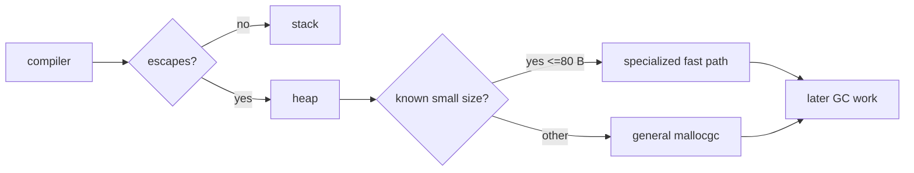

# Go 1.27 Size-Specialized Memory Allocation

## Neden önemli?
Heap allocation yalnız byte ayırmaz; allocator işi ve gelecekte GC maliyeti üretir. Go 1.27, 80 byte ve altındaki allocation'lar için size-specialized allocation functions ekledi. Go ekibinin 16 Eylül 2026 tarihli ölçümünde ilgili allocation'lar %20–30'a kadar hızlanabilir; allocation-heavy programlarda toplam etki yaklaşık %1'e kadar çıkabilir.

## Mental model

**Invariant:** Heap allocation'ın hızlanması allocation rate'i veya object lifetime maliyetini ortadan kaldırmaz.

## İçeride ne oluyor?
Compiler heap'e kaçan object için allocation call üretir. Genel runtime yolu size ve pointer bilgisini dinamik olarak işler. Specialized functions belirli küçük size/pointer kombinasyonlarında genel-case işini azaltır ve compiler'a daha fazla optimization fırsatı verir. Pointer-containing object'ler GC scanning açısından pointer-free object'lerden farklıdır.

Escape analysis hâlâ daha yüksek kaldıraç olabilir: stack'te kalan object heap pressure yaratmaz. Bu nedenle performans değerlendirmesi `ns/op` yanında `B/op`, `allocs/op`, heap live, GC CPU ve request tail latency ile yapılmalıdır.

Amdahl sezgisi: allocator toplam CPU'nun %4'üyse bu bölümü %25 hızlandırmak teorik olarak tüm programı yaklaşık %1 hızlandırır. Microbenchmark sonucu end-to-end speedup değildir.

## Mülakat soruları
1. Stack ve heap allocation farkı nedir?
2. Escape analysis neyi belirlemeye çalışır?
3. Küçük allocation %25 hızlandığında program neden %25 hızlanmaz?
4. `allocs/op` aynı kalıp `ns/op` düşerse ne öğrenirsin?
5. Object pooling ne zaman optimization, ne zaman retention/complexity problemi olur?

## Seviye beklentisi
- **Junior:** stack, heap, allocation ve GC temelini açıklar.
- **Mid:** escape analysis, size class, pointer scanning ve benchmark metriklerini bağlar.
- **Senior:** allocation profile, GC CPU, cache locality ve pooling trade-off'larını tartışır.
- **Staff:** representative benchmark, rollout, regression budget ve production validation tasarlar.

## Mini alıştırma
Küçük pointer-free struct, pointer-containing struct ve 128-byte object için Go benchmark yaz. `-benchmem` ile ns/op, B/op, allocs/op karşılaştır. Aynı object'in stack'te kaldığı ve interface/closure üzerinden heap'e kaçtığı varyantları üret.

## Proje
`alloc-lab`: HTTP JSON servisinde baseline, preallocation ve pooling varyantlarını CPU/heap profile, GC CPU ve p99 ile karşılaştır.

## Failure modes / production
Microbenchmark'ı bütün servise genellemek, pool ile retention yaratmak, escape-analysis davranışını ölçmeden varsaymak ve yalnız GC pause'a bakmak tipik hatalardır. Production'da allocation rate, heap live, GC CPU, RSS, p99 ve throughput birlikte izlenmelidir.

## Kaynaklar
- Go Blog, 16 Eylül 2026: https://go.dev/blog/size-specialized-allocations
- Go 1.27 release, 19 Ağustos 2026: https://go.dev/blog/go1.27
- Go diagnostics: https://go.dev/doc/diagnostics
