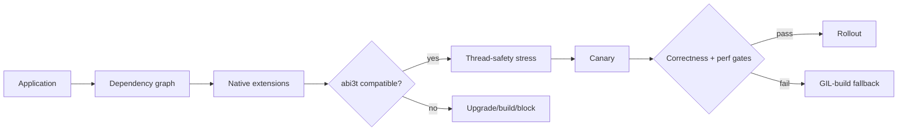

# Python Free-Threaded ABI, `abi3t` & Native Extension Compatibility

## Neden önemli?
Python free-threaded build, GIL olmadan CPU-bound thread'lerin daha fazla paralellik kurmasına izin verir; fakat native extension ekosistemi için concurrency kadar ABI ve object-lifetime problemidir. Python 3.15 için PEP 803, free-threaded build'lere özel `abi3t` Stable ABI varyantını tanımlar ve `PyObject` layout'unu extension'lardan saklar.

## Mental model

## İçeride ne oluyor?
GIL'in kalkması extension'ın global mutable state, borrowed-reference lifetime, hidden lock ve callback reentrancy varsayımlarını görünür hale getirir. Stable ABI, extension'ın CPython internal layout'una bağımlılığını azaltır; `abi3t` bunu free-threaded build için ayrı compatibility contract olarak yapar. Migration bu yüzden yalnız runtime seçimi değil dependency graph, wheel tag/ABI coverage, thread-safety test ve representative benchmark işidir.

## Mülakat soruları
1. GIL kaldırıldığında hangi workload'lar hızlanır?
2. Stable ABI neyi çözer?
3. `abi3t` neden ayrı bir ABI'dir?
4. Native extension'da hidden global state nasıl race üretir?
5. Free-threaded migration için canary ve fallback nasıl tasarlanır?
6. Throughput artarken p99 neden kötüleşebilir?

## Beklenen cevap seviyesi
- **Mid:** GIL, CPU-vs-I/O-bound, wheel/native extension, race.
- **Senior:** ABI, object lifetime, locks/reentrancy ve benchmark.
- **Staff:** runtime/dependency matrix, canary, automated gates ve fallback.
- **Principal:** ecosystem readiness, migration timing ve compute economics.

## Mini alıştırma
Native dependency içeren bir servis için GIL/free-threaded A/B testi tasarla: correctness oracle, 32-thread stress, p95/p99, CPU, RSS ve crash gate'lerini yaz.

## Proje fikri
`py-ft-readiness`: dependency tree'deki native wheel/ABI bilgisini tarayan ve free-threaded readiness raporu ile benchmark matrisi üreten CLI.

## Failure modes / trade-off
`GIL yok = otomatik hızlanma`, import success'i thread-safety kanıtı saymak, transitive native dependency'leri kaçırmak ve yalnız throughput ölçmek tipik hatalardır. Paralellik throughput'u artırabilir; synchronization, allocator ve cache contention tail latency'yi kötüleştirebilir.

## Production bağlantısı
Crash/race sinyalleri, p95/p99, CPU efficiency, RSS, lock contention, worker/thread sayısı ve dependency ABI coverage izlenmelidir. GIL-build fallback rollout boyunca hazır tutulmalıdır.

## Kaynaklar
- PEP 803 — `abi3t`: https://peps.python.org/pep-0803/
- Python 3.15.0rc2 — 1 Eylül 2026: https://www.python.org/downloads/release/python-3150rc2/
- PEP 790 — Python 3.15 schedule: https://peps.python.org/pep-0790/
