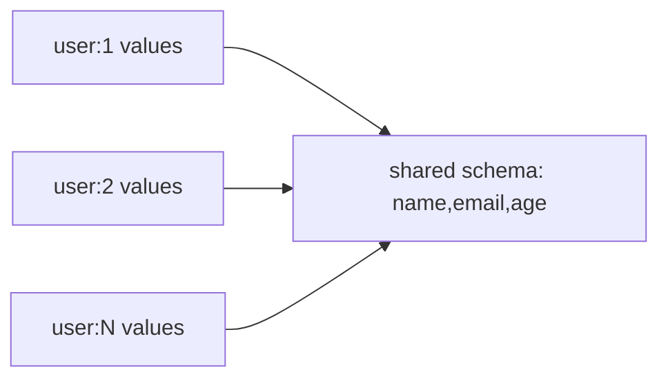

# Redis 8.10 Compact Hashes: Shared Schemas & Memory Layout

## Neden önemli?
Birçok Redis Hash aynı field set'ini taşıyorsa `name`, `email`, `age` gibi field-name metadata'sı key başına tekrar eder. Redis 8.10 compact hashes aynı field set'ini paylaşan hash'lerde field isimlerini ortak schema olarak saklayıp key başına esas olarak values + schema reference tutarak memory kullanımını azaltmayı hedefler. Mevcut hash command semantiği korunur; değişen physical encoding'dir.

## Mental model

**Invariant:** Kazanç schema sharing'den gelir. Field set sürekli değişiyorsa representation churn ve conversion maliyeti avantajı azaltabilir.

## Internals ve trade-off
- Compact hash aynı field-name set'ini paylaşan çok sayıda object için uygundur.
- `HGET`, `HGETALL` ve mevcut field value update gibi hash davranışları aynı kalır.
- `HIMPORT PREPARE` shared field names'i tanımlar; `HIMPORT SET` values göndererek bulk insertion yapar ve network/per-command overhead'i azaltabilir.
- Normal write path için automatic conversion seçenekleri vardır; conversion lazy olabilir.
- Stable schema + yüksek key sayısı iyi adaydır; high schema entropy ve sık field add/delete daha zayıf adaydır.
- Stored bytes ile process RSS aynı metrik değildir: allocator fragmentation ve transient buffers ayrıca ölçülmelidir.

## Mülakat soruları
1. Logical model ile physical encoding farkı nedir?
2. Shared schema memory'yi neden azaltır?
3. Hangi workload compact hash için kötü adaydır?
4. Bulk import network ve CPU overhead'ini nasıl etkileyebilir?
5. Senior: conversion rollout'unda p99 regression'ı nasıl yakalarsın?
6. Staff: memory saving ile schema flexibility ve operational complexity'yi nasıl dengelersin?

## Beklenen cevap derinliği
- **Junior:** hash/key/field/value ve metadata tekrarını açıklar.
- **Mid:** shared-schema encoding, bulk insertion ve memory/network trade-off'unu bağlar.
- **Senior:** schema entropy, conversion, allocator/RSS ve benchmark methodology tartışır.
- **Staff:** eligibility, canary, compatibility, rollback ve capacity economics policy tasarlar.

## Mini alıştırma
1 milyon hash × 8 field × ortalama 12-byte field name için yalnız tekrar eden field-name payload'ını kaba hesapla. 100 schema family ve 1 milyon unique schema senaryolarında sharing'in neden farklı değer ürettiğini açıkla.

## Proje fikri
`redis-layout-lab`: 100 bin object'i tek-schema, 100-schema ve random-schema dağılımlarında yükle. Classic import ve compact/HIMPORT yollarında used memory, RSS, import throughput, mutation p99 ve schema cardinality karşılaştır.

## Failure modes / production
Release benchmark yüzdesini kendi workload'una taşımak, schema entropy'yi ölçmemek, memory saving uğruna write p99'u bozmak, used memory ile RSS'i karıştırmak ve rollback planı olmadan automatic conversion açmak tipik hatalardır. Encoding distribution, used_memory/RSS, fragmentation, ops/sec, p99, conversion rate ve schema-family cardinality izlenmelidir.

## Kaynaklar
- Redis 8.10: https://redis.io/docs/latest/develop/whats-new/8-10/
- Redis Hashes / Compact hashes: https://redis.io/docs/latest/develop/data-types/hashes/
- Redis 8.10 announcement (14 Eylül 2026): https://redis.io/blog/announcing-redis-810-compact-hash-jsonpath-extensions-performance-improvements-and-more/
