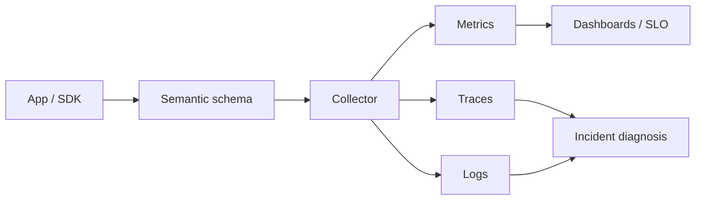

# OpenTelemetry Semantic Conventions, Cardinality & Safe Schema Migration

## Neden önemli?
Observability telemetry'si de versioned bir contract'tır. OpenTelemetry Semantic Conventions trace, metric, log ve resource alanlarında ortak isim/anlam sağlayarak polyglot servislerin aynı dashboard, alert ve incident tooling ile analiz edilmesini kolaylaştırır.

## Mental model

**Invariant:** attribute adı producer implementation detayı değil, downstream consumer contract'ıdır.

## Stable schema migration
Database semantic conventions, eski v1.24.0 veya öncesi instrumentation'lardan stable conventions'a geçiş için `OTEL_SEMCONV_STABILITY_OPT_IN=database`; geçiş sırasında iki şemayı birlikte üretmek için `database/dup` tanımlar. Dual emission dashboard/alert migration'ını güvenli kılar fakat ingest ve storage maliyetini artırır. Messaging conventions hâlen Development durumundadır; schema maturity mutlaka rollout kararına dahil edilmelidir.

## Cardinality ve privacy
Metric label düşük cardinality olmalıdır. User ID, raw URL, query text ve benzersiz destination gibi değerler time-series patlamasına neden olabilir. `db.query.summary` düşük-cardinality grouping için uygundur. Query parameter değerleri PII/secrets içerebilir; default capture edilmemelidir. Zengin/high-cardinality context çoğunlukla sampled trace/log katmanına bırakılır.

## Mülakat soruları
1. Semantic conventions neden gerekir?
2. Metric cardinality neden pahalıdır?
3. Trace attribute ile metric label seçimi nasıl farklıdır?
4. Query text/parameter capture hangi privacy risklerini taşır?
5. Stable schema'ya dashboard kırmadan nasıl geçersin?
6. Dual emission'ın trade-off'u nedir?
7. Staff seviyesinde telemetry governance nasıl kurulur?
8. Principal seviyesinde portability ve vendor-specific deep signals nasıl dengelenir?

## Seviyeye göre cevap
- **Mid:** span/metric/log, attribute, cardinality.
- **Senior:** privacy, sampling, dual-emission migration.
- **Staff:** schema governance, compatibility tests, fleet rollout, telemetry cost.
- **Principal:** SLO/incident response, platform economics ve vendor portability.

## Alıştırma
Checkout servisi için HTTP + DB + messaging telemetry şeması çıkar. 8 düşük-cardinality metric label seç; high-cardinality ve sensitive alanları trace/log'a ayır.

## Proje
`semconv-linter`: exported telemetry'de deprecated attribute, high-cardinality candidate, PII riski ve migration coverage tespit eden CLI.

## Failure modes / production
Raw IDs'i metric label yapmak, schema migration'ını deploy detayı sanmak, downstream dashboard'ları envanterlememek, duplicate emission'ı süresiz bırakmak ve sensitive parametre capture etmek başlıca failure mode'lardır. Active series, ingest bytes, dropped spans, exporter errors, attribute cardinality ve old/new schema adoption izlenmelidir.

## Kaynaklar
- https://opentelemetry.io/docs/concepts/semantic-conventions/
- https://opentelemetry.io/docs/specs/semconv/db/
- https://opentelemetry.io/docs/specs/semconv/db/database-spans/
- https://opentelemetry.io/docs/specs/semconv/messaging/
