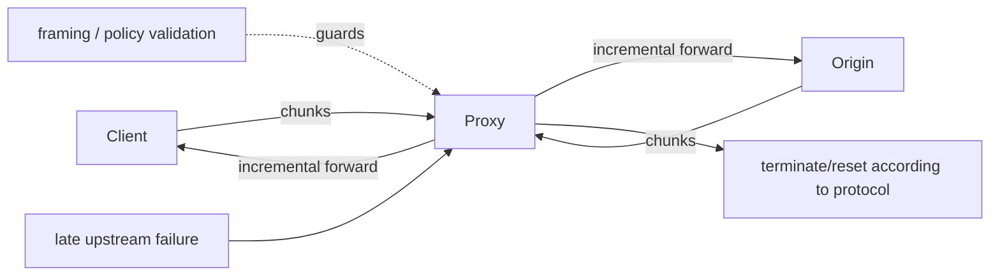

# RFC 10036: HTTP Incremental Forwarding & Streaming Proxy Economics

## Problem
Reverse proxy ve gateway'ler büyük HTTP request/response body'lerini tamamen buffer ederse memory/disk tüketimi ve time-to-first-byte artar. Ağustos 2026 tarihli RFC 10036, HTTP intermediary'lerinin mesajları incremental forward etmesine ilişkin standart davranışı tanımlar. Tasarımın özü yalnız “stream et” değildir: partial forwarding geri döndürülemez olduğu için framing validation, backpressure, retry safety ve application idempotency birlikte ele alınmalıdır.

## Mental model

> Invariant: Downstream'e gönderilmiş message prefix'i geri alınamaz. Late failure sonrası retry/correctness kararı bu gerçeği taşımalıdır.

## Nasıl çalışır?
- Intermediary header'ları parse edip framing'i belirledikten sonra body'yi geldikçe iletebilir; tüm body'yi materialize etmek zorunda değildir.
- Incremental forwarding büyük upload/download'larda TTFB ve buffering footprint'i düşürebilir.
- Hızlı producer + yavaş consumer durumunda bounded queue ve transport flow control gerekir; aksi halde “streaming proxy” fiilen unbounded buffer'a dönüşür.
- Upstream geç aşamada kapanırsa downstream kısmi mesaj görmüş olabilir. HTTP/1.1 connection close ile HTTP/2/HTTP/3 stream-level termination mekanizmaları farklıdır; application yine partial result semantics'ini anlamalıdır.
- Non-idempotent request'in origin'e ulaşıp ulaşmadığı belirsizken otomatik retry duplicate side effect üretebilir. Idempotency key veya operation-level deduplication ayrı bir contract'tır.
- Tam-body malware scan, signature verification, transformation veya size-policy gibi gereksinimler belirli endpoint'lerde buffering ya da staged streaming gerektirebilir.

## Mülakat soruları
1. Proxy neden tüm body'yi buffer etmek istemez?
2. Buffering ile streaming arasındaki memory/latency/correctness trade-off'u nedir?
3. Response'un yarısı downstream'e çıktıktan sonra upstream ölürse ne yaparsın?
4. POST retry'sinin duplicate side effect üretmesini nasıl engellersin?
5. Proxy chain boyunca backpressure nasıl korunur?
6. Security inspection gerektiren endpoint'lerle low-latency streaming'i aynı gateway'de nasıl yönetirsin?

## Seviyeye göre beklenen cevap
- **Mid:** streaming, buffering, framing ve backpressure.
- **Senior:** partial failure, idempotency, retry ve HTTP version termination semantics.
- **Staff:** bounded buffering, admission control, fault injection ve observability.
- **Principal:** gateway fleet policy, compatibility, rollout ve security blast radius.

## Mini alıştırma
2 GB upload'da client 200 MB/s, origin 20 MB/s ve proxy buffer limiti 16 MB. Backpressure mekanizmasını çiz. Origin 1.4 GB'da kapanırsa client davranışını ve retry kararını gerekçelendir.

## Proje fikri
`streaming-proxy-lab`: `buffer-all` ve `incremental` modlu reverse proxy. Maximum buffered bytes, TTFB, throughput ve partial failure davranışını ölç; origin'i body'nin %25/%75 noktasında fault injection ile kapat.

## Failure modes / production
Unbounded buffering, kör non-idempotent retry, partial response'u complete sanmak, body-inspection policy'sini bypass etmek ve slow-consumer backpressure'ını yok saymak tipik hatalardır. Production'da TTFB, buffered bytes, reset/abort rate, partial transfer bytes, retry count, duplicate-operation sinyali ve upstream/downstream throughput izlenmelidir.

## Kaynaklar
- RFC 10036 — Incremental Forwarding of HTTP Messages: https://www.rfc-editor.org/rfc/rfc10036.html
- RFC 9110 — HTTP Semantics: https://www.rfc-editor.org/rfc/rfc9110.html
- RFC 9112 — HTTP/1.1: https://www.rfc-editor.org/rfc/rfc9112.html
- RFC 9113 — HTTP/2: https://www.rfc-editor.org/rfc/rfc9113.html
- RFC 9114 — HTTP/3: https://www.rfc-editor.org/rfc/rfc9114.html
