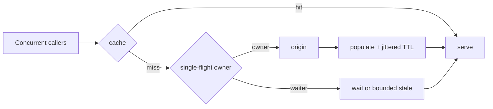

# Cache Stampede, Request Coalescing & Stale-While-Revalidate

## Neden önemli?
Popüler bir cache key aynı anda expire olduğunda çok sayıda request miss görüp origin'e giderse cache bir load amplifier'a dönüşür. Cache stampede, tail latency ve database/API saturation üzerinden cascading failure yaratabilir.

## Mental model

## Temel teknikler
- **Request coalescing / single-flight:** aynı key için bir in-flight loader paylaşılır.
- **Distributed lease:** multi-instance fleet'te `SET NX PX` benzeri atomik ownership ile refill tekilleştirilir.
- **Ownership-safe release:** lock yalnız unique token sahibi tarafından silinir.
- **TTL jitter:** çok sayıda key'in aynı anda expire olmasını azaltır.
- **Early refresh:** expiration yaklaşırken kontrollü refresh yapılır.
- **Stale-while-revalidate:** freshness budget izin veriyorsa eski değer servis edilirken arka planda refresh edilir.
- **Negative caching:** bulunamayan kayıtların origin'e sürekli tekrar sorulmasını sınırlar.

Lock TTL loader süresinden kısa kalırsa ikinci owner doğabilir; aşırı uzun TTL ise crashed owner sonrası availability'yi düşürür. Waiter queue da bounded olmalıdır. Cache correctness source-of-truth değildir; freshness ve origin protection açıkça bütçelenmelidir.

## Mülakat soruları
1. Cache stampede neden oluşur?
2. Process-local single-flight ile distributed lock farkı nedir?
3. Lock TTL nasıl seçilir?
4. TTL jitter hangi problemi azaltır?
5. Stale serving ne zaman kabul edilemez?
6. Negative caching nasıl kullanılır?
7. Staff seviyesinde hot-key detection ve adaptive refresh nasıl tasarlanır?

## Seviyeye göre cevap
- **Mid:** TTL, cache-aside, stampede ve single-flight.
- **Senior:** lock ownership, timeout, jitter, stale budget, negative cache.
- **Staff:** multi-region scope, hot-key telemetry, admission control, origin protection.

## Mini alıştırma
10k RPS alan, tek key'in %20 trafik aldığı ve origin load'un 80 ms sürdüğü sistem için lock TTL, waiter timeout, stale window ve jitter öner. Lock holder crash akışını çiz.

## Proje
`stampede-lab`: naive cache-aside, local single-flight, Redis lease ve stale-while-revalidate modlarını load test ile karşılaştır; origin QPS, p95/p99, waiter ve stale-age metriklerini üret.

## Failure modes / trade-off / production
Lock'suz refill, token'sız unlock, unbounded waiter, aynı TTL, sınırsız stale serving ve yalnız hit-rate izlemek temel hatalardır. İzlenecek sinyaller: per-key miss burst, coalesced waiter, lock contention, origin QPS, refill latency, stale age, timeout ve eviction.

## Kaynaklar
- Redis Cache-aside: https://redis.io/docs/latest/develop/use-cases/cache-aside/
- Redis Cache-aside with Go: https://redis.io/docs/latest/develop/use-cases/cache-aside/go/
- Go `singleflight`: https://pkg.go.dev/golang.org/x/sync/singleflight
