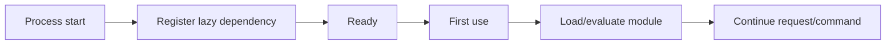

# Python 3.15 Explicit Lazy Imports: Startup vs First-Use Economics

## Konu anlatımı
Python import'u normalde modül gövdesini ilk import anında çalıştırır. Büyük CLI, plugin ve server uygulamalarında kullanılmayan ağır dependency'ler startup ve memory maliyeti yaratabilir. PEP 810 explicit lazy imports, seçilmiş import'ların evaluation maliyetini ihtiyaç anına ertelemeyi hedefler. Temel trade-off: maliyet yok olmaz; startup critical path'inden first-use critical path'ine taşınır.

Python 3.15.0rc2 1 Eylül 2026'da yayımlandı; final 3.15.0 1 Ekim 2026 için planlıdır. RC migration/test hedefidir, production baseline olarak ele alınmamalıdır.

## Mental model

## Internals ve trade-off
- Import graph aynı zamanda startup dependency graph'idir.
- Lazy edge evaluation'ı erteler; dependency hiç kullanılmazsa startup ve RSS kazanımı doğabilir.
- Import-time side effect'e dayalı registration/plugin kodu semantic regression üretebilir.
- Import failure startup yerine canlı request/feature path'inde ortaya çıkabilir.
- First-use p95/p99 ve warmup tasarımı startup benchmark'ı kadar önemlidir.

## Mülakat soruları
1. Import neden startup maliyeti yaratır?
2. Lazy import maliyeti nereye taşır?
3. Import-time side effect neden risklidir?
4. Senior: CLI için aday import'ları nasıl seçersin?
5. Staff: server first-request spike'ını nasıl önlersin?

## Seviye beklentisi
- **Mid:** module evaluation, cache ve startup/first-use ayrımı.
- **Senior:** side effects, failure timing, cold path ve benchmark.
- **Staff:** preload/warmup, fleet rollout, observability ve dependency governance.

## Alıştırma
500 ms startup'ın 250 ms B, 120 ms C import'larından geliyorsa B/C lazy olduğunda ideal startup alt sınırını hesapla. B'nin yalnız %10 komutta kullanıldığı durumda startup ve first-use latency dağılımını ayrı değerlendir.

## Proje
`lazy-import-profiler`: eager/lazy CLI/API varyantlarında startup, RSS, first-use p50/p99 ve import failures ölç; side-effect plugin ile regression testi ekle.

## Production failure modes
Her import'u lazy yapmak, first-request SLO'yu bozmak, side-effect registration'ı unutmak ve prerelease runtime'ı production baseline sanmak tipik hatalardır. Startup, cold-request p95/p99, RSS, import errors ve warmup süresi izlenmelidir.

## Kaynaklar
- https://www.python.org/downloads/release/python-3150rc2/
- https://peps.python.org/pep-0810/
- https://www.python.org/getit/
