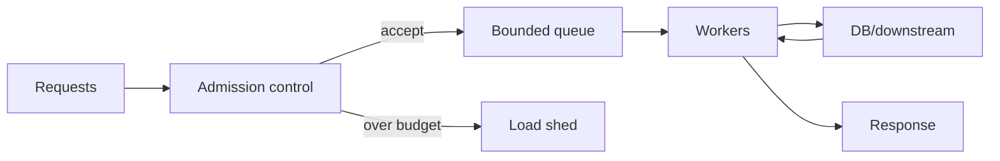

# Admission Control, Bounded Concurrency ve Overload Collapse

## Temel fikir
Backpressure sistemin kabul ettiği işi kapasiteye göre sınırlamaktır. Queue, worker, memory, DB connection ve downstream QPS sınırlı kaynaklardır. Request'i kabul etmek bu kaynaklar üzerinde gelecekteki yükü kabul etmek demektir.

Sınırsız queue kapasite değildir. Queue büyüdükçe queue-wait artar; deadline aşılır, client retry eder, retry offered load'u daha da artırır ve useful throughput düşebilir.

## Tasarım araçları
- **Concurrency limit/semaphore:** aynı anda kullanılan kıt resource miktarını sınırlar.
- **Rate limiter:** zaman başına kabul edilen work miktarını sınırlar.
- **Bounded queue:** kısa burst absorbe eder fakat maksimum beklemeyi kontrol altında tutar.
- **Deadline/timeout budget:** iş artık SLO içinde tamamlanamayacaksa erken vazgeçmeyi sağlar.
- **Load shedding:** overload altında yeni işi reddederek mevcut useful work'ü korur.
- **Retry budget + backoff/jitter:** recovery sırasında retry amplification'ı sınırlar.
- **Priority/fairness:** kritik endpoint/tenant'ların ortak bottleneck'i monopolize etmesini engeller.

## Mülakat senaryosu
API normalde 5k RPS, spike'ta 15k RPS görüyor. DB 300 concurrent query sonrasında p99'u keskin yükseltiyor. Uygulama 2.000 request queue tutuyor; client 1 saniye timeout sonrası üç kez retry ediyor.

İyi cevap önce bottleneck'i DB concurrency/latency curve ile tanımlar. DB pool'u resource semaphore olarak kullanır, queue'yu sınırlar, queue-wait deadline uygular, retry budget/jitter ekler ve DB bottleneck varken app autoscaling'in tek başına çözüm olmadığını belirtir.

## Queue neden kapasite değildir?
Queue servis hızını artırmaz; arrival ile service arasındaki farkı zamana yayar. Sustained overload'da backlog büyür. Bu nedenle queue capacity, deadline ve shedding policy birlikte tasarlanmalıdır.

## Connection pool
Connection pool yalnız connection creation optimization değildir. DB'nin kaldırabileceği concurrency için doğal bir admission boundary olabilir. Pool'u büyütmek DB throughput'unu her zaman artırmaz; saturation sonrasında latency yükselip throughput sabit kalabilir veya düşebilir.

## Retry amplification
Bir timeout downstream işi iptal etmiyorsa ilk request hâlâ çalışırken retry yeni iş ekleyebilir. Çok katmanlı retry daha da tehlikelidir. Retry yalnız transient failure varsayımı ve budget ile kullanılmalıdır.

## Mülakat soruları
1. Queue neden kapasite değildir?
2. Semaphore ve rate limiter farkı nedir?
3. Connection pool neden resource-control aracıdır?
4. Retry storm nasıl oluşur?
5. Deadline propagation neden önemlidir?
6. Tenant fairness nasıl eklenir?
7. Overload policy ürün tier/SLO/cost ile nasıl bağlanır?

## Alıştırma
DB güvenli concurrency'si 250 ve average query 40 ms ise Little's Law sezgisiyle kaba throughput sınırını hesapla. Query süresi saturation altında 200 ms olduğunda aynı concurrency'nin throughput ve queue etkisini tartış.

## Proje
`overload-lab`: sınırlı DB simulator arkasında API kur. Unbounded queue, bounded queue, semaphore admission ve shedding varyantlarını open-loop load altında karşılaştır. p99, rejection rate, useful throughput ve retry amplification ölç.

## Failure modes
- Queue'yu sonsuz büyütmek.
- Timeout sonrası server-side işi iptal etmemek.
- Retry budget kullanmamak.
- Tüm traffic'i aynı priority saymak.
- Autoscaling'i downstream capacity'den bağımsız yapmak.

Production metrikleri: admitted/rejected rate, queue wait, in-flight, pool utilization, downstream p99, timeout, cancellation ve retry amplification.

## Kaynaklar
- https://sre.google/sre-book/handling-overload/
- https://sre.google/sre-book/addressing-cascading-failures/
- https://aws.amazon.com/builders-library/timeouts-retries-and-backoff-with-jitter/
