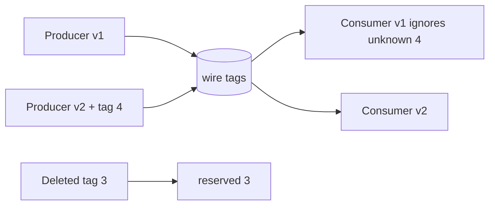

# Schema Evolution & Protobuf Wire Compatibility

## Neden önemli?
Producer ve consumer aynı anda deploy edilmez; rollback de mümkündür. Schema evolution eski ve yeni binary'lerin bir süre birlikte çalışmasını güvenli tutma problemidir. Protocol Buffers binary wire format field identity için field number/tag kullanır; bu nedenle tag lifecycle'ı API governance'ın parçasıdır.

## Mental model

## Wire modeli
Binary message key-value records taşır; key field number ve wire type'tan oluşur. Eski parser yeni unknown field'ı atlayabildiği için additive field değişiklikleri rolling deployment için elverişlidir. Ancak existing field number değiştirmek wire-unsafe'tır. Silinen field numarası yeni semantikle tekrar kullanılmamalı, `reserved` edilmelidir.

## Wire compatibility != semantic compatibility
Parser'ın bytes'ı okuyabilmesi uygulamanın aynı anlamı koruduğu anlamına gelmez. Default/presence davranışı, enum interpretation, validation, units veya business invariant değişiklikleri binary olarak okunabilirken semantic break yaratabilir. JSON/TextFormat kuralları da binary wire format'tan farklıdır.

## Mülakat soruları
1. Backward ve forward compatibility nedir?
2. Field number neden değiştirilmez/reuse edilmez?
3. Unknown fields rolling deploy'u nasıl destekler?
4. Silinen field neden reserve edilir?
5. Wire-compatible ama semantic-breaking değişikliğe örnek ver.
6. Schema registry ve CI compatibility gate nasıl tasarlanır?
7. Producer-first/consumer-first rollout nasıl seçilir?

## Beklenen cevap seviyesi
- **Mid:** tags, additive fields, unknown fields, reserve.
- **Senior:** wire-safe/compatible/unsafe, presence/default ve rollback matrix.
- **Staff:** schema registry, contract tests, compatibility policy ve multi-team governance.

## Mini alıştırma
`User { string name = 1; int32 age = 2; }` içinden `age` kaldırıp `birth_year` ekle. Tag 2'yi reserve eden v2 tasarla; v1/v2 producer-consumer matrisini test planına dönüştür.

## Proje fikri
`schema-evolution-lab`: v1/v2/v3 Protobuf definitions, golden bytes ve cross-version tests oluştur. CI'da tag reuse ve unsafe change'leri reject et; rollback kombinasyonunu ayrıca test et.

## Failure modes / production
Field number reuse, yalnız latest/latest test etmek, binary ve JSON compatibility'yi karıştırmak, semantic validation change'ini schema-safe saymak ve stored historical messages'i hesaba katmamak. Decode failures, invalid/unknown enum davranışı, version adoption ve rollback success izlenmelidir.

## Kaynaklar
- Protocol Buffers — Language Guide / Updating a Message Type: https://protobuf.dev/programming-guides/proto3/#updating
- Protocol Buffers — Encoding: https://protobuf.dev/programming-guides/encoding/
- Protocol Buffers — Best Practices: https://protobuf.dev/best-practices/dos-donts/
