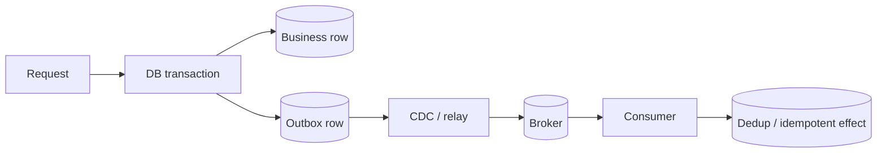

# Transactional Outbox, CDC & Exactly-Once Boundaries

## Konu anlatımı
Bir request hem relational database state'ini değiştirip hem message broker'a event publish ediyorsa klasik dual-write problemi doğar: DB commit olup publish başarısız olabilir veya event publish olup DB rollback olabilir. Transactional outbox bu iki side effect'i tek distributed transaction'a zorlamak yerine business row ile outbox row'u aynı local database transaction'ında yazar. Ayrı relay/CDC katmanı committed outbox kayıtlarını broker'a taşır.

Bu pattern “dünyada exactly once” sağlamaz. Relay crash/retry nedeniyle event duplicate olabilir; consumer'ın idempotent/dedup davranması gerekir. Kafka transaction'ları Kafka içindeki output records + consumed offsets gibi belirli sınırları atomik hale getirebilir, fakat harici database/API side effect'lerini otomatik olarak aynı transaction'a katmaz.

## İçeride ne oluyor?
- Business mutation + outbox INSERT aynı ACID transaction'da commit edilir.
- CDC/relay yalnız committed outbox change'lerini publish eder.
- Stable event ID duplicate detection için kullanılabilir.
- Aggregate ID'nin message key olması per-aggregate ordering'e yardımcı olabilir.
- Relay at-least-once davranabilir; publish sonrası crash aynı event'in yeniden gönderilmesine yol açabilir.
- Consumer side effect'i idempotent değilse inbox/dedup table veya natural idempotency key gerekir.
- Outbox retention/cleanup CDC lag ve replay ihtiyacıyla koordine edilmelidir.

## Mülakat soruları
1. Dual-write problemi nedir?
2. Transactional outbox neden 2PC gerektirmez?
3. Outbox duplicate event'i tamamen engeller mi?
4. Event ID ve aggregate ID'nin rolleri nasıl ayrılır?
5. Publish başarılı fakat relay checkpoint yazamadan crash olursa ne olur?
6. Outbox cleanup ile CDC lag arasında hangi invariant gerekir?
7. “Exactly once” iddiasının transaction boundary'sini nasıl açıkça tanımlarsın?

## Beklenen cevap seviyesi
- **Mid:** local transaction + outbox + relay mental modeli.
- **Senior:** duplicates, idempotency, ordering, retries ve cleanup.
- **Staff:** CDC operations, schema evolution, lag/backpressure ve replay.
- **Principal:** cross-system correctness contract, exactly-once boundary, compliance/audit ve platform standardization.

## Mini alıştırma
Order service DB'ye `PAID` yazıyor ve `OrderPaid` event'i yayımlıyor. Şu crash noktalarını tek tek analiz et: transaction commit öncesi; commit sonrası CDC görmeden; broker ack sonrası relay checkpoint öncesi; consumer effect sonrası offset commit öncesi. Her biri için expected retry/dedup davranışını yaz.

## Proje fikri
`outbox-cdc-lab`: PostgreSQL'de `orders` + `outbox` tablolarını aynı transaction'da güncelle. Relay'e intentional crash points ekle. Event ID ile consumer dedup uygula; duplicate rate, publish lag ve outbox backlog metriklerini çıkar.

## Production bağlantısı / failure modes
Outbox ile exactly-once'u eşitlemek, unstable event IDs, aggregate ordering'i yok saymak, cleanup'ın lagging CDC'den veri silmesi, poison event'in relay'i durdurması ve consumer idempotency'sini test etmemek tipik hatalardır. Production'da oldest-outbox age, CDC lag, publish retry/duplicate count, dead-letter rate, consumer dedup hits ve end-to-end event latency izlenir.

## Kaynaklar
- Debezium Outbox Event Router: https://debezium.io/documentation/reference/transformations/outbox-event-router.html
- Apache Kafka Design — transactions/exactly-once boundary: https://kafka.apache.org/41/design/design/
