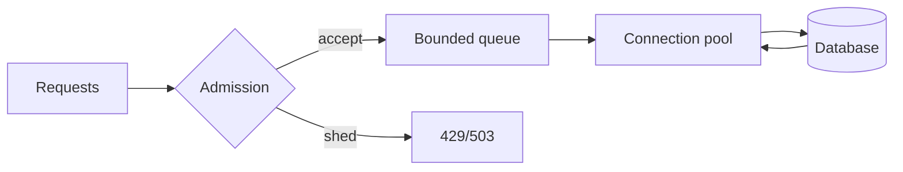

# Database Connection Pools, Queueing & Admission Control

## Konu anlatımı
Connection pool hem connection reuse hem de database'e girecek eşzamanlı işi sınırlayan capacity boundary'dir. Pool'u request concurrency kadar büyütmek çoğu zaman yanlış mental modeldir: database'in verimli active-query concurrency'si CPU, I/O, locks, working set ve query mix ile sınırlıdır.

Little's Law `L = λW` sezgisiyle servis süresi uzadığında aynı arrival rate daha fazla in-flight iş üretir. Pool dolduğunda bounded wait queue + acquisition deadline + explicit rejection overload'u görünür ve sınırlı tutar; unbounded queue ise problemi memory ve tail latency'ye dönüştürür.

## Mental model
Pool bir otoparktır; DB gerçek yol kapasitesidir. Daha çok park yeri açmak yol throughput'unu otomatik artırmaz. Optimize edilen sayı connection sayısı değil, SLO içinde tamamlanan yararlı iştir.

## İçeride ne oluyor?
- Idle connection lease edilir; yoksa caller bounded queue'da bekler.
- Acquire timeout, request deadline budget'ının parçasıdır.
- Uzun transaction connection hold time'ı büyütür ve effective capacity'yi düşürür.
- PostgreSQL `max_connections` değerine göre bazı kaynakları doğrudan boyutlandırır; limitsiz büyütmek bedelsiz değildir.
- Fleet autoscaling'de `pods × pool_size` global DB budget'ını aşabilir.
- Transaction pooling/proxy connection multiplexing sağlayabilir; session-scoped semantics ayrıca değerlendirilmelidir.

## Mülakat soruları
1. Pool neden admission control'dür?
2. Pool size neden thread/goroutine sayısına eşit değildir?
3. Acquire timeout ve query timeout farkı?
4. DB latency artınca queue neden hızla büyür?
5. Büyük pool throughput'u nasıl düşürebilir?
6. Staff: 50 pod için global connection budget nasıl paylaştırılır?
7. Principal: shed/retry/autoscaling/SLO policy'si nasıl birlikte tasarlanır?

## Beklenen cevap seviyesi
- **Mid:** reuse, bounded size, timeout, leak.
- **Senior:** queueing, Little's Law, transaction duration, contention, p99.
- **Staff:** fleet budget, tenant fairness, proxy semantics, retry amplification.
- **Principal:** capacity envelope, SLO/error budget ve topology economics.

## Mini alıştırma
120 güvenli DB connection budget'ından 20 operasyonel reserve ayır. 12 pod için başlangıç pool limitini hesapla; 40 pod'a autoscale olunca global budget'ın nasıl korunacağını tasarla.

## Proje fikri
`pool-pressure-lab`: PostgreSQL + HTTP API üzerinde pool 5/20/100 ile load test; throughput, p99, acquire wait, active sessions, CPU ve lock waits karşılaştır.

## Failure modes / trade-off / production bağlantısı
Connection leak starvation; uzun transaction capacity loss; unbounded queue latency explosion; autoscaling connection storm; aşırı küçük pool under-utilization yaratabilir. Pool active/idle/waiters, acquisition latency/timeouts, transaction duration, DB CPU, locks ve query p99 birlikte izlenmelidir.

## Kaynaklar
- PostgreSQL 17 — Connections and Authentication: https://www.postgresql.org/docs/17/runtime-config-connection.html
- PostgreSQL — `pg_stat_activity`: https://www.postgresql.org/docs/current/monitoring-stats.html#MONITORING-PG-STAT-ACTIVITY-VIEW
- Google SRE — Addressing Cascading Failures: https://sre.google/sre-book/addressing-cascading-failures/
