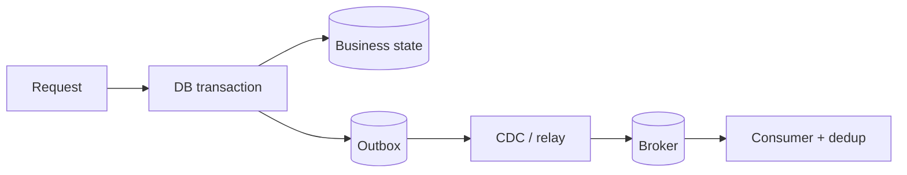

# Transactional Outbox, CDC & Exactly-Once Boundaries

## Konu anlatımı
Database state değişikliği ile broker publish'i iki bağımsız write olarak yapılırsa dual-write failure doğar. Transactional outbox, business mutation ile outbox event kaydını aynı local ACID transaction'a koyar. CDC/relay committed outbox kayıtlarını broker'a taşır.

Bu pattern global exactly-once sağlamaz. Relay retry duplicate üretebilir; consumer idempotent/deduplicating olmalıdır. Kafka transactions gibi mekanizmalar belirli Kafka sınırlarında records ve offsets'i atomik yapabilir, fakat harici DB/API side effect'lerini kendiliğinden aynı transaction'a dahil etmez.

## İçeride ne oluyor?
- Business row + outbox INSERT aynı transaction'da commit edilir.
- Relay yalnız committed outbox değişikliklerini publish eder.
- Stable event ID duplicate detection sağlar.
- Aggregate ID broker key olarak per-aggregate ordering'e yardımcı olabilir.
- Publish sonrası relay crash duplicate delivery yaratabilir.
- Consumer idempotency için inbox/dedup table veya natural idempotency key kullanılabilir.
- Cleanup policy CDC lag/replay window ile koordineli olmalıdır.

## Mülakat soruları
1. Dual-write problemi nedir?
2. Outbox neden 2PC gerektirmez?
3. Duplicate delivery neden hâlâ mümkündür?
4. Event ID ve aggregate ID farkı nedir?
5. Senior: publish ack sonrası relay crash olursa ne olur?
6. Staff: cleanup/CDC lag invariant'ı nedir?
7. Principal: exactly-once boundary nasıl tanımlanır?

## Beklenen cevap seviyesi
- **Mid:** local transaction, outbox ve relay.
- **Senior:** duplicates, idempotency, ordering ve retry.
- **Staff:** CDC operations, lag/backpressure, schema evolution ve replay.
- **Principal:** cross-system correctness contract, compliance ve platform standardization.

## Mini alıştırma
`OrderPaid` akışında commit öncesi, commit sonrası CDC öncesi, broker ack sonrası checkpoint öncesi ve consumer effect sonrası offset commit öncesi crash noktalarını analiz et.

## Proje fikri
`outbox-cdc-lab`: PostgreSQL `orders` + `outbox`, crash-injected relay ve event-ID consumer dedup ile duplicate rate, publish lag ve backlog ölç.

## Production bağlantısı / failure modes
Outbox'ı exactly-once sanmak, unstable IDs, ordering'i yok saymak, lagging CDC'den önce cleanup yapmak ve poison event'i yönetmemek tipik hatalardır. Oldest-outbox age, CDC lag, retry/duplicate count, DLQ rate, dedup hits ve end-to-end latency izlenmelidir.

## Kaynaklar
- Debezium Outbox Event Router: https://debezium.io/documentation/reference/transformations/outbox-event-router.html
- Apache Kafka Design — transactions: https://kafka.apache.org/41/design/design/
