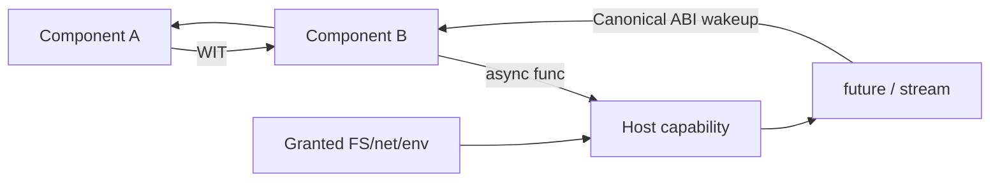

# WASI 0.3 Native Async, Component Model & Capability Boundaries

## Neden önemli?
Core WebAssembly taşınabilir compute sağlar; Component Model ise farklı dillerdeki parçaları typed ve versionlanabilir interface'lerle compose etmeyi hedefler. WIT interface/world contract'ı tanımlar, Canonical ABI dil/runtime representation farklarını component sınırında standardize eder.

WASI 0.3.0 11 Haziran 2026'da yayımlandı; 0.3.1 11 Ağustos 2026'da geldi. 0.3, WASI 0.2'deki `wasi:io`/`pollable` yaklaşımının yerine Component Model'e native `async func`, `stream<T>` ve `future<T>` primitives ekler. Özellikle `A → B → Host` zincirlerinde readiness/wakeup propagation'ın ara component polling glue code'una bağımlılığını azaltır.

## Mental model

## İçeride ne oluyor?
- WIT `interface` typed API'yi, `world` import/export yüzeyini tanımlar.
- Binding generator WIT'i dil tiplerine map eder; Canonical ABI lift/lower mekaniklerini standardize eder.
- `async func` suspend/resume edilebilir çağrıyı contract'a taşır.
- `future<T>` tek gelecek değeri, `stream<T>` typed async akışı component sınırından geçirir.
- WASI 0.3'te eski `wasi:io` paketi kaldırılır; native async runtime/ABI seviyesine taşınır.
- 0.2 ve 0.3 birlikte host edilebilir; 0.2 interface'leri 0.3 üzerinde virtualize/polyfill edilebilir.
- Host capability'leri explicit policy'dir; interface talebi filesystem/network/env erişimini otomatik vermez.
- Runtime, bindgen ve WIT version pinning artifact compatibility'sinin parçasıdır.

## Mülakat soruları
1. Core module ile Component Model component farkı nedir?
2. WIT interface/world neyi çözer?
3. WASI 0.2 pollable modeli component zincirinde neden zorlaşır?
4. `async func`, `future<T>`, `stream<T>` farkları nelerdir?
5. Senior: plugin platformunda least-privilege host capability nasıl tasarlanır?
6. Staff: 0.2 → 0.3 migration ve compatibility test stratejisi nedir?
7. Principal: Wasm component boundary'sini container/microservice ile hangi kriterlerle karşılaştırırsın?

## Seviye beklentisi
- **Mid:** module/component, WIT/world ve capability ayrımını bilir.
- **Senior:** Canonical ABI, async composition ve resource lifecycle'ını bağlar.
- **Staff:** mixed-version fleet, pinning, rollout, telemetry ve resource limits tasarlar.
- **Principal:** portability, security, platform economics ve organizational SDK strategy'ye bağlar.

## Mini alıştırma
`A → B → object-store host` zincirinde 0.2 pollable readiness relay ile 0.3 native async akışını karşılaştır. A/B için minimum host capability setini yaz.

## Proje
İki farklı dilde component'i WIT interface ile bağla; Wasmtime üzerinde minimum capability ver. 0.2/0.3 varyantlarında cold-start, memory, latency ve failure telemetry'sini ölç.

## Failure modes / trade-off / production
Version mismatch instantiation failure yaratabilir. Geniş host imports sandbox değerini düşürür. Async sınırsız concurrency değildir; slow stream consumer backpressure/memory baskısı üretir. Resource limit olmadan untrusted component noisy-neighbor olabilir. Load/instantiate failure, version distribution, in-flight async, backlog, host-call latency, memory/fuel termination ve denied-capability event'leri izlenmelidir.

## Kaynaklar
- WASI Releases: https://wasi.dev/releases
- WASI 0.3: https://wasi.dev/releases/wasi-p3
- Component Model async: https://component-model.bytecodealliance.org/design/async.html
- Wasmtime components: https://component-model.bytecodealliance.org/running-components/wasmtime.html
