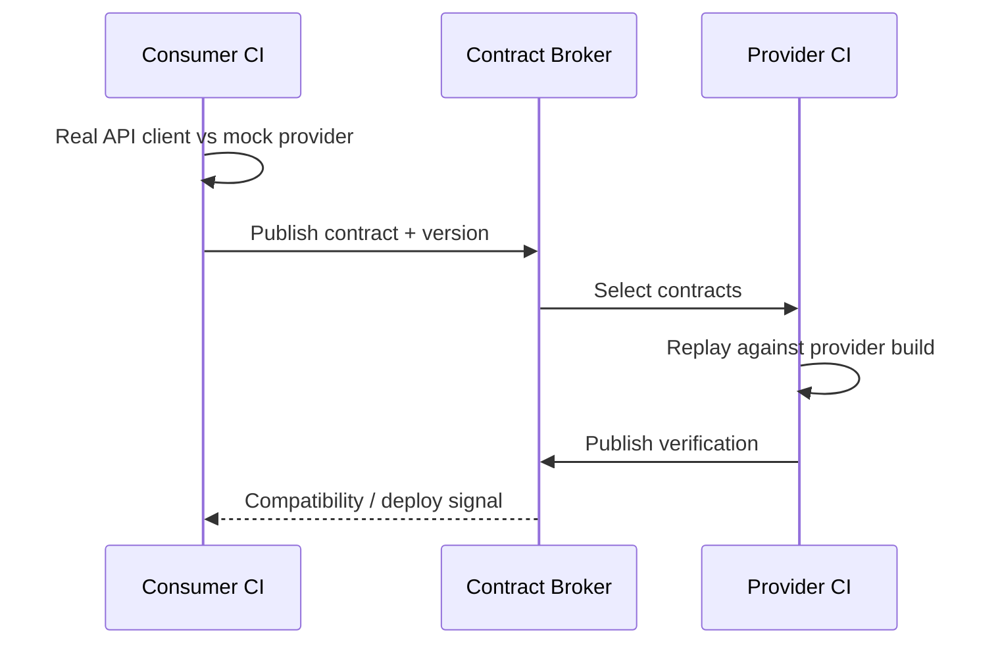

# Consumer-Driven Contract Testing: Provider Verification ve CI Gates

## Problem
Unit test bir component'in lokal davranışını, integration/E2E test ise daha geniş çalışan sistemi doğrular. Bağımsız deploy edilen servislerde sık kırılan sınır şudur: **consumer'ın kullandığı interface davranışı provider'ın yeni build'inde hâlâ compatible mı?** Consumer-driven contract testing (CDC) bu sınırı executable artifact ve provider verification ile erkenden doğrular.

## Mental model

Schema menüdür; consumer contract belirli müşterinin gerçekten sipariş ettiği davranışların çalışan sözleşmesidir. E2E ise bütün restoranı aynı anda sınar.

## Temel akış
1. Consumer test gerçek API client/data-access kodunu kullanır.
2. Mock provider expected interaction'ları sunar ve test request/response beklentisini doğrular.
3. Başarılı consumer test contract artifact üretir.
4. Contract consumer version bilgisiyle broker/artifact store'a yayınlanır.
5. Provider CI ilgili contract'ları alır ve gerçek provider build'ine replay eder.
6. Provider state kontrollü hazırlanır; response contract beklentisiyle karşılaştırılır.
7. Verification sonucu version metadata'sıyla yayınlanır.
8. Deployment gate hedef consumer/provider kombinasyonunun doğrulanmış olup olmadığını kontrol eder.

## Neden yalnız OpenAPI/schema validation değil?
Schema tüm olası resource shape'lerini tanımlayabilir; CDC consumer'ın gerçekten bağımlı olduğu concrete interaction'ları executable test olarak ifade eder. Schema-compatible bir değişiklik consumer semantiğini yine kırabilir; tersine consumer'ın hiç kullanmadığı provider alanındaki değişiklik gereksiz yere deploy'u durdurmamalıdır.

İyi tasarımda ikisi birlikte kullanılabilir:
- schema/spec: geniş interface governance ve tooling;
- CDC: gerçek consumer usage compatibility;
- provider functional tests: business logic doğruluğu;
- az sayıda E2E: gerçek multi-service wiring/workflow.

## Contract test neyi kanıtlamaz?
Provider'ın bütün business logic'inin doğru olduğunu kanıtlamaz. Network policy, auth infrastructure, TLS, gerçek database migration, latency/SLO ve bütün multi-service workflow'u tek başına test etmez. Contract testin oracle'ı iki tarafın interface beklentisinin uyumudur.

## Matchers ve brittleness
Exact fixture value'larını gereksiz yere contract'a kilitlemek brittle test üretir. Consumer için yalnız type/pattern önemliyse matcher bunu ifade etmelidir. Ancak aşırı gevşek matcher da gerçek breaking change'i kaçırır. Kural: **consumer'ın davranışı için gerekli olanı sıkı, geri kalanını mümkün olduğunca esnek tut.**

## Provider states
Provider verification deterministic state ister: örneğin `user 42 exists` veya `order is cancelled`. Provider-state setup test fixture'ını hazırlar; contract business setup detayını taşımamalıdır. Nondeterministic shared environment CDC suite'ini flaky yapar ve güveni azaltır.

## Versioning ve deployment gates
Sadece “latest contract passes” yeterli değildir. Gerçekte aynı anda production'da birden çok consumer/provider version olabilir. Broker/CI politikası branch/environment/version metadata'sıyla hangi kombinasyonların deploy edilebilir olduğunu belirlemelidir. Amaç her servisi lockstep release'e zorlamak değil, independent deployment güvenini artırmaktır.

## Async/event-driven contracts
HTTP request/response yerine producer/consumer message sınırı vardır. Payload, metadata ve event type/version compatibility test edilir. CDC burada schema registry/backward-forward compatibility politikasını tamamlayabilir; event'in business effect'ini uçtan uca kanıtlamaz.

## Failure modes
- Test gerçek consumer client yerine test içinde yeniden yazılmış HTTP request kullanır → consumer bug'ı görünmez.
- Her field exact eşleştirilir → harmless provider değişiklikleri deploy'u durdurur.
- Yalnız happy path vardır → error/null/optional semantics kırılır.
- Provider state shared/nondeterministic → flaky verification.
- Contract artifact version metadata'sı zayıf → yanlış build kombinasyonuna güvenilir.
- CDC bütün E2E/integration testlerin yerine konur → infrastructure ve workflow riskleri kapsanmaz.

## Test piramidinde yeri
Contract testler hızlı ve servis sınırına odaklı oldukları için geniş E2E suite ihtiyacını azaltabilir; fakat unit/provider functional tests ve kritik smoke E2E'ler kalır. Test suite'i “kaç test var?” yerine failure isolation, feedback latency ve production risk coverage açısından tasarla.

## Mülakat soruları
1. Contract test unit/integration/E2E'den nasıl farklıdır?
2. Consumer-driven ne demektir?
3. Schema ile executable contract farkı?
4. Provider verification nasıl çalışır?
5. Matcher ne zaman exact value'dan iyidir?
6. Provider state neden gereklidir?
7. Staff: çok consumer'lı provider için deployment gate ve version policy nasıl kurulur?
8. Staff: async event contract'ını schema compatibility ile nasıl birlikte yönetirsin?

## Seviyeye göre beklenen cevap
- **Junior:** consumer/provider ve breaking change kavramı.
- **Mid:** mock provider, generated contract, provider verification ve CI akışı.
- **Senior:** provider states, matcher brittleness, async contracts, test-scope sınırları.
- **Staff:** broker governance, deployment gate, version/branch strategy, ownership ve flaky-test izolasyonu.

## Kısa alıştırma
Consumer `GET /users/{id}` response'unda yalnız `id`, `name`, `status` kullanıyor. Provider `email` ekliyor, `status` enum değerini yeniden adlandırıyor ve `name` alanını nullable yapıyor. Consumer davranışına göre hangi değişikliklerin contract'ı kırması gerektiğini yaz; exact matcher yerine hangi alanlarda type/pattern matcher kullanacağını açıkla.

## Proje fikri
`contract-gate-lab`: iki küçük servis oluştur. Consumer gerçek API client testinden Pact contract üretip broker'a yayınlasın. Provider CI verification çalıştırsın. Breaking response değişikliğiyle gate'i kır; sonra backward-compatible migration ile tekrar geçir. Bir kritik E2E smoke testi ekleyerek CDC'nin kapsamadığı wiring riskini göster.

## Production bağlantısı
CDC en çok bağımsız release yapan çok servisli organizasyonlarda değer üretir. Breaking change'i shared staging ortamında geç keşfetmek yerine consumer/provider CI sınırında yakalar; böylece feedback süresini ve merkezi E2E suite'e bağımlılığı azaltır. Başarı metriği contract sayısı değil, kaç interface regression'ının deploy öncesi lokal ve güvenilir biçimde yakalandığıdır.

## Kaynaklar
- Pact — Consumer Driven Contracts: https://docs.pact.io/
- Pact — Consumer tests: https://docs.pact.io/consumer
- Pact — Provider verification: https://docs.pact.io/getting_started/verifying_pacts
- Pact Broker: https://docs.pact.io/pact_broker
- Testcontainers: https://testcontainers.com/
