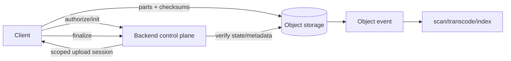

# Object Storage: Multipart Upload, Checksums & Direct-to-Storage Architecture

## Neden önemli?
Büyük dosyayı API server üzerinden tek request ile proxy etmek timeout, memory, bandwidth ve retry maliyetini uygulama katmanına taşır. Daha ölçeklenebilir model control plane ile data plane'i ayırır: backend authorization/policy/session yönetir; byte'lar istemciden doğrudan object storage'a gider.

## Mental model
Backend hava trafik kontrolüdür; kargo uçağı değildir. Multipart upload parçalara ayrılmış sevkiyat, completion manifest commit'idir. Checksum bütünlük kanıtıdır; authorization değildir.

## Multipart lifecycle
1. Backend object key/policy üretir ve minimum yetkili, kısa ömürlü upload capability verir.
2. Client part'ları paralel yollar; başarısız part bağımsız retry edilir.
3. Part veya full-object checksum ile transfer integrity doğrulanır.
4. Completion part sırasını commit edip nesneyi görünür hale getirir.
5. Incomplete upload'lar storage tüketebilir; abort/lifecycle cleanup gerekir.
6. Finalize endpoint idempotent olmalı; async scan/transcode/index state machine'i user-visible readiness'ten ayrılmalıdır.

## Checksum ve ETag
ETag'i evrensel full-object MD5 olarak yorumlama. Amazon S3 multipart nesnelerde ETag tüm nesnenin doğrudan MD5'i değildir. Güncel S3 dokümantasyonu full-object ve composite checksum türlerini ve CRC/SHA/MD5/XXHash seçeneklerini ayrı tanımlar. Integrity doğrulaması seçilen checksum contract'ına dayanmalıdır.

## Mülakat soruları
- Neden büyük dosyayı API server üzerinden proxy etmek istemezsin?
- Multipart upload throughput ve retry davranışını nasıl değiştirir?
- ETag neden full-object MD5 varsayımı için güvenli değildir?
- Scoped/presigned upload capability hangi constraint'leri taşımalıdır?
- Orphan multipart upload nasıl temizlenir?
- Staff: completion, malware scan ve publish state'i nasıl idempotent tasarlarsın?

## Failure modes / trade-off
Küçük part request overhead'ini, büyük part retry maliyetini artırır. Sınırsız concurrency throttling yaratır. Uzun URL/session TTL abuse window'u; aşırı kısa TTL ise yenileme karmaşıklığı yaratır. Completion ile downstream processing arasındaki crash duplicate event ve yarım state doğurabilir; durable state machine/idempotent consumer gerekir.

## Production bağlantısı
Completion rate, orphan bytes, checksum mismatch, part retry, upload p95/p99, storage/API throttling, egress, scan backlog ve publish latency izle. Quota, content-size/type policy ve object-key authorization backend control plane'de uygulanmalıdır.

## Kısa alıştırma
20 GiB video için 64 MiB part yaklaşık 320 part eder. Concurrency=8 için retry/backoff, checksum, resume manifest ve abort policy tasarla.

## Proje
`multipart-upload-lab`: initiate/upload-part/complete akışı; parallel client, checksum, retry/resume manifest, backend quota ve idempotent finalize.

## Kaynaklar
- Amazon S3 Multipart Upload: https://docs.aws.amazon.com/AmazonS3/latest/userguide/mpuoverview.html
- Amazon S3 Object Integrity: https://docs.aws.amazon.com/AmazonS3/latest/userguide/checking-object-integrity-upload.html
- Amazon S3 Presigned URLs: https://docs.aws.amazon.com/AmazonS3/latest/userguide/using-presigned-url.html
