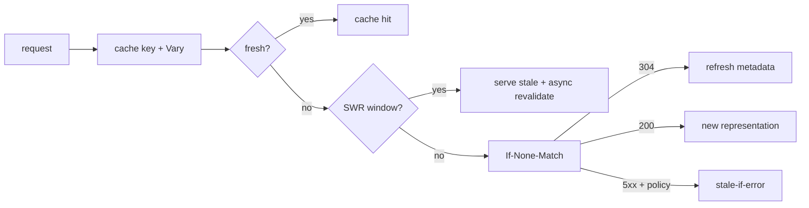

# HTTP Cache Revalidation, ETag, Vary & Stale Controls

## Neden önemli?
HTTP caching yalnız TTL değildir. Correctness için cache key/representation seçimi, freshness ve stale olduğunda validation/fallback ayrı tasarlanmalıdır. RFC 9111 freshness ve validation modelini; RFC 5861 ise kontrollü stale servis mekanizmalarını tanımlar.

## Mental model

## Temel mekanik
- `max-age` response'un normal freshness penceresini tanımlar; shared cache için `s-maxage` daha özel olabilir.
- `Age`, response üretiminden beri geçen süreyi freshness hesabına taşır.
- `ETag` representation validator'dır. `If-None-Match` ile revalidation sonucu değişiklik yoksa `304 Not Modified` dönebilir.
- `Vary`, URL dışında representation seçimini etkileyen request header'larını cache key'e dahil ettirir.
- Eksik `Vary` yanlış varyant servis edebilir; aşırı `Vary` fragmentation ve düşük hit ratio üretir.
- `stale-while-revalidate` kısa stale pencere boyunca response'u hızlı servis edip revalidation'ı arka planda yapabilir.
- `stale-if-error` belirli upstream hata durumlarında stale response ile availability'yi koruyabilir.

## Mülakat soruları
1. `no-cache` ve `no-store` neden aynı değildir?
2. ETag/If-None-Match bandwidth'i nasıl azaltır?
3. `Vary` correctness ve hit ratio'yu nasıl etkiler?
4. SWR tail latency'yi nasıl düşürür?
5. stale-if-error hangi domain'lerde risklidir?
6. Revalidation ile cache stampede nasıl etkileşir?
7. CDN/browser/service cache katmanlarında freshness contract'ını nasıl standardize edersin?

## Seviyeye göre cevap
- **Mid:** fresh/stale, max-age, ETag/304.
- **Senior:** Vary, shared/private cache, SWR/SIE, stampede.
- **Staff:** multi-layer key, purge/versioning, correctness testing ve observability.
- **Principal:** endpoint sınıfına göre freshness/availability policy ve organization-wide cache contract.

## Mini alıştırma
Katalog 60 sn stale olabilir, fiyat 5 sn, checkout stock fresh olmalı. Her endpoint için Cache-Control, validator ve stale fallback politikasını tasarla.

## Proje
`http-cache-lab`: ETag üreten origin + reverse proxy kur. `max-age`, `Vary: Accept-Language`, SWR ve SIE için origin request count, bytes, p95/p99 ve stale-served oranını ölç. Yanlış `Vary` ile bilinçli correctness bug üret ve testle yakala.

## Failure modes / trade-off / production
- Yanlış cache key tenant/user verisi sızdırabilir.
- Uzun TTL rollback'i geciktirir; kısa TTL origin yükünü artırır.
- Aşırı `Vary` cache fragmentation yaratır.
- SWR/SIE freshness penceresini genişletir; domain toleransıyla eşleşmelidir.
- Hit ratio, 304/revalidation ratio, origin offload, Age, stale-served count ve purge latency izle.

## Kaynaklar
- RFC 9111 — HTTP Caching: https://www.rfc-editor.org/rfc/rfc9111.html
- RFC 9110 — HTTP Semantics: https://www.rfc-editor.org/rfc/rfc9110.html
- RFC 5861 — stale-while-revalidate / stale-if-error: https://www.rfc-editor.org/rfc/rfc5861.html
- MDN HTTP Caching: https://developer.mozilla.org/en-US/docs/Web/HTTP/Guides/Caching
