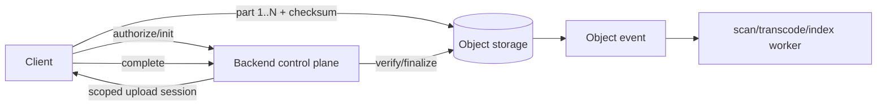

# Object Storage: Multipart Upload, Checksums & Direct-to-Storage Architecture

Büyük dosyayı uygulama sunucusundan tek HTTP request ile geçirmek memory, timeout ve bandwidth bottleneck'i yaratır. Güçlü system-design modeli control plane ile data plane'i ayırmaktır: backend kimlik/yetki, object key, quota/policy ve upload session'ını yönetir; istemci kısa ömürlü yetkiyle byte'ları doğrudan object storage'a yollar.

## Mental model

Backend hava trafik kontrolüdür; dosya byte'larını taşıyan kargo uçağı değildir. Multipart upload parçalı sevkiyat, completion manifest commit'idir. Checksum taşıma bütünlüğünü kontrol eder; authorization veya authenticity'nin yerine geçmez.



## Multipart upload nasıl çalışır?

1. Backend object namespace ve upload policy üretir.
2. Client büyük object'i part'lara böler ve sınırlı concurrency ile yükler.
3. Başarısız part bağımsız retry edilebilir; tüm object yeniden gönderilmez.
4. Part checksum'ları corruption'ı yakalamaya yardım eder.
5. Completion hangi part'ların hangi sırayla final object'i oluşturacağını commit eder.
6. Incomplete upload storage maliyeti yaratabileceği için abort/lifecycle cleanup gerekir.
7. Finalize endpoint idempotent olmalıdır; client timeout sonrası completion'ı tekrar deneyebilir.

## ETag ve checksum tuzağı

ETag'i evrensel bir full-object MD5 sanmak güvenilir değildir. Özellikle multipart nesnelerde ETag tüm nesnenin doğrudan MD5'i değildir. Object-store API'sinin açık checksum modelini kullan: provider'a göre full-object/composite checksum ve CRC/SHA/MD5/XXHash seçenekleri farklı olabilir.

Integrity ile authenticity'yi ayır. Checksum accidental corruption'ı tespit edebilir; kötü niyetli bir actor'a upload yetkisi verdiysen checksum onun yetkisini iptal etmez. Authorization, object namespace ve content policy ayrı kontrollerdir.

## Direct upload güvenlik sınırı

Scoped/presigned yetki kısa ömürlü ve minimum kapsamlı olmalıdır. Backend mümkün olduğunca key/prefix, operation, expiry, size/content policy ve tenant ownership'i kontrol eder. Upload tamamlandı diye object'i hemen güvenilir/public kabul etme: malware scan, media validation/transcoding ve metadata extraction asynchronous state machine olabilir.

```text
INITIATED -> UPLOADING -> UPLOADED_UNVERIFIED -> SCANNING -> READY
                                      \-> REJECTED
```

## Mülakat soruları

### Junior / Mid
1. Object/key modeli nedir?
2. Neden 20 GB dosyayı API server üzerinden proxy etmek istemezsin?
3. Multipart upload'ın retry ve throughput avantajı nedir?
4. Checksum neyi doğrular?

### Senior
1. ETag neden güvenilir full-object MD5 varsayımı değildir?
2. Scoped upload yetkisinde hangi constraint'leri koyarsın?
3. Orphan multipart uploads nasıl temizlenir?
4. Upload completion ve async scan nasıl idempotent tasarlanır?

### Staff / Principal
1. Part size/concurrency'yi request overhead, retry cost ve throttling ile nasıl dengelersin?
2. Multi-region placement, residency, quota ve egress maliyetini nasıl yönetirsin?
3. Scan backlog varken user-visible state ve serving policy nasıl davranmalı?
4. Object events at-least-once geliyorsa processing pipeline'ını nasıl idempotent yaparsın?

## Kısa alıştırma

20 GiB video için 64 MiB part seçildiğinde yaklaşık 320 part gerekir. Concurrency=8 için retry/backoff, checksum noktaları, upload-session expiry ve orphan-abort policy tasarla. Backend'in hangi metadata'yı durable saklayacağını belirt.

## Proje

`multipart-upload-lab`: local S3-compatible storage veya cloud sandbox ile initiate/upload-part/complete API'si kur. Client'ta bounded parallel part upload, checksum, retry ve resume manifest'i; backend'de quota, ownership ve idempotent finalize ekle. Completion sonrasında mock scan worker çalıştır.

## Failure modes / trade-off

- Çok küçük part: request/signing overhead'i artar.
- Çok büyük part: retry maliyeti artar.
- Sınırsız parallelism: client/network/storage throttling yaratır.
- Uzun URL/session expiry: abuse window büyür; aşırı kısa expiry uzun upload'ı bozar.
- Incomplete uploads: görünmez storage maliyeti üretir.
- Upload tamamlanınca doğrudan serve etmek: güvenlik/validation sınırını atlayabilir.
- Event consumer idempotent değilse retry duplicate processing yaratır.

## Production bağlantısı

Completion rate, orphan bytes, checksum mismatch, part retry rate, upload p95/p99, throttling, egress cost ve scan backlog birlikte izlenmelidir. Control-plane availability ile data-plane throughput'u ayrı SLO'larla izlemek teşhisi kolaylaştırır.

## Kaynaklar

- Amazon S3 Multipart Upload: https://docs.aws.amazon.com/AmazonS3/latest/userguide/mpuoverview.html
- Amazon S3 Object Integrity / Checksums: https://docs.aws.amazon.com/AmazonS3/latest/userguide/checking-object-integrity-upload.html
- Amazon S3 Presigned URLs: https://docs.aws.amazon.com/AmazonS3/latest/userguide/using-presigned-url.html