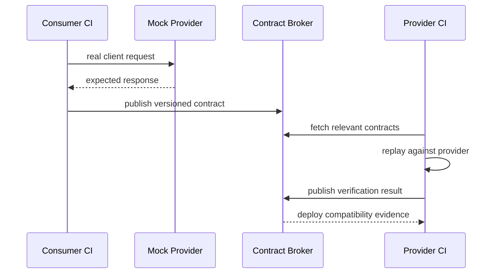

# Consumer-Driven Contract Testing & Safe API Evolution

## Konu anlatımı
Schema validation ile contract testing aynı problem değildir. OpenAPI gibi specification API'nin izin verdiği geniş yüzeyi tarif edebilir; consumer-driven contract (CDC) gerçek consumer'ın provider'dan hangi interaction ve davranışlara bağımlı olduğunu executable örneklerle kaydeder. Amaç tüm sistemi uçtan uca deploy edip brittle integration suite çalıştırmadan consumer-provider uyumluluğunu CI'da doğrulamaktır.

Pact modelinde consumer gerçek API client kodunu mock provider'a karşı çalıştırır ve kullanılan interaction'lardan contract üretir. Provider CI bu contract'ları gerçek provider implementation'a replay ederek doğrular. Broker contract ve verification sonuçlarını versiyonlar; release gate belirli consumer/provider sürümlerinin doğrulanmış olup olmadığını kontrol edebilir.

## Mental model

Schema = “hangi mesajlar biçimsel olarak geçerli olabilir?” Contract test = “bu consumer gerçekte hangi interaction'a güveniyor ve provider bunu hâlâ karşılıyor mu?”

## İçeride ne oluyor?
1. Consumer test gerçek client adapter'ını mock provider'a karşı çalıştırır.
2. Interaction request, minimal expected response ve provider state ile kaydedilir.
3. Contract consumer version'ıyla publish edilir.
4. Provider CI ilgili consumer contract'larını indirir ve endpoint'e replay eder.
5. Verification sonucu publish edilir; deployment gate compatibility graph'ını kullanabilir.
6. Async/message contract'larında aynı fikir request/response yerine message payload/metadata'ya uygulanır.

Contract'ı fazla strict yazmak testleri kırılganlaştırır. Consumer'ın kullanmadığı response alanlarını exact match etmek provider'ın güvenli değişikliklerini engeller. Tersine yalnız schema test etmek status code, gerekli header, provider state veya consumer'ın branch ettiği enum değerleri gibi semantic beklentileri kaçırabilir.

## Mülakat soruları
1. Contract test ile end-to-end integration test arasındaki fark nedir?
2. OpenAPI schema validation neden tek başına CDC'nin yerini tutmaz?
3. Consumer neden yalnız gerçekten kullandığı response alanlarını contract'a koymalı?
4. Provider state nedir ve determinism için neden önemlidir?
5. Mobile client'lar eski sürümlerde aylarca kaldığında compatibility gate nasıl değişir?
6. Yüzlerce service/consumer için contract ownership ve versioning nasıl yönetilir?
7. Contract test hangi bug sınıflarını yakalamaz?

## Beklenen cevap seviyesi
- **Mid:** consumer/provider, executable contract ve provider verification.
- **Senior:** loose matching, provider states, versioning, async messages ve schema-vs-behavior ayrımı.
- **Staff:** broker governance, deployment gates, multi-version consumers ve ownership.

## Kısa alıştırma
Mobile consumer `GET /users/{id}` cevabından yalnız `id`, `name` ve `status` kullanıyor. Provider response'a `last_login` ekliyor, `status` enum'una yeni değer ekliyor ve `name` alanını nullable yapmak istiyor. Her değişikliğin güvenliğini consumer davranışına göre ayrı tartış.

## Proje fikri
`contract-evolution-lab`: iki küçük service kur. Consumer testinden contract üret, provider CI'da verify et. Additive field, field removal, enum expansion ve type change yaparak hangi değişikliklerin gerçek consumer'ı kırdığını göster; schema-diff ile CDC sonucunu karşılaştır.

## Failure modes / trade-off / production bağlantısı
UI/business logic'i contract test içine taşımak interaction patlaması ve brittle suite yaratır. Exact response matching provider'ı gereksiz kilitler. Provider verification geçse bile auth, network, timeout, data migration ve multi-service workflow bug'ları kalabilir; E2E tamamen ortadan kalkmaz. Eski mobile/desktop consumer sürümleri compatibility window'u uzatır. Production'da verification sonucu, deployed version graph, consumer usage telemetry ve deprecation policy birlikte yönetilmelidir.

## Kaynaklar
- Pact — Provider Verification: https://docs.pact.io/getting_started/verifying_pacts
- Pact — Provider workflow: https://docs.pact.io/provider
- Pact — Versioning in the Broker: https://docs.pact.io/getting_started/versioning_in_the_pact_broker
- OpenAPI Specification: https://spec.openapis.org/oas/
