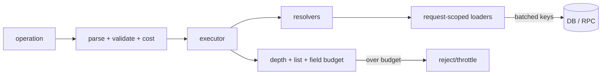

# GraphQL Execution Cost, N+1, DataLoader & Query Budgets

**Seviye:** Junior → Principal  
**Alan:** Backend / System Design

## Neden önemli?
GraphQL selection set istemciye response shape üzerinde güçlü kontrol verir; fakat tek HTTP request'in backend maliyeti küçük olmak zorunda değildir. Nested resolver'lar N+1 DB/RPC pattern'i, geniş listeler fan-out ve pahalı fields kaynak tüketimi üretebilir. Production hedefi schema ergonomisi ile bounded resource consumption arasında açık contract kurmaktır.

## Mental model

## Execution ve N+1
GraphQL September 2025 specification'da query selection-set execution normal durumda parallelization'a izin verir; top-level mutation fields serial çalıştırılır. Bu execution semantics storage access plan değildir. Naive `users -> orders` resolver'ı parent listesi için bir query, sonra her user için ayrı child query üreterek 1+N round-trip yaratabilir.

DataLoader reference implementation key lookup'larını aynı execution frame'inde batch eder ve aynı request içindeki duplicate loads'u memoize eder. Batch function output'u input key sayısı ve sırasıyla hizalanmalıdır. Loader cache'i shared application cache değildir; authorization context'leri karışmasın diye web server'larda tipik olarak request-scoped oluşturulur.

## Query cost budget
Yalnız maximum depth koruması eksiktir: `users(first:100){orders(first:100){items(first:100)}}` kontrollü depth'e rağmen büyük fan-out üretebilir. Daha iyi model:

`estimated_cost = Σ(field_weight × parent_cardinality × bounded_list_multiplier)`

Gerçek sistemde pagination caps, field-specific weights, authenticated-client/tenant budget, fragment expansion ve runtime observations ile model kalibre edilir. Static estimate'i gerçek resolver count, DB/RPC calls, rows scanned, response bytes ve latency ile karşılaştırmak model drift'ini görünür yapar.

## Mülakat soruları
1. GraphQL N+1 problemi nasıl oluşur?
2. DataLoader batching ve memoization arasındaki fark nedir?
3. Loader neden request-scoped olmalıdır?
4. Batch result neden input key order'ına map edilmelidir?
5. Depth limiti neden tek başına query-cost koruması değildir?
6. Senior: nested list query için cost formülü nasıl kurarsın?
7. Staff: static cost ile runtime telemetry'yi nasıl kalibre edersin?
8. Principal: multi-tenant gateway'de fairness ve backward-compatible budget rollout nasıl yapılır?

## Beklenen cevap seviyesi
- **Junior:** selection set/resolver ve N+1'i tanımlar.
- **Mid:** batching, memoization, request scope ve batch contract'ını açıklar.
- **Senior:** fan-out, authorization, pagination ve downstream saturation'ı tartışır.
- **Staff:** cost validation, runtime calibration, operation telemetry ve policy rollout tasarlar.
- **Principal:** tenant fairness, schema governance, gateway standards ve migration strategy'yi bağlar.

## Mini alıştırma
50 user × 20 order × 10 item query'sinde naive entity/fetch büyümesini hesapla. Hangi resolver çağrılarının DataLoader ile batch edilebileceğini göster; field weights ve list multipliers ile basit cost score yaz.

## Proje
`graphql-cost-lab`: naive N+1 API kur, DB-call counter ekle; request-scoped DataLoader ile call sayısını düşür. Validation aşamasında depth + list multiplier + field weight budget uygula ve estimated/actual cost metriği yayınla.

## Failure modes ve trade-off'lar
- Global loader cache: tenant/user veri sızıntısı riski.
- Limitsiz batch: büyük SQL `IN`/RPC payload ve memory spike.
- Sadece depth: shallow-wide query kaçar.
- Sadece static cost: storage skew ve downstream state kaçabilir.
- Çok agresif limit: legitimate client/analytics query kırılır.

Production'da operation hash/name, estimated cost, resolver count, batch size, DB/RPC calls, rows scanned, response bytes, p95/p99, cost rejection ve tenant consumption izlenmelidir.

## Kaynaklar
- GraphQL Specification — September 2025: https://spec.graphql.org/September2025/
- GraphQL Specification versions: https://spec.graphql.org/
- GraphQL DataLoader: https://github.com/graphql/dataloader
- GraphQL Golden Path — Depth limits (WIP guidance): https://goldenpath.graphql.org/solutions/depth-limits/
