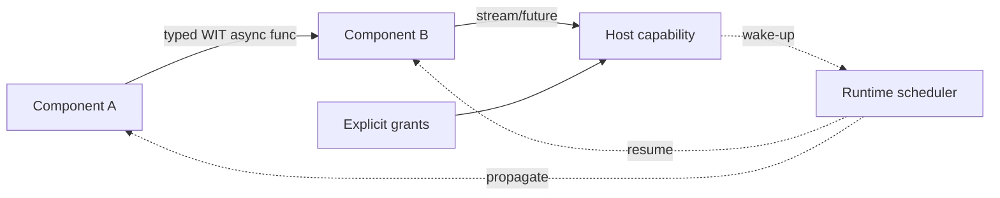

# WASI 0.3, Component Model & Native Async

**Seviye:** Mid → Principal  
**Alan:** Backend / Cloud / Platform

## Konu anlatımı
WebAssembly core spec taşınabilir bytecode ve execution semantics verir; filesystem, socket veya HTTP gibi host yeteneklerini tanımlamaz. WASI bu host-interface katmanıdır. WASI 0.2 Component Model + WIT ile typed ve composable component sınırları getirdi. **WASI 0.3, 11 Haziran 2026'da yayınlandı** ve native async'i Component Model/Canonical ABI içine taşıdı: `async func`, `stream<T>` ve `future<T>` component sınırlarında runtime-managed suspension/wakeup sağlar.

0.2'de async I/O `wasi:io` içindeki `pollable`, input/output stream ve explicit polling ile modelleniyordu. Bir component başka bir component üzerinden host'a eriştiğinde wake-up bilgisinin ara component'ten güvenli biçimde forward edilmesi zordu. 0.3 scheduling/wakeup'ı runtime'ın native sorumluluğu yaparak bu composition problemini çözer.

WASI capability-oriented'dir: component ambient authority ile başlamaz; host yalnız granted interface/resource'ları verir. Bu, plugin ve extension platformlarında güçlü bir security boundary sağlar fakat CPU, memory, wall-time ve concurrency quotas ayrıca gerekir.

## Mental model

## İçeride ne oluyor?
1. Interface contract WIT ile tanımlanır.
2. Component import/export'ları typed olur; language binding generator host-language API üretir.
3. Canonical ABI language values ile component representation arasında lifting/lowering yapar.
4. `async func` suspension/resumption'ı runtime'a devreder.
5. `stream<T>` async çoklu değer akışını, `future<T>` tek completion değerini temsil eder.
6. Runtime component chain boyunca wake-up ve scheduling'i taşır.
7. Host filesystem/socket/HTTP gibi yalnız granted capability'leri expose eder.
8. Runtime, WIT ve bindings version skew instantiation/type errors üretebilir; compatibility matrix release artifact'ı olmalıdır.

## Mülakat soruları
1. WebAssembly core ile WASI arasındaki sınır nedir?
2. Module ile Component Model component'i arasındaki fark nedir?
3. WIT ve Canonical ABI neyi standardize eder?
4. WASI 0.3 neden native async ekledi?
5. `stream<T>` ile `future<T>` semantik farkı nedir?
6. Capability model plugin güvenliğinde ne kazandırır?
7. Senior: cancellation/backpressure component boundary'de nasıl modellenmeli?
8. Staff: in-process component composition ile HTTP microservice trade-off'u nedir?
9. Principal: multi-tenant plugin platformunda capability, quota, observability ve runtime upgrade governance'ını nasıl kurarsın?

## Beklenen cevap derinliği
- **Mid:** Wasm/WASI, WIT, imports/exports ve capability ayrımını doğru kurar.
- **Senior:** Canonical ABI, async composition, cancellation/backpressure ve versioning risklerini bağlar.
- **Staff:** cross-language interoperability, host boundary, resource governance ve operational debugging'i tartışır.
- **Principal:** organization-wide runtime standardı, tenant isolation, rollout/rollback ve economics'i değerlendirir.

## Kısa alıştırma
`fetch → transform → store` üç-component zinciri çiz. 0.2 pollable modelinde wake-up relay problemini ve 0.3'te runtime'ın hangi sorumluluğu üstlendiğini açıkla. Cancellation ve bounded buffering'i de diyagrama ekle.

## Proje fikri
`wasi-async-plugin-lab`: WIT ile transform interface'i tanımla; iki farklı dilde component üret; host yalnız gerekli capability'leri grant etsin. 0.2/0.3 target matrix'i, cold start, throughput, memory ve denied-capability testlerini raporla.

## Failure modes / trade-off / production
Version skew `wrong type`/instantiation failure üretebilir. Capability modeli resource exhaustion'ı tek başına çözmez. Unbounded stream buffering memory blow-up yaratabilir; cancellation propagation eksikliği zombie work üretir. Production'da runtime/toolchain version, instantiation failures, traps, memory, CPU/fuel/epoch limits, async queue depth, latency ve denied capability olayları izlenmelidir.

## Kaynaklar
- WASI Releases: https://wasi.dev/releases
- WASI 0.3: https://wasi.dev/releases/wasi-p3
- WASI Languages: https://wasi.dev/languages
- WASI introduction: https://wasi.dev/
