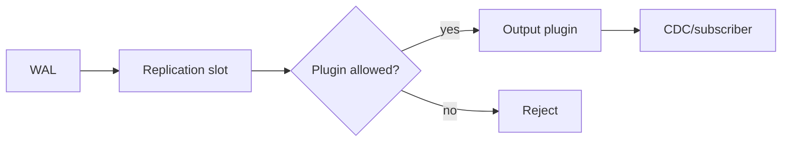

# PostgreSQL Logical Decoding Plugin Allowlisting

## Neden önemli?

Logical decoding, PostgreSQL WAL'ını output plugin aracılığıyla mantıksal değişiklik akışına dönüştürür. CDC ve heterogeneous replication için güçlüdür; ancak output plugin seçimi server process'i içinde native code çalıştırma trust boundary'sine dokunur.

PostgreSQL 18.6 yeni `output_plugin_libraries` parametresiyle logical decoding output plugin'lerini allowlist eder. Varsayılan olarak PostgreSQL ile gelen `pgoutput` ve `test_decoding` izinlidir. Üçüncü taraf decoder kullanan sistemlerde upgrade öncesi plugin inventory ve explicit policy gerekir.

## Mental model

Temel fikir: replication/data-plane privilege ile arbitrary extension execution aynı yetki değildir.

## Mülakat derinliği

- Junior/Mid: WAL, slot, logical vs physical replication.
- Senior: least privilege, WAL retention, upgrade preflight, rollback.
- Staff: fleet inventory, policy-as-code, exception governance, blast radius.
- Principal/CTO: extension ecosystem'i, security ve operability dengesi.

## Failure modes ve trade-off'lar

- Geniş allowlist attack surface'i büyütür.
- Dar allowlist CDC outage yaratabilir.
- Unused/stalled slot retained WAL nedeniyle diski doldurabilir.
- Plugin binary/version mismatch decoding failure yaratabilir.
- Inventory yapılmadan upgrade etmek cutover sırasında sürpriz yaratır.

## Production checklist

Plugin/slot inventory çıkar; trusted plugin setini tanımla; upgrade preflight çalıştır; subscriber lag ve retained WAL izle; rollback için eski binary/config ve slot stratejisini hazır tut.

## Kaynaklar

- https://www.postgresql.org/docs/release/18.6/
- https://www.postgresql.org/docs/18/logical-replication.html
- https://www.postgresql.org/docs/18/logicaldecoding.html
