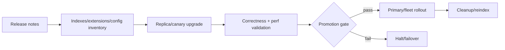

# PostgreSQL Minor Upgrades, Regression Risk & Post-Upgrade Validation

## Neden önemli?
`minor = risksiz` yanlıştır. PostgreSQL minor release'leri bug, security ve data-corruption düzeltmeleri taşır; production upgrade yine release-note-driven inventory, canary ve post-upgrade doğrulama gerektirir.

## Mental model

## İçeride ne oluyor?
Binary restart başarı kriteri değildir. Extension ABI, WAL/replication, index health, configuration cleanup ve query-plan davranışı release'e göre incelenir. Replica-first rollout bazı blast-radius risklerini azaltır; fakat application compatibility ve tüm data-shape edge case'lerini otomatik çözmez. Database rollback package downgrade kadar basit değildir; on-disk state, WAL timeline ve remediation adımları geri dönüşü zorlaştırabilir.

## Mülakat soruları
1. Major ve minor upgrade operasyonel olarak nasıl ayrılır?
2. Minor upgrade öncesi neden release notes okunur?
3. Replica-first hangi riskleri azaltır?
4. Reindex gereksinimi fleet'te nasıl operationalize edilir?
5. Query regression nasıl yakalanır?
6. Security urgency ile change risk nasıl dengelenir?

## Beklenen cevap seviyesi
- **Mid:** backup, restart, replication, release notes.
- **Senior:** extension/index inventory, query-plan regression, WAL/lag ve remediation.
- **Staff:** fleet automation, promotion gates, failover semantics ve change windows.
- **Principal/CTO:** patch SLA, EOL policy, exceptions ve security exposure economics.

## Mini alıştırma
20 PostgreSQL cluster için preflight, canary metric/query gates, rollout halt condition ve post-upgrade integrity kontrolleri içeren runbook çıkar.

## Proje fikri
`pg-patch-auditor`: version, installed extensions, index inventory, replication lag ve query fingerprint'lerini toplayıp release-specific remediation checklist üreten CLI.

## Failure modes / trade-off
Release note okumamak, extension compatibility'sini atlamak, yalnız process health kontrol etmek, lag'i görmeden failover yapmak ve remediation/reindex'i unutmak yaygın hatalardır. Hızlı patch vulnerability exposure'ı azaltır; uzun soak regression yakalama şansını artırır fakat exposure penceresini uzatır.

## Production bağlantısı
Replication lag, WAL generation/replay, error rate, query latency percentiles, plan changes, lock waits, index health ve integrity checks izlenmelidir.

## Kaynaklar
- PostgreSQL 18.6 release notes: https://www.postgresql.org/docs/release/18.6/
- PostgreSQL 18.6 announcement: https://www.postgresql.org/about/news/postgresql-186-1711-1615-1519-1424-and-19-beta-3-released-3365/
- Versioning policy: https://www.postgresql.org/support/versioning/
