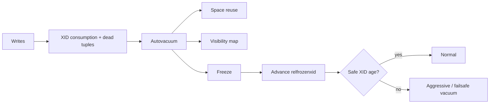

# PostgreSQL VACUUM, XID Wraparound & Autovacuum Capacity

PostgreSQL MVCC, UPDATE/DELETE sonrası eski tuple version'larını hemen fiziksel olarak kaldırmaz. `VACUUM` dead tuple alanını reuse eder, visibility map bakımına katkı sağlar ve transaction-ID wraparound'a karşı eski tuple'ları freeze eder. Normal `VACUUM` read/write ile birlikte çalışabilir; `VACUUM FULL` tabloyu rewrite eder ve `ACCESS EXCLUSIVE` lock ister.

## XID wraparound mental modeli

Normal transaction ID alanı 32-bit'tir ve modulo karşılaştırılır. Yaklaşık iki milyar XID'lik geçmiş/gelecek penceresi nedeniyle çok eski tuple'lar freeze edilmezse geçmiş transaction'lar wraparound sonrasında 'gelecekte' gibi değerlendirilebilir. PostgreSQL bu riski önlemek için wraparound-prevention autovacuum çalıştırır ve kritik sınıra yaklaşınca yeni XID atamalarını durdurabilir. Autovacuum bu yüzden yalnız bloat optimizasyonu değil, correctness/safety mekanizmasıdır.

PostgreSQL 18 normal vacuum'un bazı all-visible sayfaları erkenden freeze edebilmesini ekledi. Eager freezing, daha sonraki aggressive full-relation freeze işinin maliyetini azaltmayı hedefler.

## Mülakat soruları

1. MVCC neden dead tuple üretir?
2. `VACUUM` ve `VACUUM FULL` farkı nedir?
3. Visibility map index-only scan'i nasıl etkiler?
4. XID wraparound neden tehlikelidir; freeze ne sağlar?
5. Long transaction veya stale replication slot cleanup'ı nasıl tutabilir?
6. Autovacuum açıkken neden backlog oluşabilir?
7. Staff: yüksek-write cluster'da vacuum capacity nasıl modellenir?
8. Wraparound warning incident'ında teşhis/remediation sırası nedir?

## Beklenen cevap derinliği

- **Junior:** MVCC, dead tuple ve VACUUM temel amacı.
- **Mid:** autovacuum, visibility map, bloat ve FULL lock farkı.
- **Senior:** XID age/freeze, blockers ve I/O trade-off.
- **Staff:** throughput/capacity, per-table tuning, alert ve emergency runbook.

## Mini alıştırma

Dakikada 3 milyon row update alan tablo için dashboard tasarla. Dead tuple, vacuum duration/frequency, oldest XID age, replication-slot age ve I/O sinyallerini alarm seviyelerine ayır.

## Proje fikri

`pg-vacuum-watch`: `pg_stat_*`, `pg_class.relfrozenxid`, database XID age ve replication-slot xmin verisinden risk skoru, blocker listesi ve vacuum-capacity trendi çıkaran CLI/dashboard.

## Failure modes / trade-off / production

Autovacuum'u agresif kısmak wraparound riskini büyütür; aşırı agresif vacuum I/O contention yaratır; long transaction old snapshot tutar; stale slot cleanup'ı geciktirir; yanlış zamanda `VACUUM FULL` downtime yaratabilir. Dead tuples, vacuum backlog/runtime, `age(relfrozenxid)`, database oldest XID, slot xmin age, long transactions, I/O latency ve relation size birlikte izlenmelidir.

## Kaynaklar

- PostgreSQL 18 — Routine Vacuuming: https://www.postgresql.org/docs/18/routine-vacuuming.html
- PostgreSQL 18 — VACUUM: https://www.postgresql.org/docs/18/sql-vacuum.html
- PostgreSQL 18 release notes: https://www.postgresql.org/docs/18/release-18.html
- PostgreSQL documentation: https://www.postgresql.org/docs/
