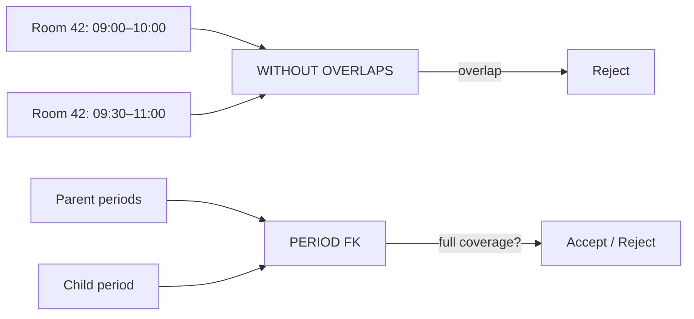

# PostgreSQL 18 Temporal Constraints: WITHOUT OVERLAPS & PERIOD

## Neden önemli?
Zaman boyutlu modellerde integrity yalnız row/value equality değildir. Aynı business key için geçerlilik dönemleri çakışmamalı; child kaydın geçerli olduğu tüm dönem parent tarafından kapsanmalıdır. PostgreSQL 18, `PRIMARY KEY`/`UNIQUE` için `WITHOUT OVERLAPS`, foreign key için `PERIOD` ile bunu database constraint olarak ifade eder.

## Mental model
Klasik unique: **aynı değer var mı?** Temporal unique: **aynı key'in zamanı çakışıyor mu?** Klasik FK: **parent row var mı?** PERIOD FK: **parent period'larının birleşimi child period'un tamamını kapsıyor mu?**

## Internals ve trade-off
- `WITHOUT OVERLAPS` son kolonun range/multirange olmasını ister; empty range kabul edilmez.
- PostgreSQL bunu equality kolonları + overlap (`&&`) ile GiST-backed exclusion semantics olarak uygular.
- Scalar equality kolonlarında `btree_gist` gerekebilir.
- `PERIOD` FK'nin referans verdiği key temporal primary/unique key olmalıdır.
- Application-side `SELECT overlap` + `INSERT` kontrolü concurrency race üretir; constraint invariant'ı transaction boundary'de korur.
- Half-open `[start,end)` interval modeli bitiş ve başlangıç sınırlarını composable yapar.

## Mülakat soruları
- `UNIQUE` ile `WITHOUT OVERLAPS` farkı nedir?
- `[start,end)` neden sık tercih edilir?
- Application-side overlap check neden race condition üretir?
- Senior: GiST write/read maliyeti nedir?
- Staff: dirty data üzerinde temporal constraint migration'ını nasıl rollout edersin?
- Bitemporal model için valid-time constraint tek başına yeterli midir?

## Seviye beklentisi
- **Junior:** range/overlap örneği verir.
- **Mid:** syntax, interval boundaries ve concurrency gerekçesini açıklar.
- **Senior:** GiST, contention, migration ve query-plan trade-off'larını tartışır.
- **Staff:** domain invariant'ı CDC, audit, partitioning ve rollout stratejisiyle bağlar.

## Alıştırma / proje
`room_booking(room_id, valid_at tstzrange)` için temporal unique constraint kur. 09:00–10:00 ile 10:00–11:00'ın `[)` semantics ile birlikte kabul edildiğini, 09:30–10:30'un reddedildiğini test et. Ardından availability tablosuna `PERIOD` FK ekle. Concurrent workers ile application-side check ve DB constraint'i karşılaştır.

## Production failure modes
Yanlış inclusive boundaries, timezone normalization eksikliği, open-ended/empty range politikasının belirsizliği, dirty data temizlemeden migration, GiST write cost'unu ölçmeme ve valid-time ile bitemporal semantics'i karıştırma. İzlenecek metrikler: constraint violations, lock wait, write latency, GiST index size/bloat, invalid-range ingestion ve migration reject set.

## Kaynaklar
- https://www.postgresql.org/docs/18/release-18.html
- https://www.postgresql.org/docs/18/sql-createtable.html
- https://www.postgresql.org/about/featurematrix/detail/temporal-constraints/
- https://www.postgresql.org/support/versioning/
