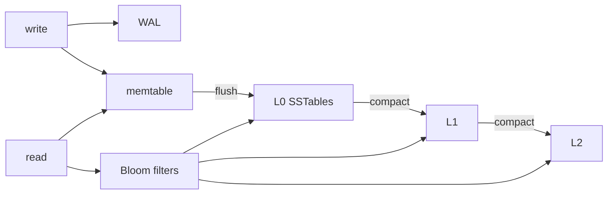

# LSM Trees, SSTables, Bloom Filters & Compaction

## Neden var?
LSM-tree write-heavy storage engine'lerinde random in-place update yerine WAL + memory buffer + immutable sorted files yaklaşımıyla write path'i sequential hale getirir. Bu kazanç ücretsiz değildir: read, write ve space amplification arasında sürekli trade-off vardır.

## Mental model

## Write path
1. Mutation WAL'a eklenir; crash recovery için durable history sağlar.
2. Aynı mutation mutable ordered memtable'a uygulanır.
3. Memtable limitte immutable olur; yenisi foreground write almaya başlar.
4. Immutable memtable sorted SSTable olarak flush edilir.
5. Background compaction sorted runs/files arasında merge yapar.

SSTable immutable olduğu için update yeni version/tombstone yazar. Eski physical data uygun compaction noktasına kadar yaşayabilir.

## Read path ve Bloom filter
Point read en yeni in-memory state'ten eski on-disk state'e doğru adayları arar. L0 dosyaları overlapping olabilir; leveled compaction'ın daha alt seviyelerinde key ranges tipik olarak non-overlapping tutulur. Bloom filter bir key'in belirli SSTable'da kesinlikle olmadığını gösterebilir. False positive ek probe yaratabilir; false negative kabul edilmez. Range scan için ise hangi keys'in aralıkta bulunduğunu keşfetmek gerektiğinden Bloom filter aynı read-amplification çözümünü sağlamaz.

## Üç amplification
- **Read amplification:** bir logical read için kaç structure/file/block inceleniyor?
- **Write amplification:** bir user byte storage stack tarafından toplam kaç byte yazılıyor/yeniden yazılıyor?
- **Space amplification:** logical live dataset'e göre fiziksel olarak ne kadar fazla alan tutuluyor?

Leveled compaction read/space amplification'ı kontrol altında tutarken byte'ları seviyeler arasında tekrar yazdığı için write amplification yaratır. Tiered/universal yaklaşım daha az rewrite karşılığında daha çok overlapping sorted run ve dolayısıyla daha yüksek read/space amplification kabul edebilir.

## Compaction debt ve write stall
Compaction throughput incoming write rate'in gerisinde kalırsa L0 dosyaları ve pending bytes büyür. Bu yalnız background maintenance problemi değildir: daha çok L0 file read path'i pahalılaştırır, disk bandwidth'i tüketir ve engine sonunda writes'ı yavaşlatabilir veya durdurabilir. Bu nedenle compaction debt doğrudan foreground p99 latency ve admission-control problemidir.

## B+Tree ile karşılaştırma
B+Tree page-oriented in-place/near-in-place ordered index yaklaşımıdır; point/range read path'i doğrudandır fakat random writes page split/cache/storage davranışına tabidir. LSM writes'ı buffer/flush/compact eder. Seçim workload'a bağlıdır: write rate, point/range read mix, storage medium, durability, cache budget, SSD endurance ve latency SLO birlikte değerlendirilir.

## Mülakat soruları
1. WAL ve memtable neden ikisi birden gerekir?
2. SSTable neden immutable'dır?
3. Bloom filter hangi lookup sınıfını hızlandırır?
4. L0 neden diğer level'lardan farklıdır?
5. Read/write/space amplification'ı tanımla.
6. Leveled vs tiered compaction trade-off'u nedir?
7. Tombstone neden hemen diskten kaybolmaz?
8. Compaction debt neden p99 write latency'yi etkiler?
9. B+Tree vs LSM seçimini workload üzerinden açıkla.

## Seviyeye göre beklenen cevap
**Mid:** WAL → memtable → flush → SSTable → compaction zincirini doğru kurar. **Senior:** Bloom filters, tombstones, leveled/tiered ve amplification trade-off'larını açıklar. **Staff:** compaction scheduling, stalls, SSD endurance, cache ve SLO/cost ekonomisini bağlar.

## Mini alıştırma
L0'da `[a-f]`, `[d-k]`, `[m-z]`; L1'de `[a-h]`, `[i-r]`, `[s-z]` dosyaları çiz. `q` miss lookup'ında Bloom filter yokken/varken file probes'u düşün. Ardından `[e-n]` range scan'inde neden aynı kazancın oluşmadığını açıkla.

## Proje fikri
`mini-lsm-lab`: WAL, sorted memtable, immutable SSTable ve basit compaction içeren küçük KV store yaz. Bloom filter ekle. Random workload'da user bytes, total bytes written, files probed/read, compaction duration ve p99 write latency ölç.

## Failure modes / production
Compaction'ı housekeeping sanmak; Bloom filter'ı range index sanmak; tombstone/version retention'ı unutmak; disk bandwidth'i foreground I/O ve compaction arasında bütçelememek; yalnız average latency ölçmek tipik hatalardır. Production'da L0 file count, pending compaction bytes, stall duration/count, compaction throughput, read/write amplification, disk utilization, cache hit ratio ve p99 birlikte izlenir.

## Kaynaklar
- RocksDB — Leveled Compaction: https://github.com/facebook/rocksdb/wiki/Leveled-Compaction
- RocksDB — Compaction: https://github.com/facebook/rocksdb/wiki/Compaction
- RocksDB — Tuning Guide: https://github.com/facebook/rocksdb/wiki/RocksDB-Tuning-Guide
- RocksDB — Block-based Table Format: https://github.com/facebook/rocksdb/wiki/Rocksdb-BlockBasedTable-Format
