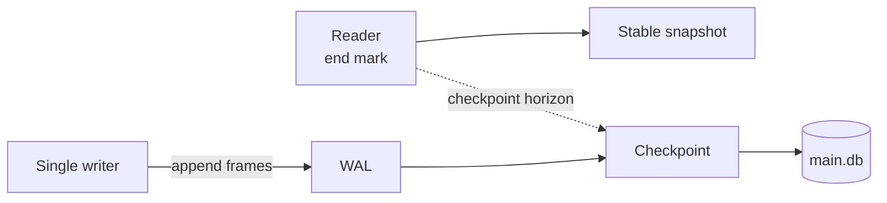

# SQLite WAL, Checkpoint Starvation & Single-Writer Concurrency

## Neden önemli?
SQLite embedded ve edge/mobile sistemlerde operasyonel sadelik sağlar; WAL read/write concurrency'yi artırır. Fakat WAL çok-writer paralelliği değildir: resmi SQLite dokümantasyonuna göre tek WAL olduğundan aynı anda yalnız bir writer ilerler. Doğru mental model **reader snapshot + append-only writer + checkpoint** üçlüsüdür.

## Mental model

Reader başladığında son geçerli commit'i end mark olarak tutar. Writer WAL sonuna ekler. Checkpoint güvenli frame'leri ana DB'ye taşır fakat aktif reader'ın snapshot'ını bozacak noktayı geçemez.

## Concurrency ve starvation
- Reader ve writer eşzamanlı ilerleyebilir.
- Writer'lar birbirini serialize eder; uzun write transaction contention yaratır.
- Uzun-lived reader checkpoint horizon'ını tutabilir.
- Checkpoint sürekli tam ilerleyemezse WAL büyür: checkpoint starvation.
- WAL shared-memory/wal-index gerektirdiğinden network filesystem için uygun değildir.

## 2026 reliability notu
SQLite'ın resmi WAL sayfası 3 Mart 2026'da bulunan nadir WAL-reset corruption bug'ını belgeler. Bug 3.7.0–3.51.2 aralığını etkileyebilir; 3.51.3 (13 Mart 2026) ve sonraki sürümlerde fix vardır. 3.53.4 release'i (24 Temmuz 2026) fix'i içerir. Production inventory'de SQLite sürümünü izlemek correctness kontrolüdür.

## Mülakat soruları
1. WAL rollback journal'a göre concurrency'yi neden artırır?
2. WAL modunda neden yine tek writer vardır?
3. Reader end mark neyi garanti eder?
4. Checkpoint starvation nasıl oluşur?
5. Uzun transaction ve network I/O neden tehlikelidir?
6. `SQLITE_BUSY` politikasını nasıl tasarlarsın?
7. Staff: hangi workload sinyalleri client/server DB'ye migration gerektirir?

## Seviye beklentisi
- **Junior:** append log ve reader/writer ayrımını açıklar.
- **Mid:** checkpoint, single writer ve transaction scope'u bağlar.
- **Senior:** busy handling, starvation, durability, backup/crash recovery'yi tartışır.
- **Staff:** write contention, HA, remote access ve migration ekonomisini değerlendirir.

## Alıştırma
İki reader + iki writer timeline'ı çiz. Bir reader 30 saniye açık kalsın; WAL threshold'u aşılsın. Checkpoint'in nerede duracağını ve ikinci writer'ın hangi bölümde beklediğini göster.

## Proje
`sqlite-wal-lab`: concurrent reader/writer benchmark; WAL pages, checkpoint duration, `SQLITE_BUSY`, transaction duration ve p95 write latency ölç. Uzun reader fault injection ekle.

## Failure modes / trade-off / production
Uzun read cursor, transaction içinde remote I/O, kontrolsüz WAL büyümesi, network filesystem, busy policy eksikliği ve eski SQLite sürümü başlıca risklerdir. WAL bytes/pages, checkpoint sonucu/süresi, write transaction duration, busy count, fsync latency ve DB büyümesi izlenmelidir.

## Kaynaklar
- SQLite — WAL: https://www.sqlite.org/wal.html
- SQLite — Transactions: https://www.sqlite.org/lang_transaction.html
- SQLite 3.53.4 (2026-07-24): https://www.sqlite.org/releaselog/3_53_4.html
- SQLite News: https://sqlite.org/news.html
