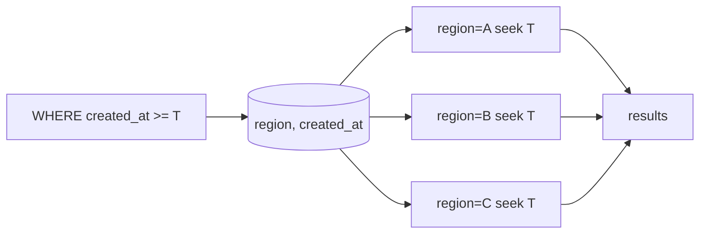

# PostgreSQL 18 B-tree Skip Scan & Composite Index Economics

## Neden önemli?
Composite B-tree için “leftmost prefix” iyi bir başlangıç kuralıdır ama PostgreSQL 18 ile eksik prefix equality koşulu her zaman index'in kullanılamayacağı anlamına gelmez. Skip scan, daha sonraki index kolonunda yararlı predicate olduğunda farklı leading-prefix grupları arasında yeniden konumlanarak index'in gereksiz bölümlerini atlayabilir.

## Mental model

## Planner ekonomisi
Skip scan'ın faydası leading kolonun distinct sayısı, suffix predicate selectivity'si, table/index büyüklüğü, heap erişim maliyeti ve statistics doğruluğuna bağlıdır. Leading kolon düşük cardinality ise az sayıda yeniden search tüm index'i taramaktan ucuz olabilir. Cardinality çok yüksekse tekrar konumlanma maliyeti büyür ve planner sequential scan veya başka access path seçebilir.

PostgreSQL 18 ayrıca `EXPLAIN ANALYZE` çıktısında index scan'in kaç index lookup yaptığını görünür kılar; major-version upgrade sonrası plan davranışını gerçek workload ile ölçmek gerekir.

## Mülakat çekirdeği
- Composite index kolon sırası neden önemlidir?
- Skip scan leftmost-prefix mental modelini nasıl inceltir?
- Düşük/yüksek cardinality leading kolon sonucu nasıl değiştirir?
- Statistics neden plan kararının parçasıdır?
- Bir index'in read kazancı ile write amplification/storage maliyeti nasıl dengelenir?

## Production failure modes
- Skip scan var diye workload'a uymayan kolon sırası seçmek.
- Stale statistics ile planner kararına kör güvenmek.
- Aynı query ailesi için gereksiz duplicate index üretmek.
- Major upgrade sonrası plan regression izlememek.
- Synthetic benchmark sonucunu production dağılımı sanmak.

## Production telemetry
Query p95/p99, plan değişimleri, index lookup count, `EXPLAIN (ANALYZE, BUFFERS)` buffer erişimleri, table/index I/O, index size/bloat ve write amplification birlikte değerlendirilir.

## Kaynaklar
- PostgreSQL 18 — Multicolumn Indexes: https://www.postgresql.org/docs/18/indexes-multicolumn.html
- PostgreSQL 18 release notes: https://www.postgresql.org/docs/18/release-18.html
- PostgreSQL 18 Released: https://www.postgresql.org/about/news/postgresql-18-released-3142/
- PostgreSQL 18.6 release notes (13 Ağustos 2026): https://www.postgresql.org/docs/release/18.6/
