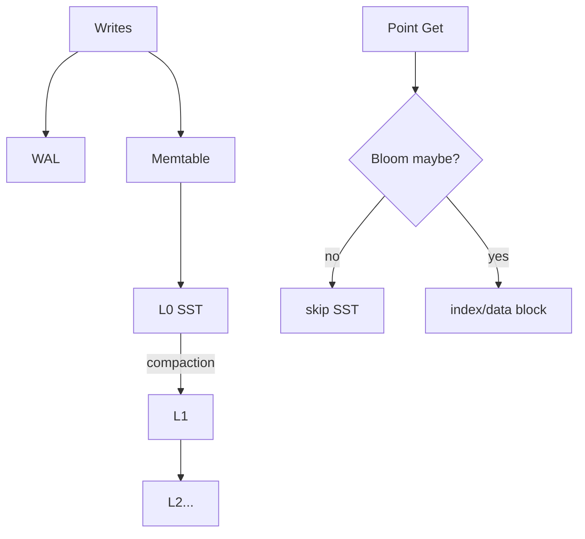

# RocksDB LSM Compaction, Bloom Filters & Amplification Budgets

## Konu anlatımı
LSM-tree write path random in-place update yerine WAL + memtable'a yazar, sonra immutable sorted SST üretir. Bu write throughput'u artırırken read, write ve space amplification trade-off'ları doğurur. Compaction sorted run'ları merge ederek tree shape'i kontrol eder.

RocksDB leveled, universal/tiered ve FIFO compaction stilleri sunar. Leveled daha düşük read fan-out karşılığında daha fazla rewrite yapabilir; universal daha düşük write amplification karşılığında daha çok run bırakabilir; FIFO TTL/event-log workload'unda eski files'ı düşürür.

Bloom filter point lookup'ta bir SST'nin key'i kesinlikle içermediğini söyleyerek I/O'yu engeller; positive yalnız `maybe` anlamına gelir. False-positive rate RAM ile takas edilir. Range scan için genellikle yararlı değildir. Yeni SST üretildiğinde filter yeni key set'inden yeniden oluşturulur.

## Mental model

## İçeride ne oluyor?
- Flush immutable SST üretir; L0 ranges overlap edebilir.
- Compaction merge/sort ve obsolete-version cleanup yapar.
- Leveled compaction read fan-out'u azaltmaya çalışır, rewrite I/O öder.
- Bloom negative lookup'ı eler; positive lookup data/index kontrolü gerektirir.
- Filter/index caching RAM ile storage I/O arasında trade-off'tur.
- Compaction rate limiting foreground tail latency ile backlog arasında denge kurar.

## Mülakat soruları
1. LSM neden write-heavy workload'da avantajlıdır?
2. Read/write/space amplification nedir?
3. Bloom neden false-negative üretmemelidir?
4. Range scan'de Bloom neden az faydalıdır?
5. Leveled vs universal trade-off'u nedir?
6. Senior: compaction debt p99'u nasıl bozar?
7. Staff: bits/key, block cache ve IOPS bütçesini nasıl seçersin?

## Beklenen cevap seviyesi
- **Junior:** memtable, SST, compaction, Bloom.
- **Mid:** FPR, cache ve amplification.
- **Senior:** compaction debt, tombstone, snapshot, tail latency.
- **Staff:** workload-driven compaction/memory/IO policy.

## Mini alıştırma
100 SST ve SST başına %1 Bloom false-positive ile absent-key lookup'ta beklenen false-positive file sayısını hesapla. FPR %0.1 olursa RAM/IO trade-off'unu tartış.

## Proje fikri
`lsm-amplification-lab`: RocksDB point-get/range-scan benchmark; Bloom ve compaction-rate varyasyonlarında p50/p99, bytes read/written, cache hit ve backlog ölç.

## Failure modes / trade-off / production bağlantısı
Bloom'u membership oracle sanmak, range-heavy workload'da filtre RAM'ini boşa harcamak, compaction'ı sınırsız I/O ile foreground read'leri boğmak veya fazla kısıp L0/backlog biriktirmek tipik hatalardır. L0 file count, pending compaction bytes, amplification, Bloom usefulness/FPR, block-cache hit, stall ve p99 izlenir.

## Kaynaklar
- RocksDB Wiki — Compaction: https://github.com/facebook/rocksdb/wiki/Compaction
- RocksDB Wiki — Bloom Filter: https://github.com/facebook/rocksdb/wiki/RocksDB-Bloom-Filter
- RocksDB Wiki — Setup Options and Basic Tuning: https://github.com/facebook/rocksdb/wiki/Setup-Options-and-Basic-Tuning
