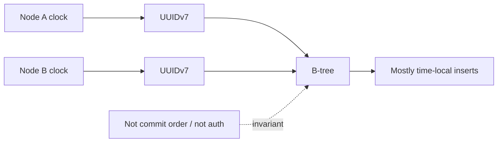

# UUIDv7, B-Tree Locality & Identifier Semantics

## Neden önemli?
Identifier seçimi yalnız uniqueness değildir; index locality, ordering semantics, metadata leakage ve generation authority'yi etkiler. RFC 9562 UUIDv7'yi Unix timestamp tabanlı zaman sıralanabilir 128-bit UUID olarak standardize eder. PostgreSQL 18 core `uuidv7()` üretimini destekler.

## Mental model

**Invariant:** UUIDv7 uniqueness ve temporal locality sağlar; causality, commit ordering veya access control sağlamaz.

## UUIDv4 vs UUIDv7
UUIDv4 büyük ölçüde random key-space'e dağılır. B-tree insert'leri farklı page'lere yayılabilir. UUIDv7'nin yüksek bitlerinde zaman bilgisi bulunduğu için yeni ID'ler genel olarak yakın key bölgelerine gelir; cache/page locality açısından avantaj sağlayabilir. Kazanç workload, concurrency, fillfactor, cache ve storage'a bağlıdır; benchmark edilmelidir.

## Ordering semantiği
'Time-ordered' global total order demek değildir. Multi-node clock skew, aynı millisecond içindeki generation stratejisi ve transaction commit sırası UUID order ile business-event order'ın ayrışmasına neden olabilir. Pagination veya event ordering contract'ı yalnız `ORDER BY id` üzerine kurulursa gizli clock varsayımı oluşur.

## Privacy ve security
UUIDv7 timestamp taşır. PostgreSQL `uuid_extract_timestamp()` ile v7 UUID'den timestamp çıkarabilir. Bu debugging için yararlı, fakat creation-time metadata leakage olabilir. UUID hiçbir sürümde authorization token değildir; unguessability access control yerine geçmez.

## Generation authority
DB-side generation tek implementation ve clock domain sağlar; client-side generation round trip/central sequence ihtiyacını azaltır ve offline/distributed creation'ı kolaylaştırır. Buna karşılık implementation compatibility, clock anomaly ve rollout sorumluluğu client fleet'e yayılır.

## Mülakat soruları
1. UUIDv4 ve UUIDv7 farkı nedir?
2. UUIDv7 B-tree locality'yi neden iyileştirebilir?
3. UUIDv7 sırası neden commit sırası değildir?
4. Timestamp hangi privacy etkisini yaratır?
5. DB-side vs client-side generation trade-off'u nedir?
6. Senior: multi-region clock skew ile pagination'ı nasıl kurarsın?
7. Senior: UUID PK varken neden business unique constraint gerekir?
8. Staff: v4 -> v7 migration'ını nasıl rollout/rollback edersin?

## Seviye beklentisi
- **Junior:** uniqueness, v4 randomlığı ve v7 temporal ordering'i açıklar.
- **Mid:** B-tree locality ve generation boundary'sini tartışır.
- **Senior:** clock skew, pagination, index/storage, migration ve privacy failure mode'larını yönetir.
- **Staff:** identifier contract'ını API, storage, event ordering, observability ve multi-region mimariyle standardize eder.

## Mini alıştırma
10M UUIDv4 PK içeren `orders` tablosunda yeni insert'leri v7'ye geçir. API/schema compatibility, index metrikleri ve rollback planını yaz. `ORDER BY id` ifadesinin neden kesin event ordering olmadığını göster.

## Proje
`uuid-locality-lab`: PostgreSQL 18'de UUIDv4/v7 insert benchmark'ı. Index size, buffer hit, WAL bytes, insert latency ve page-split göstergelerini concurrency/fillfactor varyasyonlarıyla karşılaştır. Extracted timestamp metadata leakage testini de ekle.

## Failure modes / production
UUIDv7'yi global sequence sanmak, ID'yi auth mekanizması yapmak, timestamp leakage'i yok saymak, client clock çeşitliliğini test etmemek, business uniqueness'i yalnız UUID'ye bırakmak ve locality kazancını ölçmeden varsaymak tipik hatalardır. Generation error/latency, clock anomaly, index growth/bloat, buffer hit, WAL/write latency ve migration-version dağılımı izlenir.

## Kaynaklar
- IETF RFC 9562 — UUIDs, Mayıs 2024: https://www.rfc-editor.org/rfc/rfc9562.html
- PostgreSQL 18 — UUID Type: https://www.postgresql.org/docs/18/datatype-uuid.html
- PostgreSQL 18 — UUID Functions: https://www.postgresql.org/docs/18/functions-uuid.html
- PostgreSQL 18 Release Notes — `uuidv7()`, 25 Eylül 2025: https://www.postgresql.org/docs/18/release-18.html
