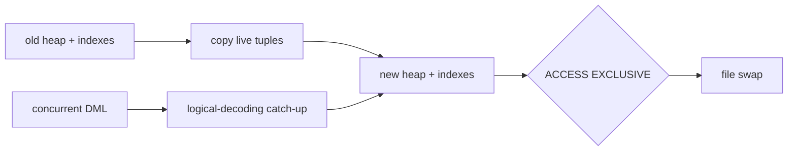

# PostgreSQL 19 REPACK CONCURRENTLY: Table Rewrite & Lock Economics

> Durum notu (20 Eylül 2026): PostgreSQL 19 hâlâ beta hattındadır. Resmi beta politikası beta/RC sürümlerini production için önermez. Bu bölüm mekanizma, test ve rollout düşüncesi içindir.

## Neden var?
MVCC UPDATE/DELETE sonrası eski tuple sürümlerini fiziksel dosyadan hemen kaldırmaz. Normal `VACUUM` alanı tekrar kullanılabilir yapar fakat çoğu durumda relation dosyasını küçültüp alanı OS'e geri vermez. Full rewrite bunu yapabilir, fakat klasik yol uzun `ACCESS EXCLUSIVE` lock ile availability maliyeti yaratır.

PostgreSQL 19'daki `REPACK`, `VACUUM FULL` ve `CLUSTER` benzeri rewrite operasyonlarını tek model altında toplar. `CONCURRENTLY` seçeneği rewrite boyunca DML'yi açık tutup değişiklikleri logical decoding ile yakalar; final file swap için yine kısa bir `ACCESS EXCLUSIVE` lock gerekir.

## Mental model

**Invariant:** Concurrent, lock-free değildir. Uzun rewrite ile kısa exclusivity penceresini ayırır.

## Internals
- Non-concurrent `REPACK`, yeni heap/index dosyaları oluşturup relation'ı yeniden yazar.
- `CONCURRENTLY`, copy sırasında DML değişikliklerini yakalayıp yeni dosyaya uygular.
- Swap yine exclusive lock ister; yüksek write backlog'u final catch-up/lock süresini büyütebilir.
- Temporary space en az table + indexes ölçeğindedir; sort yolu ek table-size temporary alan isteyebilir.
- Concurrent mode replica identity/primary key, replication slot kapasitesi ve desteklenen relation türleri gibi precondition'lara sahiptir.
- `pg_stat_progress_repack` scan, sort, write, catch-up, swap ve index rebuild aşamalarını görünür kılar.

## Mülakat soruları
1. `VACUUM` neden her zaman disk dosyasını küçültmez?
2. Full rewrite ile normal vacuum'ın availability/capacity farkı nedir?
3. `REPACK CONCURRENTLY` DML'yi nasıl korur?
4. Neden final swap hâlâ `ACCESS EXCLUSIVE` ister?
5. Senior: 2 TB hot table için disk ve WAL headroom'u nasıl hesaplarsın?
6. Staff/Principal: catch-up backlog, lock wait ve replication lag için abort policy nasıl tasarlanır?

## Beklenen cevap derinliği
- **Senior:** MVCC, dead tuples, rewrite, lock ve disk amplification.
- **Staff:** logical decoding, replica identity, WAL/slot retention, DDL conflict, observability.
- **Principal:** eligibility policy, canary, maintenance windows, rollback ve production-readiness governance.

## Mini alıştırma
500 GB heap + 180 GB indexes için minimum temporary disk'i hesapla. Sort seçildiğinde yaklaşık peak'i çıkar. 20 MB/s write rate ile 40 dakikalık copy sırasında oluşabilecek change volume'u hesaplayıp catch-up riskini tartış.

## Proje fikri
`repack-readiness`: catalog/statistics üzerinden relation/index size, free disk, write/WAL rate, replica identity ve slot headroom kontrol eden preflight CLI. Disposable PostgreSQL 19 beta ortamında chaos/load testleri ekle.

## Failure modes / production
“Concurrent = zero lock” varsayımı, yetersiz disk, DDL conflict, yüksek write rate nedeniyle catch-up uzaması, slot/WAL retention büyümesi ve beta özelliğini production-ready sanmak ana risklerdir. Free disk, WAL rate, replication lag, lock waits, transaction age ve `pg_stat_progress_repack` phase/duration birlikte izlenmelidir.

## Kaynaklar
- PostgreSQL 19 REPACK: https://www.postgresql.org/docs/19/sql-repack.html
- PostgreSQL 19 release notes: https://www.postgresql.org/docs/19/release-19.html
- PostgreSQL beta policy/status: https://www.postgresql.org/developer/beta/
- Progress reporting: https://www.postgresql.org/docs/19/progress-reporting.html
