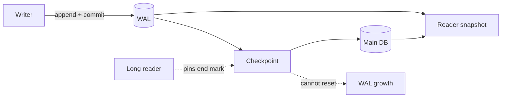

# SQLite WAL, Checkpoint Starvation & Embedded-DB Concurrency

**Seviye:** Junior → Staff | **Alan:** Databases / Backend

## Konu anlatımı
SQLite WAL, değişen page'leri ana database'e yerinde yazmak yerine `-wal` dosyasına append eder. Commit WAL'a commit marker eklenmesiyle tamamlanabilir. Reader transaction başında bir end mark sabitler; writer daha yeni frame'ler append ederken reader kendi snapshot'ını okumaya devam eder. Bu yüzden WAL reader/writer concurrency'yi iyileştirir, fakat normal WAL'da aynı anda yalnız bir writer vardır.

Checkpoint WAL frame'lerini ana database'e geri taşır. Aktif reader'ın end mark'ının ötesine geçemediği için uzun veya sürekli overlap eden reader'lar checkpoint'in tamamlanmasını engelleyebilir; WAL büyümesi ve read/operational cost artışı checkpoint starvation'ın tipik sonucudur. Varsayılan auto-checkpoint 1000 page'dir; bu workload'a göre tune edilmesi gereken bir policy'dir.

## Mental model

**Invariant:** WAL lock-free veya multi-writer değildir; checkpoint progress reader lifetime'a bağlıdır.

## İçeride ne oluyor?
- WAL frame'leri revised page content taşır; commit marker transaction sınırıdır.
- Reader end mark ile sabit görünüm seçer; wal-index görünür frame lookup'ını hızlandırır.
- Shared-memory wal-index nedeniyle klasik WAL aynı-host varsayımına dayanır.
- Uzun write transaction tek-writer serialization yüzünden diğer writer'ları bekletir.
- `PASSIVE`, `FULL`, `RESTART`, `TRUNCATE` checkpoint modları progress/blocking bakımından farklıdır.
- `synchronous=FULL` ve `NORMAL` latency/durability trade-off'u yaratır.

## Mülakat soruları
1. WAL rollback journal'dan nasıl farklıdır?
2. Reader/writer concurrency nasıl mümkün olur?
3. WAL'da neden yine tek writer vardır?
4. Checkpoint starvation nedir?
5. `SQLITE_BUSY` için transaction scope ve retry nasıl tasarlanır?
6. Senior: checkpoint threshold hangi metriklerle tune edilir?
7. Staff: embedded SQLite ile client/server DB seçimini nasıl yaparsın?

## Beklenen cevap seviyesi
- **Junior:** append + checkpoint modelini açıklar.
- **Mid:** end mark, single writer ve busy davranışını bağlar.
- **Senior:** starvation, fsync/durability ve p99 etkisini ölçer.
- **Staff:** workload, failure domain, operational simplicity ve migration boundary ile teknoloji seçer.

## Mini alıştırma
20 kısa reader + bir 60 saniyelik reader + saniyede 100 kısa write için WAL büyümesini çiz. Uzun reader'ı 500 ms parçalara bölmenin checkpoint progress ve snapshot semantics etkisini tartış.

## Proje fikri
`sqlite-wal-lab`: reader lifetime, write rate ve `wal_autocheckpoint` değerini değiştir. WAL bytes, checkpointed frames, busy count, commit/read p99 ve fsync latency ölç; uzun reader ile starvation üret.

## Failure modes / trade-off / production
WAL'ı “lock yok” sanmak, transaction içinde network çağrısı yapmak, sınırsız busy retry, WAL büyümesini yalnız disk problemi görmek ve aggressive checkpoint ile tail latency'yi bozmak tipik hatalardır. WAL bytes/pages, checkpoint progress, longest read/write transaction, busy rate, p99 ve disk sync latency izlenmelidir.

## Kaynaklar
- SQLite — Write-Ahead Logging: https://www.sqlite.org/wal.html
- SQLite — Isolation: https://www.sqlite.org/isolation.html
- SQLite — PRAGMA: https://www.sqlite.org/pragma.html
- SQLite — WAL File Format: https://www.sqlite.org/fileformat.html#the_write_ahead_log
