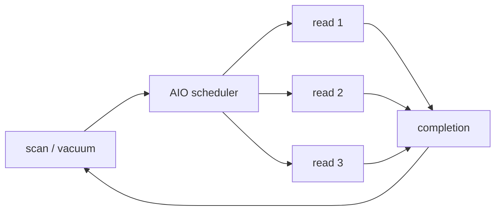

# PostgreSQL 18 Asynchronous I/O, Queue Depth & Storage Latency Hiding

## Neden var?
PostgreSQL 18, engine'in birden fazla read I/O isteğini eşzamanlı kuyruğa almasını sağlayan asynchronous I/O subsystem'i getirdi. Amaç tek bir disk erişimini sihirli biçimde hızlandırmak değil; database'in bildiği access pattern üzerinden bağımsız I/O'ları overlap etmek, storage parallelism'ini kullanmak ve bekleme süresini gizlemektir.

Sequential scan, bitmap heap scan ve vacuum gibi yollar bu modelden yararlanabilir. PostgreSQL 18 `io_method` ile `worker`, uygun Linux/liburing build'inde `io_uring`, veya `sync` seçebilir. Varsayılan `worker`'dır.

## Mental model

**Invariant:** AIO throughput'u concurrency ile artırabilir; tek request'in physical service time'ını garanti olarak azaltmaz.

## Temel mekanikler
- `io_method=worker`: worker process tabanlı AIO; platformlar arası varsayılan yöntem.
- `io_method=io_uring`: Linux'ta liburing ile kernel submission/completion yolu.
- `io_method=sync`: AIO-eligible işleri synchronous yürütür ve fallback/baseline sağlar.
- `io_max_concurrency`: bir process'in eşzamanlı I/O üst sınırını kontrol eder.
- PostgreSQL 18 `pg_aios` view'u AIO file-handle gözlemlenebilirliği sağlar.

AIO ile asynchronous commit farklı kavramlardır. AIO burada eligible storage reads'in execution/scheduling modelidir; commit durability'nin WAL flush garantisini kendi başına değiştirmez.

## Queue-depth ekonomisi
Queue depth düşükse device parallelism'i kullanılmayabilir. Çok yüksekse device saturation, tail latency, cache pollution ve mixed-workload interference oluşabilir. Bu yüzden tuning'in hedefi “en yüksek concurrency” değil, workload ve storage için throughput/tail-latency optimumudur.

Benchmark'ta en az şunları ayır:
- cold vs warm cache,
- sequential vs bitmap access,
- vacuum vs foreground query,
- average throughput vs p95/p99 latency,
- local NVMe vs network/block storage,
- single workload vs mixed OLTP + scan.

## Mülakat soruları
1. Blocking I/O ile AIO arasındaki fark nedir?
2. AIO neden tek I/O latency'sini azaltmadan throughput'u artırabilir?
3. Database engine neden yalnız OS readahead'e güvenmeyebilir?
4. `worker`, `io_uring`, `sync` trade-off'ları nelerdir?
5. Queue depth fazla yükselirse ne olur?
6. Senior: benchmark'ta page cache'i nasıl kontrol edersin?
7. Staff: analytical scan'in OLTP p99'unu bozmasını nasıl teşhis edersin?
8. Principal: fleet rollout, kernel/storage compatibility ve rollback'i nasıl tasarlarsın?

## Seviyeye göre cevap
- **Mid:** latency/throughput ve blocking/overlap ayrımını kurar.
- **Senior:** queue depth, cache state ve tail latency'yi ölçer.
- **Staff:** workload isolation, storage saturation ve observability tasarlar.
- **Principal:** platform compatibility, rollout, regression budget ve fallback politikası kurar.

## Mini alıştırma
8 ms storage latency'sinde 1 ve 8 outstanding request için idealized throughput'u hesapla. Sonra CPU, device queue, cache, dependency ve tail-latency nedenleriyle gerçek sistemin idealden sapmasını açıkla.

## Mini proje
`pg18-aio-lab`: PostgreSQL 18 üzerinde `sync`, `worker`, mümkünse `io_uring` karşılaştır. Sequential scan, bitmap heap scan ve vacuum için elapsed time, IOPS, throughput, CPU, p95/p99 ve storage queue depth ölç. `io_max_concurrency` sweep'i ekle.

## Failure modes / production
AIO'yu durability özelliği sanmak; yalnız average throughput ölçmek; warm-cache sonucu disk benchmark'ı diye sunmak; storage queue'yu aşırı doldurmak; `io_uring`'i evrensel varsaymak; mixed workload tail latency'sini göz ardı etmek. Production'da query p95/p99, scan throughput, vacuum duration, device utilization/queue latency, CPU, cache hit ve AIO configuration/version matrisi izlenir.

## Kaynaklar
- PostgreSQL 18 release announcement, 25 Sep 2025: https://www.postgresql.org/about/news/postgresql-18-released-3142/
- PostgreSQL 18 release notes: https://www.postgresql.org/docs/18/release-18.html
- PostgreSQL 18 resource/I/O configuration: https://www.postgresql.org/docs/18/runtime-config-resource.html
