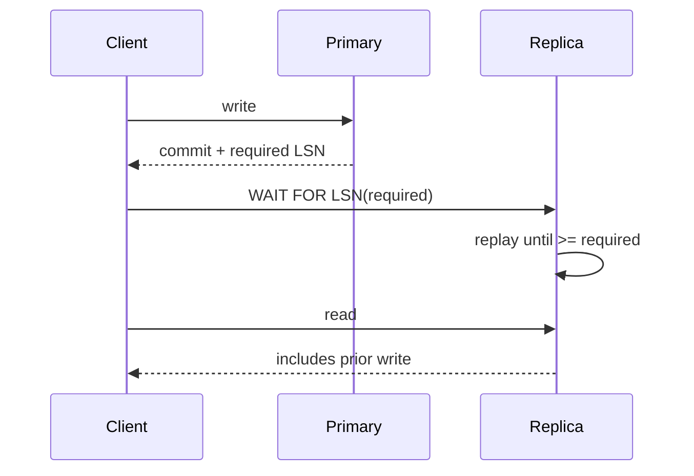

# PostgreSQL 19 `WAIT FOR LSN`: Read-Your-Writes ve Replica Consistency

## Neden önemli?
Asenkron replica read scaling sağlar fakat son commit henüz replay edilmediyse stale read üretir. PostgreSQL 19 beta hattındaki `WAIT FOR LSN`, belirli bir WAL progress point'e kadar replica'nın beklemesini sağlayarak read-your-writes akışlarını açık bir consistency contract'ına dönüştürür.

> 20 Eylül 2026 itibarıyla PostgreSQL 19 Beta 3'tür; beta/RC sürümleri production için önerilmez.

## Mental model

**Invariant:** Replica health, belirli bir write'ın görünür olduğu anlamına gelmez; progress condition gerekir.

## Temel kavramlar
- WAL konumları LSN ile ifade edilir; receive/flush/replay progress aynı olmayabilir.
- Read-your-writes client'ın kendi write'ını sonraki read'de görmesidir; global linearizability değildir.
- Sabit sleep correctness mekanizması değildir; lag workload ve topology ile değişir.
- Wait mutlaka request budget/timeout ile sınırlandırılmalıdır. Timeout sonrası primary fallback, başka replica veya explicit stale-read policy seçilebilir.
- LSN token API/routing contract'ına taşınabilir; router required progress'i sağlayan replica'yı seçmelidir.
- Synchronous replication commit yoluna daha geniş latency yükler; per-read waiting yalnız consistency isteyen read'leri etkileyebilir.

## Mülakat soruları
1. Replication lag hangi user-visible anomalileri üretir?
2. Read-your-writes ile linearizability farkı nedir?
3. Neden `sleep(100ms)` güvenilir değildir?
4. `WAIT FOR LSN` timeout olursa ne yaparsın?
5. LSN token'ını stateless gateway ve replica router boyunca nasıl taşırsın?
6. Multi-region sistemde consistency tier'larını ürün/SLO contract'ına nasıl bağlarsın?

## Beklenen cevap derinliği
- **Mid:** primary/replica, WAL, lag, stale read.
- **Senior:** progress token, timeout, fallback, tail latency.
- **Staff:** replica routing, overload feedback loop, observability.
- **Principal:** consistency tier, multi-region latency, durability ve ürün semantics.

## Mini alıştırma
İki replica'nın replay lag'i p50/p99 20/400 ms ve 60/180 ms; request budget 250 ms. Write sonrası read için replica seçimi, wait timeout ve primary fallback politikasını tasarla.

## Proje
`ryw-router-lab`: primary + iki replica üzerinde progress token taşıyan servis; artificial lag ile wait duration, stale-read, fallback ve p99 ölç.

## Failure modes / production
Wall-clock'u progress token sanmak, timeout koymamak, tüm read'leri primary'ye göndermek, lagging replica'ya wait storm bindirmek ve read-your-writes'ı global strong consistency sanmak tipik hatalardır. Replay lag, wait duration/timeouts, fallback ratio, stale-read violations, primary read load ve replica saturation izle.

## Kaynaklar
- PostgreSQL 19 Beta 1 (`WAIT FOR LSN`): https://www.postgresql.org/about/news/postgresql-19-beta-1-released-3313/
- PostgreSQL 19 Beta 3, 13 Ağustos 2026: https://www.postgresql.org/about/news/postgresql-186-1711-1615-1519-1424-and-19-beta-3-released-3365/
- PostgreSQL beta policy: https://www.postgresql.org/developer/beta/
