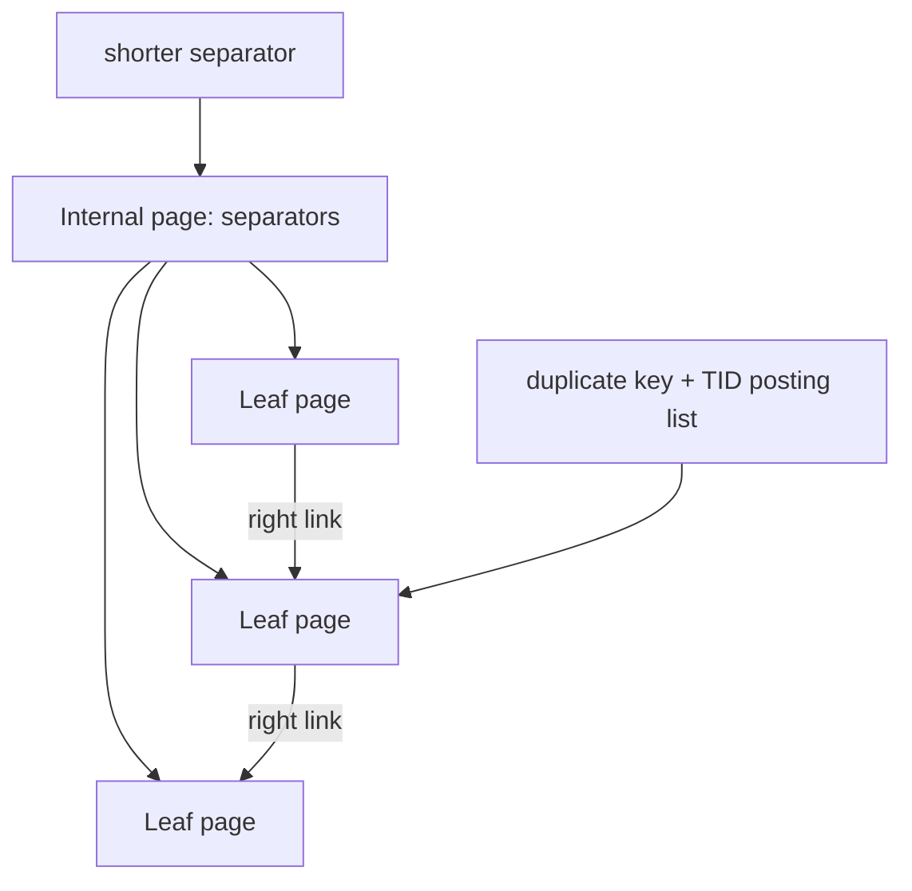

# B+Tree Fanout, Separator Keys, Suffix Truncation & Deduplication

## Konu anlatımı
B+Tree'nin yüksek fanout'u page tabanlı indekslerin ana avantajıdır: internal node daha çok child pointer taşıdıkça ağaç yüksekliği küçülür. Internal key'lerin görevi gerçek row key'ini yeniden saklamak değil, komşu child key-range'lerini ayıracak separator sağlamaktır. Doğru ayrım korunduğu sürece separator suffix'leri kısaltılabilir.

PostgreSQL B-tree'de suffix truncation parent separator tuple'ından gereksiz suffix attribute'larını kaldırabilir. Leaf seviyesinde duplicate key'ler posting-list tuple olarak deduplicate edilebilir. İki teknik farklı problemi çözer ama aynı fiziksel hedefe hizmet eder: page başına daha fazla yararlı bilgi, daha az split/bloat ve daha iyi cache/I/O davranışı.

## Mental model
Internal key adresin tamamı değil, iki sokağı ayırmaya yetecek yön tabelasıdır. Leaf dedup aynı apartman adını her daire için yeniden yazmak yerine adı bir kez, TID listesini yanında tutmaktır.

## İçeride ne oluyor?
1. Page size sabitken entry küçüldükçe fanout artar; yaklaşık yükseklik `log_fanout(N)` ile azalır.
2. Leaf page index tuple/TID ilişkisini; internal page child downlink ve separator taşır.
3. Split parent'a yeni separator ekler; parent doluysa split yukarı cascade edebilir.
4. Separator composite key'in tüm suffix'lerini taşımak zorunda değildir; range'i ayırmaya yeten prefix korunur.
5. PostgreSQL dedup aynı key'e ait leaf tuple'larını tek key + sıralı TID posting list biçiminde temsil edebilir.
6. Dedup duplicate-heavy index boyutunu ve split baskısını azaltabilir; her datatype/collation/index biçiminde güvenli değildir.
7. `INCLUDE` index'lerde dedup kullanılamaması gibi implementation kısıtları physical design kararını etkiler.

## Yüksek getirili mülakat soruları
1. B+Tree neden binary tree yerine yüksek fanout kullanır?
2. Internal separator key ile leaf key'in görevi nasıl farklıdır?
3. Composite key için separator neden tüm suffix'i taşımak zorunda olmayabilir?
4. Fanout artışı tree height ve page read sayısını nasıl etkiler?
5. Duplicate-heavy workload'da posting-list dedup ne kazandırır?
6. Key width, INCLUDE columns, fillfactor, split rate ve cache residency arasında nasıl trade-off kurarsın?
7. MVCC version churn ile physical duplicate index tuples arasındaki ilişki nedir?

## Beklenen cevap seviyesi
- **Junior:** page, leaf/internal node, fanout, O(log N).
- **Mid:** separator/downlink, split propagation, key width etkisi.
- **Senior:** suffix truncation, posting-list dedup, MVCC churn, cache/I/O.
- **Staff:** workload-aware physical index design, bloat/split observability, write/read amplification.

## Mini alıştırma
8 KiB page varsay. Internal entry 64 byte iken ve 32 byte'a indiğinde kaba fanout'u hesapla; 100 milyon key için `ceil(log_fanout(N))` ile yaklaşık seviyeyi karşılaştır. Header/fragmentation'ı ihmal ettiğini belirt.

## Proje fikri
`btree-page-lab`: sabit boyutlu page üzerinde internal/leaf node simülatörü yaz. Configurable key width, separator truncation ve duplicate posting-list ile fanout, split count ve tree height karşılaştır.

## Failure modes / trade-off / production bağlantısı
Geniş composite/include key'ler fanout'u düşürür; monoton insert hot rightmost page yaratabilir; duplicate-heavy index bloat yapabilir; dedup CPU işi ekler ve semantik güvenlik koşullarına bağlıdır. Production'da index size, split/bloat belirtileri, cache hit, read/write latency ve VACUUM davranışı birlikte değerlendirilmelidir.

## Kaynaklar
- PostgreSQL 18 B-Tree Indexes: https://www.postgresql.org/docs/18/btree.html
- PostgreSQL page inspection: https://www.postgresql.org/docs/18/pageinspect.html
- PostgreSQL nbtree source README: https://github.com/postgres/postgres/blob/master/src/backend/access/nbtree/README
