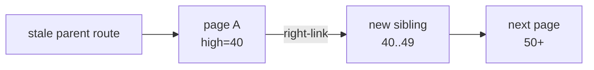

# Concurrent B+Tree — Page Splits, Right Links, Latches & MVCC

## Mental model
A concurrent B+Tree is not only a parent-child tree. Same-level sibling links provide an escape path when structural changes race with readers.

## Why concurrent split is hard
A reader may descend using a parent separator while another worker splits the target leaf. If keys move right before the parent route is fully updated, a reader that trusts only the old parent-child edge can miss the key. High-key/right-link designs let the reader detect that the target key belongs to a page to the right and continue horizontally.

PostgreSQL 18 describes its B-tree as a multi-level structure whose levels can be traversed as doubly-linked page lists. Leaf splits add a new page and a parent downlink; parent splits can cascade through the tree and a root split increases tree height.

## Three correctness layers
- **Latch:** short-lived protection for in-memory page/data-structure state.
- **Transaction lock / MVCC:** logical visibility and isolation across transactions.
- **WAL / recovery:** crash-safe reconstruction and durability.

A design can be concurrency-correct yet recovery-incorrect, or vice versa. Interview answers should name these boundaries explicitly.

## Split path
1. Locate the target leaf.
2. If target key exceeds the page's current range, follow the right-link.
3. If possible, reclaim/deduplicate space instead of splitting.
4. Allocate a sibling and redistribute tuples.
5. Publish range/sibling metadata in a safe order.
6. Insert/update parent separator/downlink.
7. Cascade upward if the parent overflows.

## MVCC interaction
MVCC can create multiple physical index tuples for successive versions of one logical row. Version churn can increase page pressure even when indexed values barely change. PostgreSQL's bottom-up index deletion is triggered around anticipated version-churn splits, while deduplication can compress duplicate key entries and delay splits.

## Hot pages and trade-offs
Monotonically increasing keys tend to concentrate writes on the right edge. Lower fillfactor reserves space and may reduce splits, but increases footprint and can reduce cache efficiency. Global tree locking simplifies correctness but limits scalability; page-level latches improve concurrency while adding ordering, retry and deadlock complexity.

## Interview ladder
- **Mid:** explain split, sibling link and latch-vs-lock.
- **Senior:** explain publication ordering, latch coupling and MVCC churn.
- **Staff:** reason about hot pages, fillfactor, WAL volume and contention telemetry.
- **Principal:** separate concurrency/recovery invariants and define workload-specific index policy.

## Exercise
Trace a search for key 47 racing with a split where the parent separator is delayed. Show failure without a right-link and recovery with high-key/right-link.

## Production checklist
Measure query latency together with page split rate, index size/bloat, buffer hit ratio, WAL volume and lock/latch waits. Avoid tuning fillfactor or key layout from theory alone; reproduce the production key distribution and concurrency shape.

## Sources
- PostgreSQL 18 B-Tree implementation: https://www.postgresql.org/docs/18/btree.html
- PostgreSQL nbtree internals: https://github.com/postgres/postgres/blob/master/src/backend/access/nbtree/README
- PostgreSQL Index Locking: https://www.postgresql.org/docs/current/index-locking.html
