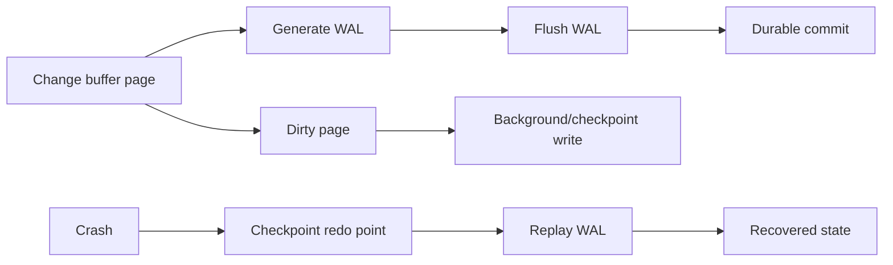

# PostgreSQL WAL, Checkpoints, Crash Recovery & Durability

## Mental model
WAL'ın ana ordering kuralı: data page değişikliği durable data file'a güvenle yazılmadan önce onu yeniden oluşturacak log record durable olmalıdır. Commit path WAL durability ile data-page flush'ını ayırarak random data writes yerine sequential log flush üzerinden throughput kazanabilir.

## Temel kavramlar
- **WAL-before-data:** recovery'nin temel ordering invariant'ı.
- **Checkpoint:** dirty data pages'i kalıcı storage'a ilerletir ve recovery redo başlangıcını sınırlar.
- **Group commit:** bir WAL flush maliyetini birden çok commit paylaşabilir.
- **Full-page writes:** checkpoint sonrası ilk page modification'ında torn-page riskine karşı WAL hacmi karşılığında koruma sağlar.
- **LSN:** WAL pozisyonudur; replication'da write/flush/replay aşamalarını ayırmak gerekir.
- **synchronous_commit:** client'a success dönmeden önce beklenen durability/replication noktasını seçer. `off`, crash penceresinde yakın transaction kaybını kabul eder; `fsync=off` ile aynı corruption risk sınıfı değildir.

## Mülakat soruları
1. WAL neden data page'den önce durable olmalıdır?
2. Commit olduğunda heap/index page'in diskte olması gerekir mi?
3. Checkpoint sıklığı recovery time, WAL volume ve I/O'yu nasıl etkiler?
4. Group commit neden işe yarar?
5. `synchronous_commit=off` ile `fsync=off` farkı nedir?
6. Senior: write/flush/replay LSN farkını açıkla.
7. Staff: p99 commit latency incident'ında hangi storage/WAL telemetry'sini korele edersin?
8. Principal: RPO/RTO ve cross-region latency için durability tier'ları nasıl kurarsın?

## Beklenen cevap seviyesi
- **Mid:** WAL ordering, checkpoint ve crash replay.
- **Senior:** group commit, full-page writes, LSN, PITR ve synchronous modes.
- **Staff:** checkpoint pressure, replication durability, recovery drills ve observability.
- **Principal:** RPO/RTO, failure domains, cost ve durability governance.

## Mini alıştırma
Üç kısa transaction aynı page'i değiştirirken WAL flush=2 ms, data-page write=5 ms kabul et. Per-transaction page flush ile group commit timeline'ını karşılaştır; WAL durable olmadan ve olduktan sonra oluşan crash'lerin sonucunu çiz.

## Proje
Disposable PostgreSQL üzerinde write-heavy workload çalıştır; WAL/checkpoint stats ile p95/p99 commit latency'yi kaydet. Kontrollü crash/restart recovery süresini ölç; yalnız test ortamında `synchronous_commit` varyantlarını karşılaştır.

## Failure modes / production
Checkpoint'i backup sanmak, WAL'ı replication ile eşitlemek, `write` LSN'i `replay` sanmak ve async commit ile `fsync=off` risklerini aynı kabul etmek hatalıdır. WAL bytes/sec, flush latency, checkpoint write/sync time, archive lag, replication write/flush/replay lag ve recovery drill sonuçlarını birlikte izle.

## Kaynaklar
- PostgreSQL 18 — WAL Reliability: https://www.postgresql.org/docs/18/wal.html
- PostgreSQL 18 — WAL Configuration: https://www.postgresql.org/docs/18/wal-configuration.html
- PostgreSQL 18 — Runtime WAL Settings: https://www.postgresql.org/docs/18/runtime-config-wal.html
- PostgreSQL 18 — Monitoring Statistics: https://www.postgresql.org/docs/18/monitoring-stats.html
