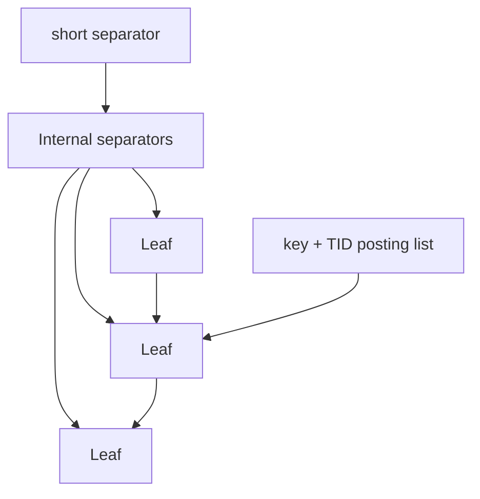

# B+Tree Fanout, Separator Keys, Suffix Truncation & Deduplication

## Temel model
B+Tree yüksek fanout sayesinde az seviye ile büyük key-space yönlendirir. Internal page'deki key'ler leaf row key'lerinin kopyası olmak zorunda değildir; child range'lerini ayırmaya yetecek separator'lardır.

Page sabitken entry küçüldükçe fanout büyür ve yaklaşık height `log_fanout(N)` azalır. Split parent'a yeni downlink/separator ekler ve parent doluysa yukarı cascade edebilir.

## Separator suffix truncation
Composite key'in tamamı parent'ta gerekli olmayabilir. Komşu ranges'i doğru ayıran prefix yeterliyse gereksiz suffix attribute'ları kaldırılabilir. Bu internal tuple'ları küçültür ve fanout'u iyileştirir.

## Leaf deduplication
PostgreSQL duplicate leaf tuples'ı tek key + sıralı heap TID posting list olarak temsil edebilir. Duplicate-heavy workload'da index boyutunu azaltabilir, page split'i geciktirebilir ve cache davranışını iyileştirebilir. Güvenlik datatype/collation semantics'e bağlıdır; `INCLUDE` index'lerde dedup uygulanmaz.

## Mülakat soruları
1. B+Tree neden binary tree yerine yüksek fanout ister?
2. Separator key ile leaf key'in görevi nedir?
3. Composite separator neden tüm suffix'i taşımayabilir?
4. Key width tree height/page reads'i nasıl etkiler?
5. Posting-list dedup hangi workload'da yararlıdır?
6. MVCC version churn physical duplicate tuple üretebilir mi?
7. Staff: INCLUDE/key width/fillfactor/split/cache trade-off'unu nasıl değerlendirirsin?

## Mini alıştırma
8 KiB page'de 64-byte ve 32-byte internal entry için kaba fanout hesapla. 100M key için `ceil(log_fanout(N))` seviyelerini karşılaştır; page header/fragmentation'ın ihmal edildiğini belirt.

## Proje
`btree-page-lab`: configurable key width, separator truncation ve duplicate posting-list içeren page simulator. Fanout, split count, height ve bytes/key ölç.

## Failure modes / production
Geniş key/INCLUDE fanout'u düşürür. Monoton inserts rightmost-page hotspot oluşturabilir. Duplicate-heavy index bloat yapabilir. Dedup CPU maliyeti ve semantic restrictions taşır. Index size, split/bloat sinyalleri, cache hit, latency ve VACUUM davranışı birlikte izlenmelidir.

## Kaynaklar
- PostgreSQL 18 B-Tree: https://www.postgresql.org/docs/18/btree.html
- PostgreSQL pageinspect: https://www.postgresql.org/docs/18/pageinspect.html
- PostgreSQL nbtree internals: https://github.com/postgres/postgres/blob/master/src/backend/access/nbtree/README
