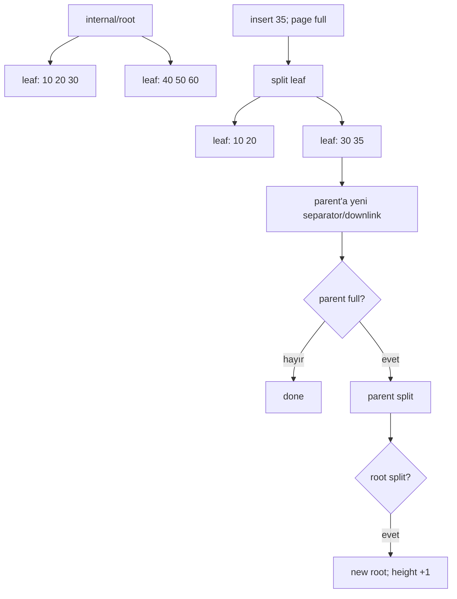

# B+Tree Page Split, Separator Keys & Height Growth

## Konu anlatımı
B+Tree'nin production değerini yalnızca `O(log n)` diye açıklamak eksiktir. Asıl fikir, disk/buffer-pool page boyutuna uygun yüksek fan-out ile ağacın sığ kalmasıdır. Internal page'ler arama yönlendiren separator/downlink'leri, leaf page'ler ise sıralı index entry'lerini taşır. Bir leaf'e yeni entry sığmazsa page split gerekir: entry'lerin bir bölümü yeni sibling page'e taşınır ve parent'a yeni child'ı ayıran bir separator/downlink eklenir.

Parent da doluysa split yukarı doğru cascade edebilir. Root split olduğunda yeni root oluşur ve ağacın yüksekliği bir artar. Bu olay pahalı olabilir ama her insert'te olmaz; yüksek fan-out nedeniyle height tipik olarak küçüktür. Deletion tarafında textbook “merge hemen yapılır” modeli production engine'lerde fazla basittir: MVCC version churn, garbage index tuples, deduplication ve vacuum/cleanup politikaları split baskısını etkiler.

## Mental model
B+Tree = “RAM pointer tree” değil, page-oriented sorted routing structure. Split = local capacity overflow'un structural değişikliğe dönüşmesi; root split = height artışının tek kapısı.

## İçeride ne oluyor?
1. Search root'tan leaf'e separator/downlink'lerle iner.
2. Leaf'te insertion position bulunur.
3. Yeterli free space varsa entry page'e eklenir.
4. Page doluysa yeni sibling allocate edilir ve key/entry'ler bölüştürülür.
5. Parent'a yeni child için separator/downlink eklenir.
6. Parent overflow ederse aynı süreç yukarı taşınır.
7. Root overflow ederse yeni root yaratılır.
8. Production engine concurrency, WAL/crash safety, MVCC garbage ve page cleanup ile bu algoritmayı birlikte yönetir.

## Yüksek getirili mülakat soruları
- B+Tree neden binary search tree yerine database index'lerinde uygundur?
- Internal node ile leaf node arasındaki fark nedir?
- Page split nasıl çalışır ve neden parent'ı etkileyebilir?
- Mid: root split neden tree height'i artırır?
- Senior: random insert ile monotonik insert split/locality davranışını nasıl değiştirir?
- Senior: MVCC version churn neden index bloat/split baskısı yaratabilir?
- Staff: hot-page contention, fill factor, WAL volume ve page split latency'yi nasıl gözlemlersin?
- Principal: index tasarımı ile write amplification/read latency/storage cost arasında nasıl politika kurarsın?

## Seviyeye göre cevap derinliği
- **Junior:** sorted pages, fan-out, logarithmic traversal.
- **Mid:** leaf/internal ayrımı, separator/downlink ve cascading split.
- **Senior:** page locality, MVCC churn, dedup/cleanup, write amplification.
- **Staff:** concurrent split safety, WAL, buffer pool, observability ve workload shape.
- **Principal:** index portfolio, storage economics, operational policy ve migration risk.

## Kısa alıştırma
Her leaf'in en fazla 4 key tuttuğu küçük bir B+Tree çiz. `10,20,30,40,50,35,25` insert'lerini sırayla uygula; hangi adımda leaf split olduğunu, parent separator'ın nasıl değiştiğini ve hangi koşulda root split olacağını işaretle.

## Proje fikri
`btree-page-lab`: sabit page kapasitesine sahip küçük bir B+Tree simülatörü yaz. Sequential ve random key workload'larında height, split count, average occupancy ve write count ölç. Sonra basit bir fill-factor parametresi ekleyip trade-off'u raporla.

## Failure modes / trade-off / production bağlantısı
- Düşük occupancy daha fazla page/I/O; aşırı doluluk ise insert sırasında split baskısı yaratır.
- Random write workload locality'yi bozabilir; monotonik key workload sağ kenarı hot spot yapabilir.
- MVCC garbage temizlenmezse gereksiz split ve scan maliyeti doğabilir.
- Split yalnızca CPU işi değildir: dirty page, WAL, buffer-pool pressure ve contention üretir.
- Production'da index size/bloat, page split eğilimi, buffer hit ratio, WAL bytes ve write latency birlikte izlenmelidir.

## Birincil / güncel kaynaklar
- PostgreSQL 18 — B-Tree Indexes / Implementation: https://www.postgresql.org/docs/18/btree.html
- PostgreSQL source — `src/backend/access/nbtree/README`: https://github.com/postgres/postgres/blob/master/src/backend/access/nbtree/README
