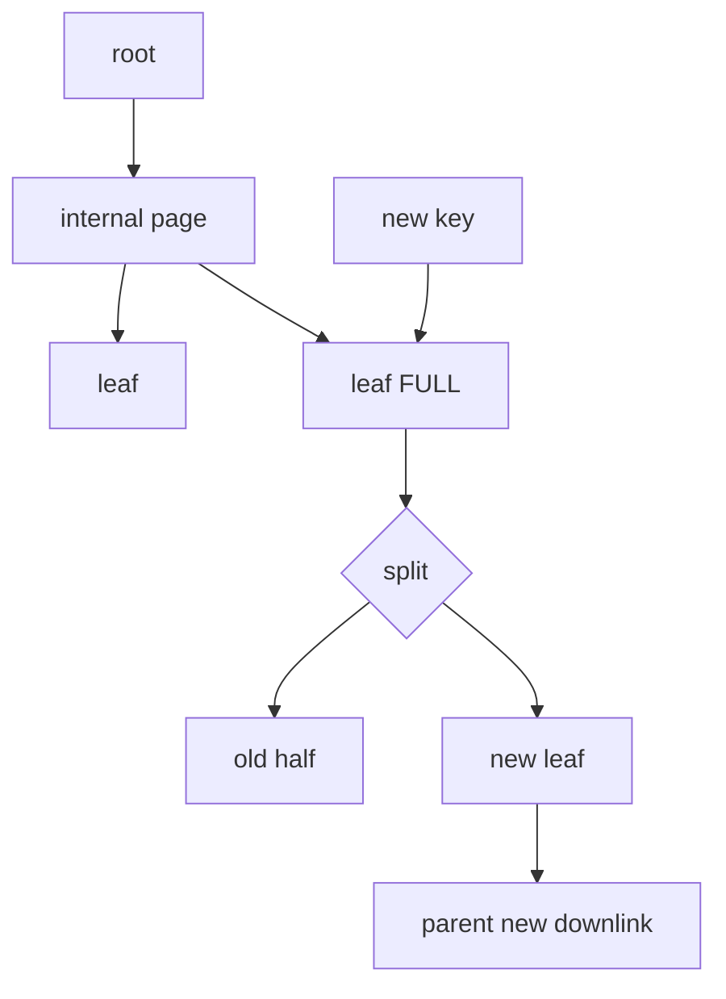

# B-Tree Pages, Splits, Fillfactor & Index Bloat

**Seviye:** Junior → Staff  
**Alan:** Databases

## Mental model
B-tree yalnız `O(log n)` değildir; fixed-size database pages üzerinde yüksek fan-out ile çalışan bir storage structure'dır.

Internal pages separator key/downlink, leaf pages key ve row reference taşır. Yüksek fan-out tree height'ı düşük tutar; performansta page IO/cache davranışı asimptotik complexity kadar önemlidir.

## Page split
Leaf page dolunca incoming tuple için yer açmak üzere içerik yeni page'e bölünür. Parent'a yeni downlink eklenir. Parent doluysa split yukarı cascade edebilir; root split yeni bir level yaratır. Split allocation, tuple movement, WAL ve cache değişimi nedeniyle write latency spike üretebilir.

## PostgreSQL ve MVCC churn
MVCC'de logical row update edilirken farklı physical versions kısa süre birlikte yaşayabilir ve index entries birikebilir. PostgreSQL anticipated version-churn split öncesinde bottom-up index deletion ile garbage tuples temizlemeye çalışır. Deduplication eşit indexed key'leri posting-list representation ile sıkıştırabilir ve bazı split'leri geciktirebilir.

## Fillfactor
Daha düşük B-tree fillfactor leaf page'lerde headroom bırakır. Insert/update-heavy workload'da split oranını azaltabilir veya yumuşatabilir; karşılığında daha büyük index, daha fazla page ve cache footprint doğurabilir. Ayar workload ölçümüyle yapılmalıdır.

Covering/`INCLUDE` index heap erişimini azaltabilir fakat leaf tuple'ları büyütür ve write/storage maliyetini artırır. PostgreSQL'de INCLUDE içeren B-tree index'lerde deduplication kullanılmaz.

## Mülakat soruları
1. B-tree neden binary tree değildir?
2. Fan-out neden önemlidir?
3. Leaf split parent'a nasıl yayılır?
4. Fillfactor trade-off'u nedir?
5. Composite index column order neden önemlidir?
6. MVCC index bloat'ı nasıl üretir?
7. Covering index read/write trade-off'u nedir?
8. Random UUID write workload'unda hangi metrikleri incelersin?

## Beklenen cevap derinliği
- **Junior:** sorted tree ve logarithmic lookup.
- **Mid:** pages, fan-out, split ve composite prefix.
- **Senior:** MVCC churn, bloat, fillfactor, cache/WAL economics.
- **Staff:** index portfolio, online rebuild, IO/lock budget ve production observability.

## Mini alıştırma
Leaf capacity 4 key olsun. `10,20,30,40,25,27` insert'lerini elle uygula ve split/downlink akışını çiz. Capacity 200 olduğunda aynı key count için tree height'ın neden çok daha küçük kalacağını açıkla.

## Proje
PostgreSQL'de sequential bigint, random UUID ve time-ordered UUID benzeri üç primary-key workload'u üret. Aynı insert hacminde index size, WAL bytes, p95/p99 insert latency ve page density ölç. Fillfactor varyasyonlarını karşılaştır.

## Failure modes / production
Her sorguya index eklemek write amplification ve cache footprint'i büyütür. Bloat'ı yalnız REINDEX ile çözmek long-running transactions, vacuum ve workload nedenlerini gizleyebilir. Production'da index size, buffer hit, page density, WAL, vacuum progress, query plan ve tail write latency birlikte izlenmelidir.

## Kaynaklar
- PostgreSQL 17 — B-Tree implementation: https://www.postgresql.org/docs/17/btree.html
- PostgreSQL current — CREATE INDEX: https://www.postgresql.org/docs/current/sql-createindex.html
- PostgreSQL current — Routine Reindexing: https://www.postgresql.org/docs/current/routine-reindex.html
- PostgreSQL source — nbtree README: https://github.com/postgres/postgres/blob/master/src/backend/access/nbtree/README
