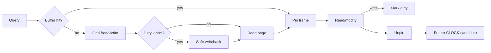

# Buffer Pool, Pinning, Dirty Pages & CLOCK-Sweep

**Seviye:** Junior → Staff  
**Çalışma süresi:** 20–30 dk

## Temel model
B+Tree hangi page'e gidileceğini belirler; buffer manager page'in RAM'de bulunup bulunmadığını ve RAM doluysa hangi frame'in çıkarılacağını yönetir. Buffer pool storage pages için kontrollü bir RAM cache'idir.

## Pin, dirty ve eviction
**Pin/reference** aktif operation'ın frame'i kullanmakta olduğunu gösterir ve eviction'ı engeller. **Dirty** ise RAM'deki page'in storage kopyasından farklı olduğunu gösterir. Dirty victim yeniden kullanılmadan önce güvenli writeback gerekir. WAL tabanlı sistemlerde data page writeback log durability ordering invariant'ını ihlal etmemelidir.

PostgreSQL 18 `pg_buffercache`, her buffer için `isdirty`, CLOCK-sweep `usagecount` ve `pinning_backends` gibi gözlemlenebilir alanlar sunar. Bu üçlü interview mental modelini doğrudan production telemetry'ye bağlar.

## CLOCK neden exact LRU değil?
Exact global LRU her access'te ortak ordering metadata'sını güncelleme maliyeti ve contention yaratabilir. CLOCK ailesi yakın geçmişte kullanım sinyalini yaklaşık sayaç/reference bit ile tutar. Sweep eli adayları gezer; kullanılan frame'e ikinci şans verir, pinned frame'i atlar ve düşük kullanım sinyalli güvenli victim arar.

## Dirty-page economics
Eviction anında dirty page'i synchronous yazmak foreground latency'yi artırabilir. Background writer/checkpoint mekanizmaları dirty work'ü zamana yaymaya çalışır. Ancak çok büyük dirty burst veya checkpoint pressure storage bandwidth'i doyurup p99 query latency'ye yansıyabilir.

Sequential scan ayrıca hot OLTP working set'i cache'ten çıkarabilir. Bu yüzden bazı engine'ler bulk/scan workload'ları için ring veya scan-resistant policy uygular.

## Mülakat soruları
1. Buffer pool neden B+Tree'den ayrı katmandır?
2. Pin ile dirty flag arasındaki fark nedir?
3. Pinned page neden victim olamaz?
4. CLOCK neden exact LRU'ya tercih edilebilir?
5. Dirty eviction p99 latency'yi nasıl etkiler?
6. Sequential scan cache pollution'a karşı ne yaparsın?
7. Staff: DB buffer pool, OS page cache, checkpoint ve working set için memory/I/O bütçesini nasıl kurarsın?

## Beklenen cevap derinliği
- **Junior:** page/frame, hit/miss, dirty, eviction.
- **Mid:** pin/refcount, CLOCK/LRU, background writeback.
- **Senior:** WAL-before-data ordering, checkpoint pressure, scan pollution, concurrency.
- **Staff:** working-set sizing, NUMA/I/O topology, memory accounting, tail-latency telemetry.

## Mini alıştırma
4 frame için `(page, usagecount, pinned, dirty)` tablosu kur. CLOCK sweep'i elle yürüt; pinned frame'i atla, usagecount'ları düşür ve ilk victim'i seç. Dirty victim seçilirse writeback adımını ekle.

## Proje
`buffer-pool-lab`: 64–256 frame ile LRU, CLOCK ve scan-resistant ring karşılaştır. Zipf + sequential scan workload'larında hit ratio, eviction count, dirty writeback ve p95 miss cost ölç.

## Failure modes / trade-off / production
Working set pool'dan büyükse thrashing; uzun pin'ler replacement freedom kaybı; dirty/checkpoint burst write spike; aşırı büyük pool OS memory pressure/NUMA maliyeti yaratabilir. Yalnız cache-hit oranına bakmak yeterli değildir: usage-count dağılımı, dirty/pinned buffers, IOPS, checkpoint volume ve query latency birlikte değerlendirilmelidir.

## Kaynaklar
- PostgreSQL 18 `pg_buffercache`: https://www.postgresql.org/docs/18/pgbuffercache.html
- PostgreSQL 18 Resource Consumption: https://www.postgresql.org/docs/18/runtime-config-resource.html
- PostgreSQL buffer manager source: https://github.com/postgres/postgres/tree/master/src/backend/storage/buffer
