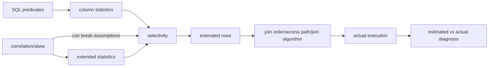

# Cardinality Estimation, Histograms & Extended Statistics

## Konu anlatımı
Query optimizer her plan node'undan kaç satır çıkacağını yaklaşık tahmin eder. Cardinality/selectivity tahmini join order, access path, join algorithm ve resource cost hesabının temelidir. Hata plan ağacında büyüyebilir; kötü görünen executor seçimi çoğu zaman yanlış row estimate'in sonucudur.

PostgreSQL `ANALYZE` örnekleme ile `null_frac`, `n_distinct`, most-common-values/frequencies ve histogram bounds gibi özetler üretir. Equality ve range predicate'leri bu sıkıştırılmış dağılım bilgisinden tahmin edilir. Statistics target daha ayrıntılı bilgi sağlayabilir ama ANALYZE/catalog maliyeti getirir.

Tek-column statistics cross-column correlation'ı göremez. `city='Istanbul' AND country='TR'` gibi predicates bağımsız değildir. `CREATE STATISTICS` ile functional dependencies, multivariate distinct counts ve multivariate MCV toplanabilir; kolon kombinasyonları workload'a göre bilinçli seçilir.

## Mental model
Optimizer gerçek veriyi değil **sıkıştırılmış istatistiksel haritayı** görür. Cardinality error yanlış yol tarifidir.

## İçeride ne oluyor?
1. `ANALYZE` sample alıp column statistics üretir.
2. Equality MCV/distinct bilgisini, range predicate histogram bilgisini kullanabilir.
3. Multiple predicates çoğu durumda independence varsayımına ihtiyaç duyar.
4. Correlated columns bu varsayımı bozar.
5. Extended statistics dependency/MCV/ndistinct bilgisi ekler.
6. Estimated rows cost model ve join order'a akar.
7. `EXPLAIN (ANALYZE ...)` estimated-vs-actual farkını görünür kılar.
8. Root cause stale stats, skew, correlation, parameter sensitivity veya predicate shape olabilir.

## Yüksek getirili mülakat soruları
- Cardinality estimation neden query plan için kritiktir?
- MCV ile histogram hangi farklı problemi çözer?
- Correlated predicates independence assumption'ı nasıl bozar?
- Estimated 100, actual 1M ise hangi sırayla debug edersin?
- Statistics target'ı her kolonda maksimum yapmak neden doğru değildir?
- Multi-tenant skew için CE observability nasıl tasarlanır?
- Optimizer upgrade regression'ı workload replay ile nasıl gate edilir?

## Seviyeye göre cevap derinliği
- **Mid:** selectivity, histogram, MCV, estimated-vs-actual rows.
- **Senior:** skew, stale stats, correlation, extended statistics ve join-order etkisi.
- **Staff:** workload-specific stats policy, plan regression detection ve tenant segmentation.
- **Principal:** optimizer/version rollout, benchmark corpus, SLO/cost gate ve rollback.

## Kısa alıştırma
10M satırda `country='TR'` %10, `city='Istanbul'` %4; Istanbul satırlarının tamamı TR içinde. Independence tahminini gerçek 400k ile karşılaştır ve uygun extended statistics yaklaşımını seç.

## Proje fikri
**ce-lab:** PostgreSQL'de correlated ve skewed dataset üret. `pg_stats` + `EXPLAIN (ANALYZE, BUFFERS)` ile estimate/actual ratio'yu ölç; `CREATE STATISTICS` öncesi/sonrası plan, runtime ve buffer reads'i karşılaştır.

## Failure modes / trade-off / production
Stale stats, rapidly changing distributions, rare values, correlations ve parameter sensitivity CE'yi bozar. Higher statistics target planning/catalog maliyetini artırır ve her correlation'ı çözmez. Production'da estimate/actual ratio, plan change, p95/p99, spill, buffer reads ve ANALYZE freshness birlikte izlenmelidir.

## Kaynaklar
- PostgreSQL 17 — Statistics Used by the Planner: https://www.postgresql.org/docs/17/planner-stats.html
- PostgreSQL 17 — CREATE STATISTICS: https://www.postgresql.org/docs/17/sql-createstatistics.html
- PostgreSQL 17 — Using EXPLAIN: https://www.postgresql.org/docs/17/using-explain.html
