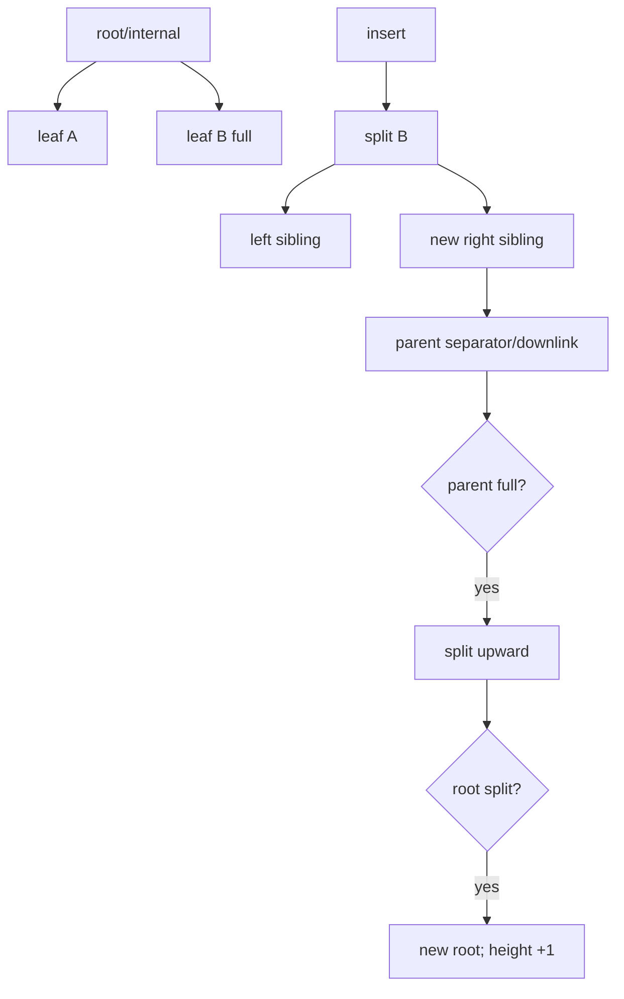

# B+Tree Page Split, Separator Keys & Height Growth

## Konu anlatımı
B+Tree'yi yalnızca `O(log n)` olarak düşünmek eksiktir. Database index'i page-oriented bir yapıdır: yüksek fan-out ağacı sığ tutar; internal page'ler separator/downlink ile yönlendirir, leaf page'ler sıralı index entry'lerini taşır. Leaf dolduğunda yeni sibling oluşturulur, entry'ler bölüştürülür ve parent'a yeni child için separator/downlink eklenir. Parent doluysa split yukarı cascade eder; root split yeni root yaratarak height'i bir artırır.

PostgreSQL 18 B-Tree implementation dokümantasyonu level'ların doubly-linked page listeleri olduğunu ve split'in parent/root'a kadar cascade edebildiğini açıklar. Production engine'de textbook algoritmaya MVCC garbage, deduplication, WAL, buffer pool ve concurrency eklenir. PostgreSQL bottom-up index deletion ile bazı version-churn page split'lerini split gerçekleşmeden önlemeye çalışır.

## Mental model
B+Tree = page-oriented sorted routing structure. Split = local capacity overflow'un structural değişikliğe dönüşmesi. Root split = tree height artışının tek kapısı.

## İçeride ne oluyor?
1. Search separator/downlink'lerle leaf'e iner.
2. Leaf insertion position bulunur.
3. Free space yeterliyse local insert yapılır.
4. Doluluk halinde sibling allocate edilip entries bölüştürülür.
5. Parent'a yeni downlink/separator eklenir.
6. Parent overflow recursive split yaratabilir.
7. Root overflow yeni root oluşturur.
8. WAL/crash safety, latch/lock protokolü, MVCC cleanup ve buffer management structural değişimi güvenli hale getirir.

## Mülakat soruları
- B+Tree neden binary search tree yerine database index'lerinde uygundur?
- Internal page ile leaf page farkı nedir?
- Page split neden parent'ı değiştirebilir?
- Root split neden height'i artırır?
- Random ve monotonik insert workload'ları locality/hot-page davranışını nasıl değiştirir?
- MVCC version churn split baskısını nasıl artırabilir?
- Staff: concurrent split sırasında reader/writer correctness nasıl korunur?
- Principal: fill factor, write amplification, read latency ve storage cost arasında nasıl politika kurarsın?

## Beklenen cevap seviyesi
- **Junior:** sorted pages, fan-out ve logarithmic traversal.
- **Mid:** separator/downlink, leaf/internal ve cascading split.
- **Senior:** locality, MVCC churn, cleanup/dedup ve write amplification.
- **Staff:** concurrent split safety, WAL, buffer pool ve observability.
- **Principal:** index portfolio ve storage/performance economics.

## Mini alıştırma
Leaf kapasitesi 4 key olan küçük bir ağaçta `10,20,30,40,50,35,25` insert'lerini uygula. Split noktalarını ve parent separator değişimlerini çiz.

## Proje fikri
`btree-page-lab`: fixed-capacity page kullanan küçük B+Tree simülatörü yaz. Sequential/random workload için height, split count, occupancy ve write count ölç; fill-factor parametresi ekle.

## Failure modes / trade-off / production bağlantısı
Düşük occupancy page/I/O maliyetini artırır; aşırı doluluk split baskısı yaratır. Random writes locality'yi azaltabilir, monotonik keys sağ kenarı hot spot yapabilir. MVCC garbage gereksiz split/scan maliyeti doğurabilir. Split dirty page, WAL, buffer-pool pressure ve contention üretir. Index size/bloat, WAL bytes, buffer hit ratio ve write latency birlikte izlenmelidir.

## Kaynaklar
- PostgreSQL 18 — B-Tree Indexes: https://www.postgresql.org/docs/18/btree.html
- PostgreSQL source — nbtree README: https://github.com/postgres/postgres/blob/master/src/backend/access/nbtree/README
